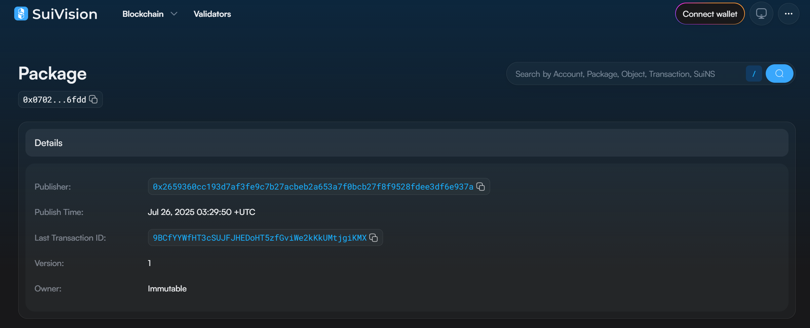

## 基本信息
- Sui钱包地址: `0x62afa046e05383976a69fe82a919e6322f6ed5d4cabde3ed29e783f4f72420d2`
- github: `Quarix`

## 个人简介
- 工作经验: 0x00年
- 技术栈: `C` `C++` `Python` `Typescript`
- 多年Web2开发经验，对Move特别感兴趣，想通过Move入门区块链
- 联系方式: Email: `Github.envoy692@passinbox.com` 

## 任务

##   01 hello move  
- [x] Sui cli version: sui 1.52.2-7f45ba185ff0
- [x] Sui钱包截图: 
- [x] package id: 0x0702f2b74c29c09ba0cde50e094e2c5c9f478a61a235914adb4d275f18516fdd
- [x] package id 在 scan上的查看截图:

##   02 move coin
- [] My Coin package id : 
- [] Faucet package id : 
- [] 转账 `My Coin` hash:
- [] `Faucet Coin` address1 mint hash:
- [] `Faucet Coin` address2 mint hash:

##   03 move NFT
- [] nft package id :
- [] nft object id : 
- [] 转账 nft  hash:
- [] scan上的NFT截图:

##   04 Move Game
- [] game package id :
- [] deposit Coin hash:
- [] withdraw `Coin` hash:
- [] play game hash:

##   05 Move Swap
- [] swap package id :
- [] call swap CoinA-> CoinB  hash :
- [] call swap CoinB-> CoinA  hash :

##   06 Dapp-kit SDK PTB
- [] save hash :

##   07 Move CTF Check In
- [] CLI call 截图 : 
- [] flag hash :

##   08 Move CTF Lets Move
- [] proof : 
- [] flag hash :

