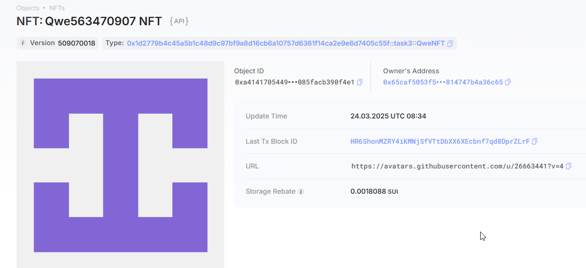
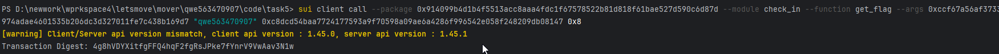

## 基本信息
- Sui钱包地址: `0x65caf5053f5df98ca9ad92f6eb3335619844a2b7dee64291e4814747b4a36c65`
> 首次参与需要完成第一个任务注册好钱包地址才被合并，并且后续学习奖励会打入这个地址
- github: `qwe563470907`

## 个人简介
- 工作经验: 3年
- 技术栈: `Js`
> 重要提示 请认真写自己的简介
- 多年web2开发经验，对Move特别感兴趣，想通过Move入门区块链
- 联系方式: `qwe563472907@163.com`

## 任务

##   01 hello move  
- [x] Sui cli version: 1.45.0
- [x] Sui钱包截图: 
- [x] package id: 0x289241c451dacbe3f41af2cd5dc8b98f93ed58a0298f9cc13e241d7a8e7f2ec5
- [x] package id 在 scan上的查看截图:

##   02 move coin
- [x] My Coin package id : 0x9eed64d3176c07b019dcdf66b5894a3bc5755fbe0201417feb851e697247f399
- [x] Faucet package id : 0x9eed64d3176c07b019dcdf66b5894a3bc5755fbe0201417feb851e697247f399
- [x] 转账 `My Coin` hash:65RqCSScNgp1bxoegt4snpXUuKHVk82o4CHgrRBfZtN6
- [x] `Faucet Coin` address1 mint hash:2gsxEA4zCkVGUFsk3aLMq8vZNR1USWpWzNKR3A4vU6tb
- [x] `Faucet Coin` address2 mint hash:GMGUeJKtW4nm6DGEZLXUA2mnp84N5zKFVdeCXEwKELzc

##   03 move NFT
- [x] nft package id :0x1d2779b4c45a5b1c48d9c97bf9a8d16cb6a10757d6361f14ca2e9e6d7405c55f
- [x] nft object id : 0xa41417054492f8deb59d3f5237fbfa1933c0eb5dbe6a1ec5c0085facb390f4e1
- [x] 转账 nft  hash:Dzo7tDnPKZaSxG9g1VaxxtUSsEo9ZvrpoAGv6Lr6HW7n
- [x] scan上的NFT截图:

##   04 Move Game
- [x] game package id :0x345ab93adf534a7d6185c5be79aa4aec86ef96d116ab964093233f74bb023c6e
- [x] deposit Coin hash:9Jxt2vt8Mut4KabVBbgcEqRNM7NAVUUbdsb4VBtHBH2k
- [x] withdraw `Coin` hash:7YkALf9vnjmYuqNksKpU5Kg35CDDiepVDoESkx2bbvJ1
- [x] play game hash:EJuNV4cggddwDSfkUwCjUuquq2XD4m3Kt2DRb5oQbTUT

##   05 Move Swap
- [x] swap package id :0xd880cf54cfb82384e2dbe40ecb377dcbd6c2901954d06b76daec43c3743f5460
- [x] call swap CoinA-> CoinB  hash :BfrF44KPSXnGodHXaadxc9CCkySWrs7PEREgqhb259be
- [x] call swap CoinB-> CoinA  hash :C5CTGUCra6sRcA9NCyS6iRN54EuXbVXyuNGrat7LZW8v

##   06 Dapp-kit SDK PTB
- [x] save hash :7wDURu7wVZFC9MFZAEGmtEy5LD4YcSt37Sz5CfDM4i5J

##   07 Move CTF Check In
- [x] CLI call 截图 : 
- [x] flag hash :4g8hVDYXitfgFFQ4hqF2fgRsJPke7fYnrV9VwAav3N1w

##   08 Move CTF Lets Move
- [x] proof : 0xf9792d0000000000
- [x] flag hash :25SbCAPKbeK9MC1odn3yZbsFk7vvxkgsADRvv3dpG8pf

