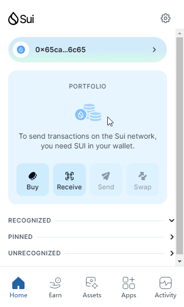
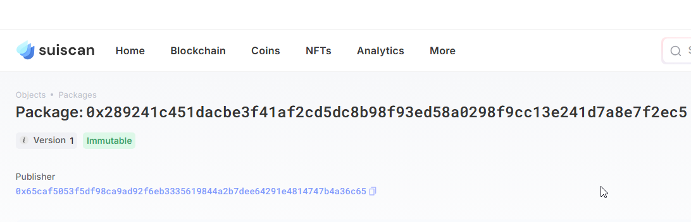

## 基本信息
- Sui钱包地址: `0x65caf5053f5df98ca9ad92f6eb3335619844a2b7dee64291e4814747b4a36c65`
> 首次参与需要完成第一个任务注册好钱包地址才被合并，并且后续学习奖励会打入这个地址
- github: `qwe563470907`

## 个人简介
- 工作经验: 3年
- 技术栈: `Js`
> 重要提示 请认真写自己的简介
- 多年web2开发经验，对Move特别感兴趣，想通过Move入门区块链
- 联系方式: `qwe563472907@163.com`

## 任务

##   01 hello move  
- [x] Sui cli version: 1.45.0
- [x] Sui钱包截图: 
- [x] package id: 0x289241c451dacbe3f41af2cd5dc8b98f93ed58a0298f9cc13e241d7a8e7f2ec5
- [x] package id 在 scan上的查看截图:

##   02 move coin
- [] My Coin package id : 
- [] Faucet package id : 
- [] 转账 `My Coin` hash:
- [] `Faucet Coin` address1 mint hash:
- [] `Faucet Coin` address2 mint hash:

##   03 move NFT
- [] nft package id :
- [] nft object id : 
- [] 转账 nft  hash:
- [] scan上的NFT截图:

##   04 Move Game
- [] game package id :
- [] deposit Coin hash:
- [] withdraw `Coin` hash:
- [] play game hash:

##   05 Move Swap
- [] swap package id :
- [] call swap CoinA-> CoinB  hash :
- [] call swap CoinB-> CoinA  hash :

##   06 Dapp-kit SDK PTB
- [] save hash :

##   07 Move CTF Check In
- [] CLI call 截图 : 
- [] flag hash :

##   08 Move CTF Lets Move
- [] proof : 
- [] flag hash :

