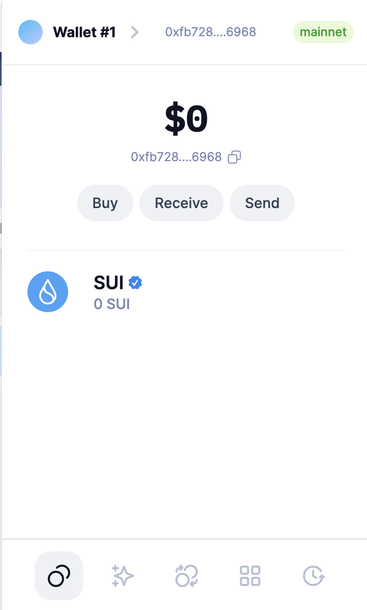
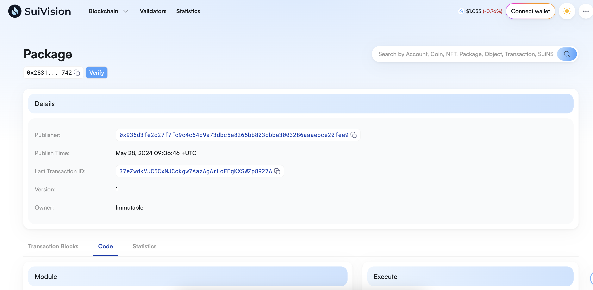

## 基本信息

- Sui 钱包地址: `0xfb728df2a5b4196e1ec810e1877a702be1ef29c13d7dfb8a2c12c6734c916968`
  > 首次参与需要完成第一个任务注册好钱包地址才被合并，并且后续学习奖励会打入这个地址
- github: `qweghj1245`

## 个人简介

- 工作经验: 5 年
- 技术栈: `JS` `TS` `Solidity`
- 对 MOVE 语言、Sui 生态感兴趣
- 联系方式: email: `qweghj1245@gmail.com`

## 任务

## 01 hello move

- [] Sui cli version: 1.24.1
- [] Sui 钱包截图: 
- [] package id: 0x283113dc3e11171f904a5f8487f0f6fa6a978f99a18bb7207bef6babe3201742
- [] package id 在 scan 上的查看截图:

## 02 move coin

- [] My Coin package id :
- [] Faucet package id :
- [] 转账 `My Coin` hash:
- [] `Faucet Coin` address1 mint hash:
- [] `Faucet Coin` address2 mint hash:

## 03 move NFT

- [] nft package id :
- [] nft object id :
- [] 转账 nft hash:
- [] scan 上的 NFT 截图:

## 04 Move Game

- [] game package id :
- [] deposit Coin hash:
- [] withdraw `Coin` hash:
- [] play game hash:

## 05 Move Swap

- [] swap package id :
- [] call swap CoinA-> CoinB hash :
- [] call swap CoinB-> CoinA hash :

## 06 SDK PTB

- [] save hash :
