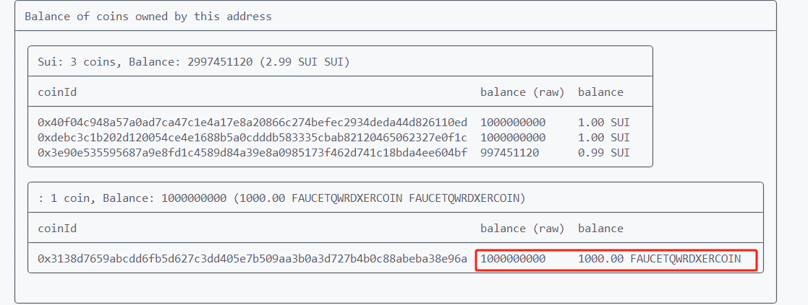
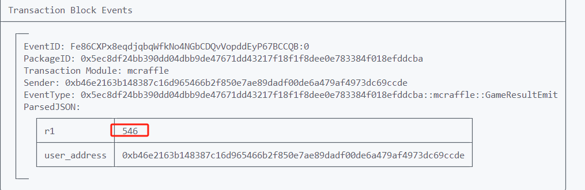
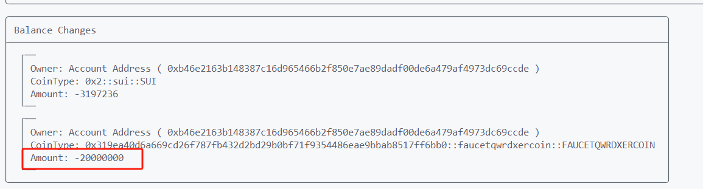
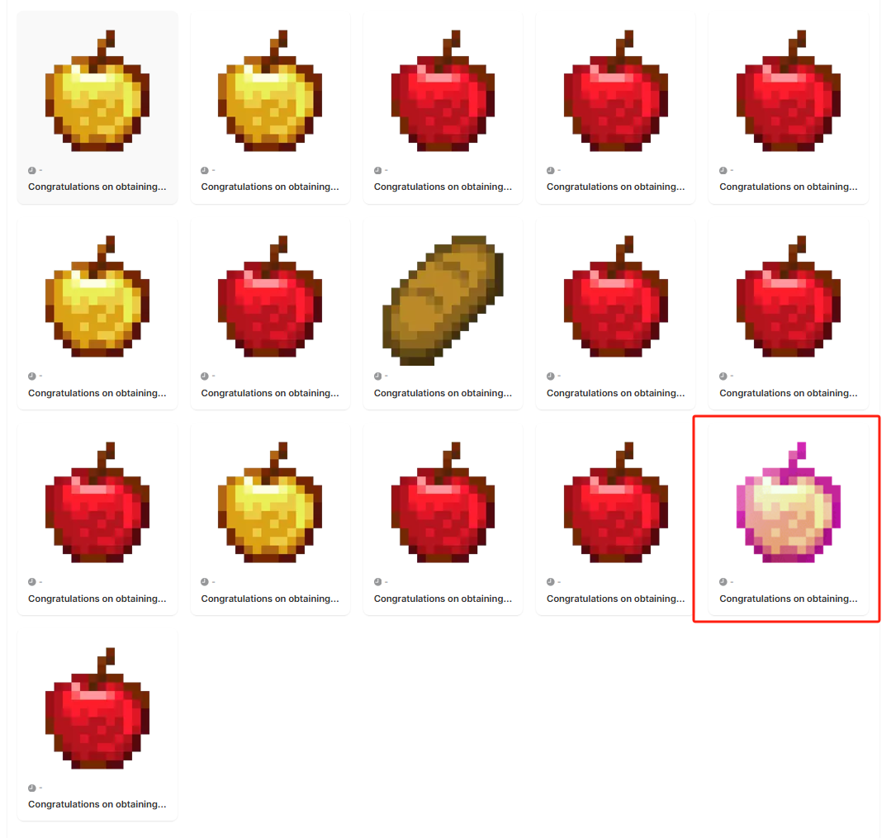
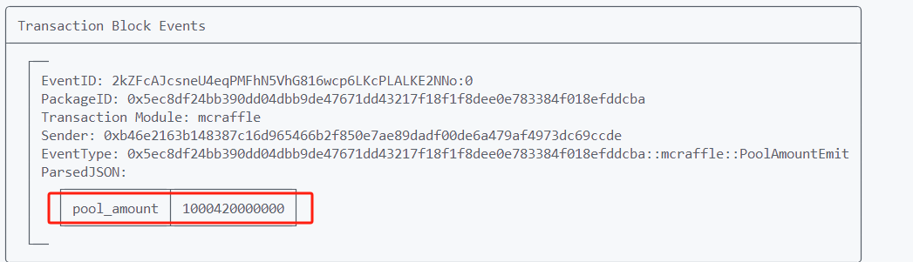
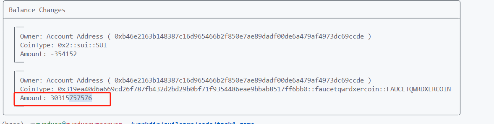
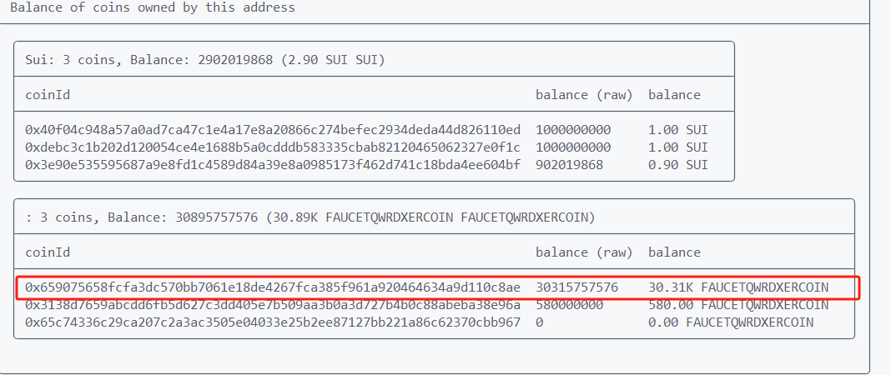
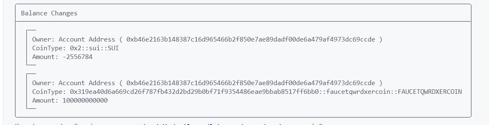

## 一、博客概述

### 1 目标

Let's Move 一项学Move获得SUI的激励计划，鼓励更多的人学习Move语言,本篇为task4任务的实现与代码分析。

任务目标:
1. 完成 链游相关知识的学习
2. 完成 随机数的学习，游戏必须包含随机数
3. 完成 存和取游戏资金池
4. 完成 如何存储Coin在合约的学习，游戏必须能存取[task2] 发行的Faucet Coin,用task2的 Faucet Coin作为游戏输赢的资产
5. 完成 第一个游戏合约部署主网

### 2 游戏设计
游戏的逻辑比较简单，从玩家的视角来看,每次消耗20 `faucetCoin` 进行NFT抽奖, 消耗的Coin会存入奖池中,玩家可以选择销毁NFT来兑换一定数量的`faucetCoin`。具体概率和兑换率如下:
- 附魔金苹果 获取概率10% ,可以兑换奖池总量的5%的COIN
- 金苹果 ,获取概率20%,可以兑换奖池总量的3.33%的COIN
- 苹果,获取概率30% ,可以兑换奖池总量的1%的COIN
- 面包,获取概率40% ,可以兑换 10个COIN


## 二、简单游玩
这里展示在测试网(Testnet)下游玩,核心步骤为: ** 领水 **,qwrdxerfaucetcoin是参与游戏用到的代币, ** 参与游戏 **,调用函数`raffle_play` 消耗20 代币来抽取NFT, ** 销毁NFT获取代币奖励 ** ,玩家可以选择销毁NFT来获取奖励
### step 1 领水
首先是领水 `faucetqwrdxercoin` 这是task2实现的水龙头,领取方法是将{your_address} 替换为自己的钱包地址
```rust
sui client call --package 0x319ea40d6a669cd26f787fb432d2bd29b0bf71f9354486eae9bbab8517ff6bb0 --module faucetqwrdxercoin --function mint --args  0xdaba562b748d108e6cea27d23a7c8487729a60ff041cbb31d6c7c7bd92d1e8a1 10000000000 {your_address}  --gas-budget 10000000
```

我的地址是`0xb46e2163b148387c16d965466b2f850e7ae89dadf00de6a479af4973dc69ccde` ,执行命令如下:
```rust
sui client call --package 0x319ea40d6a669cd26f787fb432d2bd29b0bf71f9354486eae9bbab8517ff6bb0 --module faucetqwrdxercoin --function mint --args  0xdaba562b748d108e6cea27d23a7c8487729a60ff041cbb31d6c7c7bd92d1e8a1 1000000000 0xb46e2163b148387c16d965466b2f850e7ae89dadf00de6a479af4973dc69ccde  --gas-budget 10000000
```


执行命令`sui client balance --with-coins` 查看是否获取成功,顺便记一下coinId,等会要用到。注意`faucetqwrdxercoin`的精度是6,所以balance值除以10^6才是真实coin数量,这里领取了1000个COIN


### step 2 抽NFT
游戏游玩方式比较简单,每次用户需要支付20个`FAUCETQWRDXERCION` 给合约,合约会生成一个1~1000的随机数,根据值来判断发放什么NFT,最好的NFT需要值大于900。执行如下命令即可,将coinId替换为自己的coinId,注意coin对象的balance要大于20个才能参加游戏。
```bash
    sui client call --package 0x5ec8df24bb390dd04dbb9de47671dd43217f18f1f8dee0e783384f018efddcba \
    --module mcraffle --function raffle_play \
    --args 0xeb9f401eae86c5cfb72f097dd507543a05eca0f40a88d0aa98a7d7977ef56b31 0x8 {coinId} --gas-budget 100000000

```

我的执行命令:
```rust
    sui client call --package 0x5ec8df24bb390dd04dbb9de47671dd43217f18f1f8dee0e783384f018efddcba \
    --module mcraffle --function raffle_play \
    --args 0xeb9f401eae86c5cfb72f097dd507543a05eca0f40a88d0aa98a7d7977ef56b31 0x8 0x3138d7659abcdd6fb5d627c3dd405e7b509aa3b0a3d727b4b0c88abeba38e96a --gas-budget 100000000
```

翻看一下日志,首先是随机数，我的随机数是546,获得一个苹果NFT


消耗了20 `FAUCETQWRDXERCOIN`


水领了1000,能玩50次,我运行了整整`21`次才得到最好的NFT:`附魔金苹果`(非酋) , 可以去suiscan的testnet查看一下
https://suiscan.xyz/testnet/account/0xb46e2163b148387c16d965466b2f850e7ae89dadf00de6a479af4973dc69ccde/portfolio



抽到的NFT可以兑换奖池中的`FAUCETQWRDXERCOIN` ,为了提高测试体验,我提高了概率和回报(伟大,无需多言)。
- 附魔金苹果 获取概率10% ,可以兑换奖池总量的5%的COIN
- 金苹果 ,获取概率20%,可以兑换奖池总量的3.33%的COIN
- 苹果,获取概率30% ,可以兑换奖池总量的1%的COIN
- 面包,获取概率40% ,可以兑换 10个COIN

### step3 销毁NFT获取奖励
我刚才抽了21次,现在奖池只有20* 21=420 COIN,还好我是管理员,给奖池加一笔巨款,自娱自乐一下!
```rust
    sui client call --package 0x5ec8df24bb390dd04dbb9de47671dd43217f18f1f8dee0e783384f018efddcba \
    --module mcraffle --function depositeCoin \
    --args  0xa1c0cbf7c63ce1f5c06f5c4dbf42104466f124e8036737affc8ae70d13fb3020 0xeb9f401eae86c5cfb72f097dd507543a05eca0f40a88d0aa98a7d7977ef56b31 0x65c74336c29ca207c2a3ac3505e04033e25b2ee87127bb221a86c62370cbb967 10000000000000--gas-budget 100000000
```

注意这个`depositeCoin`函数需要有管理员权限,大家是用不了的哦，现在有100万个左右的COIN, 我用金苹果能兑换奖池的3.3333% 也就是三万个左右的COIN

现在就拿我抽到的NFT来兑换COIN了，主要是需要传入NFT的ID,合约销毁这个NFT后会按照NFT的类型发放COIN奖励,NFT的Id可以在浏览器和日志上找到。执行命令如下:
```rust
    sui client call --package 0x5ec8df24bb390dd04dbb9de47671dd43217f18f1f8dee0e783384f018efddcba \
    --module mcraffle --function raffle_exchange \
    --args  0xeb9f401eae86c5cfb72f097dd507543a05eca0f40a88d0aa98a7d7977ef56b31 {NFT ID}--gas-budget 100000000

```
我的金苹果ID为 `0x6cbd79fd6a51b7d8837c2a0ae4ab88a25ffe82b3a05340f4f75a7ea1a3f3f938`
```rust
    sui client call --package 0x5ec8df24bb390dd04dbb9de47671dd43217f18f1f8dee0e783384f018efddcba \
    --module mcraffle --function raffle_exchange \
    --args 0xeb9f401eae86c5cfb72f097dd507543a05eca0f40a88d0aa98a7d7977ef56b31 0xe1fb9d436fffea6e768308c7672bde73c2f0ef5b6a52ec892a23e872815db125 --gas-budget 100000000

```
理所当然的,我会获得三万个coin,赢麻了


查看钱包,确实到账了



## 三、项目分析

### 3.1 整体设计

 1. 游戏需要一个资金池用于存储和发放代币奖励,这个代币是 `task2`发布的,要导入这个项目包
 2. 管理员有`权限`可以随时存取资金池的代币
 3. 游戏基于概率,因此需要用到`随机数`
 4. 用户参与游戏和获得奖励就是`NFT的创建与销毁`

接下来就是详细的代码分析

### 3.0 导包
在本项目的`Move.toml` 的[dependencies] 下是记录包依赖的位置,在这里指定用到的代币项目位置
```toml
task2_coin={local="../task2_coin"}
```
注意这个位置是通过`sui move new projectname`创建项目时, `projectname`所在路径

---
至于为啥不用指定链上代币所在的包id,因为在代币项目发布时,`Move.lock`会记录项目所在的链上包id,sui会自动使用发布的最新报id, 翻看`Move.lock` 最下面就有类似如下的记录:
```rust
[env.testnet]
chain-id = "4c78adac"
original-published-id = "0x5ec8df24bb390dd04dbb9de47671dd43217f18f1f8dee0e783384f018efddcba"
latest-published-id = "0x5ec8df24bb390dd04dbb9de47671dd43217f18f1f8dee0e783384f018efddcba"
published-version = "1"
```
Ok,直接啃代码,代码逻辑还是比较清楚的,但有些冗余代码,还请见谅。
### 3.1 结构体定义

```rust
module task4_game::mcraffle{ 
    public struct AdminCap has key { //管理员权限对象
        id: UID
    }
    public struct GamePool has key{ //游戏资金池
        id:UID,
        balance:Balance<FAUCETQWRDXERCOIN>
    }

    public struct GameNFT has key, store { //游戏NFT
        id: UID,
        name: String,
        image_url: String,
        catalog: u8 //NFT类型  1 2 3 4
    }
    //随机数结果日志
    public struct GameResultEmit has drop,copy{
        r1:u16,
        user_address:address
    }
    //奖池当前coin数量日志
    //随机数结果日志
    public struct PoolAmountEmit has drop,copy{
        pool_amount:u64,
    }
    public struct MCRAFFLE has drop{}
```
`AdminCap` 为管理员权限对象,在项目初始化时会将其发送给合约部署者,合约部署着有权利对资金池进行随时的存取

`GamePool` 为游戏的资金池, 其`balance` 成员变量存储了资金池拥有的代币

`GameNFT` 为游戏的NFT, catalog代表类型,一共有四个类型的NFT:附魔金苹果、金苹果、苹果、面包,根据用户抽奖结果创建不同的NFT并发放给玩家

`GameResultEmit`和 `PoolAmountEmit` 是日志结构体, 方便查看合约调用结果。
`MCRAFFLE` 用到了`otw` 这在游戏NFT创建时会用到

### 3.2 初始化函数分析

虽然代码看着比较多,但很大一部分都是NFT创建的标准流程,个人对这部分还未完全了解,就不详细介绍了,大家也可以直接跳过NFT创建的代码
```rust
    fun init(otw: MCRAFFLE, ctx:&mut TxContext){

        //------------------------------这是一对NFT标准创建流程代码-----------------------------
        let keys = vector[
            b"name".to_string(),
            b"link".to_string(),
            b"image_url".to_string(),
            b"description".to_string(),
            b"project_url".to_string(),
            b"creator".to_string(),
        ];

        let values = vector[
            // For `name` one can use the `Hero.name` property
            b"{name}".to_string(),
            // For `link` one can build a URL using an `id` property
            b"raffle".to_string(),
            // For `image_url` use an IPFS template + `image_url` property.
            b"{image_url}".to_string(),
            // Description is static for all `Hero` objects.
            b"Raffle".to_string(),
            // Project URL is usually static
            b"https://sui-raffle.io".to_string(),
            // Creator field can be any
            b"Unknown Sui Fan".to_string(),
        ];

        // Claim the `Publisher` for the package!
        let publisher = claim(otw, ctx);
        // Get a new `Display` object for the `Hero` type.
        let mut display = new_with_fields<GameNFT>(
            &publisher, keys, values, ctx
        );

        // Commit first version of `Display` to apply changes.
        display.update_version();
        transfer::public_transfer(publisher, ctx.sender());
        transfer::public_transfer(display, ctx.sender());
        //------------------------------这是一堆NFT标准创建流程代码-----------------------------
        let mcrafflePool=GamePool{
            id:object::new(ctx),
            balance: balance::zero(),
        };
        transfer::share_object(mcrafflePool); //大家都能访问这个游戏对象
        transfer::transfer(AdminCap{id:object::new(ctx)},tx_context::sender(ctx))//把权限给部署合约的人
    }
```
总之,创建GameNFT后,就是游戏的一些对象创建,首先是游戏奖池对象的创建, 将这个对象的balance成员设置为0,随后调用 `share_object`函数将其共享出去,后续的游戏操作其实都是对GameNFT 和 奖池对象的操做。
然后就是创建管理员权限对象 `AdminCap` 发送给合约部署者。


### 3.3 游戏函数分析

先介绍一下大概流程: 用户带着自己的代币对象和共享的资金池对象、随机数种子调用这个函数,
1. 首先判断用户的代币对象的balance是否达到入场费的要求20个Coin
2. 将入场费存储奖池中
3. 生成一个1~1000范围的随机数
4. 将随机数的值写入区块链日志中,方便查看结果
5. 根据随机数的结果创建相应的NFT发送给玩家
```rust
const ENRTY_COIN:u64=20_000000;//入场费用  20 COIN
    public entry fun raffle_play(
        mcrafflePool:&mut GamePool,
        rdm:&Random,
        coin:&mut Coin<FAUCETQWRDXERCOIN>,
        ctx:&mut TxContext
    ) {
        //用户资金是否大于20
        assert!(
            coin.value() >= ENRTY_COIN,
            InSufficientBalance
        );
        // 存入奖池中
        let split_balance = balance::split(balance_mut(coin), ENRTY_COIN);
        balance::join(&mut mcrafflePool.balance, split_balance);
        //生成 一个1~1000范围的随机数
        let mut gen = random::new_generator(rdm, ctx);
        let r1 = random::generate_u16_in_range(&mut gen, 1, 1000);
        emit(GameResultEmit { r1: r1, user_address: tx_context::sender(ctx) });//结果放到日志里面

        if (r1 >900) {
            //如果为111,222,333,444 ...
            //发放附魔金苹果NFT
            let nft = GameNFT {
                id: object::new(ctx),
                name: string::utf8(b"Congratulations on obtaining the Enchanted Golden Apple!"),
                image_url: string::utf8(b"https://i.mcmod.cn/item/icon/128x128/11/118550.png"),
                catalog: 1
            };
            transfer::public_transfer(nft, sender(ctx));
        }else if (r1 > 700) {
            //发放金苹果NFT
            let nft = GameNFT {
                id: object::new(ctx),
                name: string::utf8(b"Congratulations on obtaining the  Golden Apple!"),
                image_url: string::utf8(b"https://i.mcmod.cn/editor/upload/20240915/1726376603_899182_aqta.webp"),
                catalog: 2
            };
            transfer::public_transfer(nft, sender(ctx));
        }else if(r1 > 400) {
            //发放普通 苹果
            let nft = GameNFT {
                id: object::new(ctx),
                name: string::utf8(b"Congratulations on obtaining the  Apple!"),
                image_url: string::utf8(b"https://i.mcmod.cn/editor/upload/20241014/1728881348_899182_HjeV.webp"),
                catalog: 3
            };
            transfer::public_transfer(nft, sender(ctx));
        }else  if (r1 > 200) {
            //发放面包
            let nft = GameNFT {
                id: object::new(ctx),
                name: string::utf8(b"Congratulations on obtaining the  BREAD!"),
                image_url: string::utf8(b"https://i.mcmod.cn/editor/upload/20240915/1726382983_899182_YYyp.webp"),
                catalog: 4
            };
            transfer::public_transfer(nft, sender(ctx));
        }
    }
```

首先分析一下代币是如何存入奖池的

```rust
let split_balance = balance::split(balance_mut(coin), ENRTY_COIN);
        balance::join(&mut mcrafflePool.balance, split_balance);
```
1. 函数传入的`coin`是一个可变引用`coin:&mut Coin<FAUCETQWRDXERCOIN>,` 这表示函数用户知晓函数有权利对代币对象进行修改了， `balance_mut(coin)` 就是获取coin对象的balance,可以对balance进行修改(取出入场费)。
2. `balance::split`就是扣除指定数量的balance,创建一个新的balance。
3. `balance::join`将指定数量的balance加入奖池中。
4. `split_balance`变量没有drop能力,所以存取是守恒的,这是move语言的特性。

后续NFT创建和发送就比较简单了,代码还有点冗余, 主要是不同的nft的属性不同，所以需要分别创建。

### 3.4 NFT销毁&奖励获取函数

还是比较多冗余代码啊,大概流程: 1. 解构NFT对象获取id和catelog,根据catelog进行奖励发放,调用id.delete()销毁NFT

```rust
    //兑换函数
    public entry fun raffle_exchange(gamePool:&mut  GamePool,nft:GameNFT,ctx:&mut TxContext){
        let GameNFT{id,name:_,image_url:_,catalog}=nft;// 解构NFT对象获取id和catelog
        //根据类别转账
        if(catalog==1){
            let current_pool_balance=gamePool.balance.value();//获取奖池的balance,即存储的代币数量
            let withdrawamount=divide_and_round_up(current_pool_balance,20);//除以20, 为总数量的5%
            let cach=take(&mut gamePool.balance,withdrawamount,ctx);//创建一个指定数量的代币对象
            transfer::public_transfer(cach,ctx.sender());//发送代币对象给NFT持有者
        };
        if(catalog==2){
            let current_pool_balance=gamePool.balance.value();
            let withdrawamount=divide_and_round_up(current_pool_balance,33);//除以33 ,为总数量的3%
            let cach=take(&mut gamePool.balance,withdrawamount,ctx);
            transfer::public_transfer(cach,ctx.sender());
        };
        if(catalog==3){
            let current_pool_balance=gamePool.balance.value();
            let withdrawamount=divide_and_round_up(current_pool_balance,100);//除以100 ,为总数量的1%
            let cach=take(&mut gamePool.balance,withdrawamount,ctx);
            transfer::public_transfer(cach,ctx.sender());
        };
        if(catalog==4){
            let current_pool_balance=gamePool.balance.value();
            let cach=take(&mut gamePool.balance,10_000000,ctx);//10个COIN
            transfer::public_transfer(cach,ctx.sender());
        };

        id.delete();//调用id.delete()销毁NFT
    }
```
分析一下
`let cach=take(&mut gamePool.balance,withdrawamount,ctx);`

take定义如下
```rust
/// Take a `Coin` worth of `value` from `Balance`.
/// Aborts if `value > balance.value`
public fun take<T>(balance: &mut Balance<T>, value: u64, ctx: &mut TxContext): Coin<T> {
    Coin {
        id: object::new(ctx),
        balance: balance.split(value),
    }
}
```
内部还是调用了`balance.split(value)`来切分指定数量的balance,创建一个新的代币对象


### 3.5 管理员的存取函数

大部分代码跟上文相同,但要注意函数参数有`AdminCap` 这代表只有拥有AdminCap的人才能调用这个函数,通过这个方法对权限进行了限制。
```rust
    // 管理员的存取函数
    public entry fun depositeCoin(_:&mut AdminCap,gamePool:&mut GamePool,coin:&mut Coin<FAUCETQWRDXERCOIN>,amount:u64,_:&mut TxContext){
        assert!(
            coin.value() >= amount,
            InSufficientBalance
        );
        let split_balance = balance::split(balance_mut(coin), amount);
        balance::join(&mut gamePool.balance, split_balance);
        emit(PoolAmountEmit{pool_amount:gamePool.balance.value()})
    }
    public entry fun withdrawCoin(_:&mut AdminCap,gamePool:&mut GamePool,amount:u64,ctx:&mut TxContext){
        let cach=take(&mut gamePool.balance,amount,ctx);
        transfer::public_transfer(cach,ctx.sender());
        emit(PoolAmountEmit{pool_amount:gamePool.balance.value()})
    }
```
最开始我展示了如何存入100万个Coin,这里展示一下取出一些coin
```rust
    sui client call --package 0x5ec8df24bb390dd04dbb9de47671dd43217f18f1f8dee0e783384f018efddcba \
    --module mcraffle --function withdrawCoin \
    --args  0xa1c0cbf7c63ce1f5c06f5c4dbf42104466f124e8036737affc8ae70d13fb3020 0xeb9f401eae86c5cfb72f097dd507543a05eca0f40a88d0aa98a7d7977ef56b31 100000000000 --gas-budget 100000000
```




## 四、部署主网

> 切换主网
```shell
 sui client switch --env mainnet
```
部署合约: 在faucetcoin 和 game项目下分别执行命令来部署代币合约和游戏合约
```shell
sui client publish
```

> 领水

先领100wCoin ,放进奖池
```shell
sui client call --package 0x9969677c39e8e668b0bc21db0ddf0aec6d636ebb71f210b593ff9a3154cafeb5 --module faucetqwrdxercoin --function mint --args  0xc7252962e51a9de3a58f8eaf0e3fd7acaebef1c457934cbb20bbe49e40b3c4cb 1000000000000 0x01bde56f16b7ad996f559ff2d34fa7a11030a8f303ff69bfe1017b321591cc5b  --gas-budget 10000000
```

再领1000,用于抽奖
```shell
sui client call --package 0x9969677c39e8e668b0bc21db0ddf0aec6d636ebb71f210b593ff9a3154cafeb5 --module faucetqwrdxercoin --function mint --args  0xc7252962e51a9de3a58f8eaf0e3fd7acaebef1c457934cbb20bbe49e40b3c4cb 1000000000 0x01bde56f16b7ad996f559ff2d34fa7a11030a8f303ff69bfe1017b321591cc5b  --gas-budget 10000000
```
> 管理员存入奖池depositeCoin

```shell
sui client call --package 0x12aa2008a54b7be74ef8f4ee515498f8972299b22a90840ea14379ebc935f62f --module mcraffle --function depositeCoin --args 0xa250e6edf61f50871c7e632465a7dad236d8913246c2124830a1f8f8b59c022f 0xcf7d9c2e480afa08763f464cc4ae7bffed681d360d09e91fc6fe2a45693559ad 0xf755ff203949a11ccef9ffa461f59b8a4b75f74f9b4fd0fa32ad94da79acaec5 1000000000000 --gas-budget 10000000
```
> 管理员取出代币withdrawCoin

```shell
sui client call --package 0x12aa2008a54b7be74ef8f4ee515498f8972299b22a90840ea14379ebc935f62f --module mcraffle --function withdrawCoin --args 0xa250e6edf61f50871c7e632465a7dad236d8913246c2124830a1f8f8b59c022f 0xcf7d9c2e480afa08763f464cc4ae7bffed681d360d09e91fc6fe2a45693559ad  100000000000 --gas-budget 10000000
```

> 参与抽奖

```shell
    sui client call --package 0x12aa2008a54b7be74ef8f4ee515498f8972299b22a90840ea14379ebc935f62f \
    --module mcraffle --function raffle_play \
    --args 0xcf7d9c2e480afa08763f464cc4ae7bffed681d360d09e91fc6fe2a45693559ad 0x8 0x5dc5a0252892d1d3dcc76dfff636d5bdf63ae066706981abea3f8f03da9aa98e --gas-budget 100000000
```

>销毁NFT获取奖励
```shell
    sui client call --package 0x12aa2008a54b7be74ef8f4ee515498f8972299b22a90840ea14379ebc935f62f \
    --module mcraffle --function raffle_exchange \
    --args 0xcf7d9c2e480afa08763f464cc4ae7bffed681d360d09e91fc6fe2a45693559ad 0x15ddd8756bb58c976831be038bd6fe52820cfd3761dfa25e7e1b094b1f76b815 --gas-budget 100000000
```