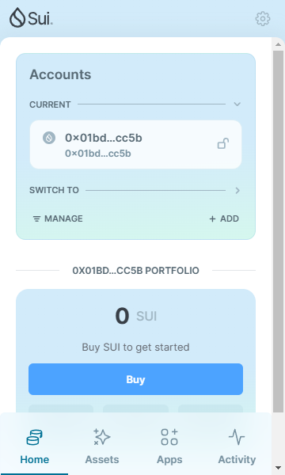
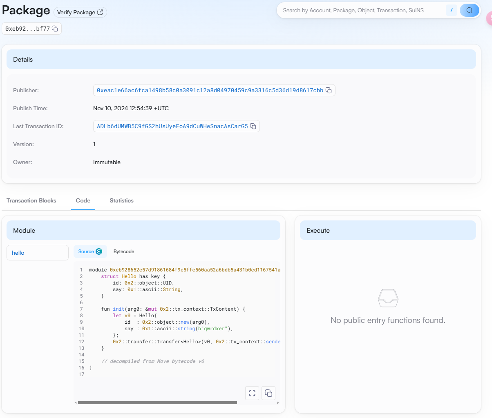
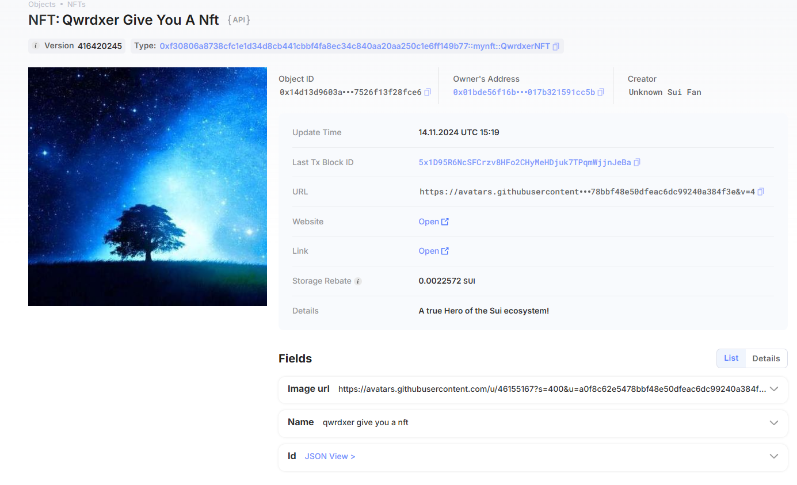

## 基本信息
- Sui钱包地址: `0x01bde56f16b7ad996f559ff2d34fa7a11030a8f303ff69bfe1017b321591cc5b`
> 首次参与需要完成第一个任务注册好钱包地址才被合并，并且后续学习奖励会打入这个地址
- github: `qwrdxer`

## 个人简介
- 工作经验: 研究生在读
- 技术栈: `javascript` `python` `rust`
> 重要提示 请认真写自己的简介
- 有web2开发、大模型相关项目经验、学习过solidity,对move生态感兴趣,共同学习进步。
- 联系方式: tg: `https://t.me/qwrdxer` 

## 任务

##   01 hello move  
- [✓] Sui cli version: sui 1.37.1-homebrew
- [✓] Sui钱包截图: 
- [✓] package id: 0xeb928652e57d91861684f9e5ffe560aa52a6bdb5a431b0ed1167541a39ccbf77
- [✓] package id 在 scan上的查看截图:

##   02 move coin
- [✓] My Coin package id : 0x2a9a3474683292a9f88e5a404c191db5b7e9c8017380344d1ebc0d68caa3f369
- [✓] Faucet package id : 0x2a9a3474683292a9f88e5a404c191db5b7e9c8017380344d1ebc0d68caa3f369
- [✓] 转账 `My Coin` hash: CkKeFBSFptCTo2Yq8DJhirsMrpkDCwhkiTCuHHWDUGaw
- [✓] `Faucet Coin` address1 mint hash:7xzyJPKZbwvh8HRC4fEsTjUKfyAqTY3SMhVY2KpQTW55
- [✓] `Faucet Coin` address2 mint hash:GDg4keQ1fGQVjoSHwiEPeZ3D29UUWNVgAPPEB1ui2LV8

##   03 move NFT
- [√] nft package id : 0xf30806a8738cfc1e1d34d8cb441cbbf4fa8ec34c840aa20aa250c1e6ff149b77
- [√] nft object id : 0x14d13d9603ad0ffe955f2051f2163ea357478d5f2a0a74f1c77526f13f28fce6
- [√] 转账 nft  hash: Bez242vQST4sPW97UD881MG3NA1HdDfDPySVpYLcuRs9
- [√] scan上的NFT截图:

##   04 Move Game
- [√] game package id : 0x12aa2008a54b7be74ef8f4ee515498f8972299b22a90840ea14379ebc935f62f
- [√] deposit Coin hash: 5hnSNVcaQUras1gmpWGsuRSBexrrFgtLmoSgnXrNqgRn
- [√] withdraw `Coin` hash: FPqPELcg2PzXqePvVDdtU51jedV8tgKZGjP81zAWkX8t
- [√] play game hash: Cstddpqusyiy8tcWepr8BvZJtW1kdnpgPXqPrHojytRW
                        3fEZrqVfa5qVMMzq35gDktiqF1RNA9sSJg7bh8KJzs7i

##   05 Move Swap
- [√] swap package id : 0x48251c536f9c06c5a68d958ce4c1ba6ee1d1bf36698ab42b0c1929d12969a840
- [√] call swap CoinA-> CoinB  hash : 5Gpmj7w7nonDEa48qtrsHyvaxSxXrY47Vonsqmyg5TdR
- [√] call swap CoinB-> CoinA  hash : F4vBUtrMMEJmtcUNvKfJEaPghYj37U3ehFkfVW5o155W

##   06 Dapp-kit SDK PTB
- [] save hash :

##   07 Move CTF Check In
- [] CLI call 截图 : 
- [] flag hash :

##   08 Move CTF Lets Move
- [] proof : 
- [] flag hash :
