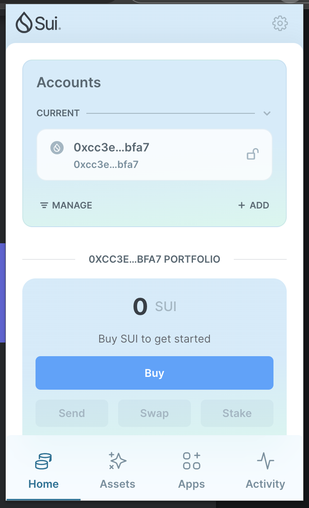
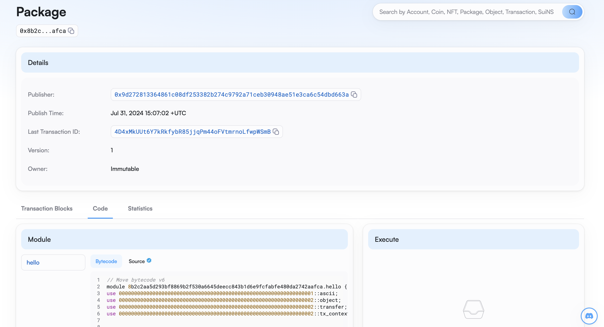

## 基本信息
- Sui钱包地址: `0xcc3e057cba646c478c4f356bfff8aa7b69013335236f9e4c4cf865d76012bfa7`
> 首次参与需要完成第一个任务注册好钱包地址才被合并，并且后续学习奖励会打入这个地址
- github: `rainbow`

## 个人简介
- 工作经验: 5年
- 技术栈:`Javascript、Typescript、Golang`
> 重要提示 请认真写自己的简介
- 在职打工仔，对Move和sui特别感兴趣，想通过Move入门区块链并了解sui
- 联系方式: Email: `87624931@qq.com`

## 任务

##   01 hello move  
- [] Sui cli version:sui 1.29.2-homebrew
- [] Sui钱包截图:
- [] package id: 0x8b2c2aa5d293bf8869b2f530a6645deecc843b1d6e9fcfabfe480da2742aafca
- [] package id 在 scan上的查看截图:

##   02 move coin
- [] My Coin package id : 
- [] Faucet package id : 
- [] 转账 `My Coin` hash:
- [] `Faucet Coin` address1 mint hash:
- [] `Faucet Coin` address2 mint hash:

##   03 move NFT
- [] nft package id :
- [] nft object id : 
- [] 转账 nft  hash:
- [] scan上的NFT截图:

##   04 Move Game
- [] game package id :
- [] deposit Coin hash:
- [] withdraw `Coin` hash:
- [] play game hash:

##   05 Move Swap
- [] swap package id :
- [] call swap CoinA-> CoinB  hash :
- [] call swap CoinB-> CoinA  hash :

##   06 Dapp-kit SDK PTB
- [] save hash :

##   07 Move CTF Check In
- [] CLI call 截图 : 
- [] flag hash :

##   08 Move CTF Lets Move
- [] proof : 
- [] flag hash :
