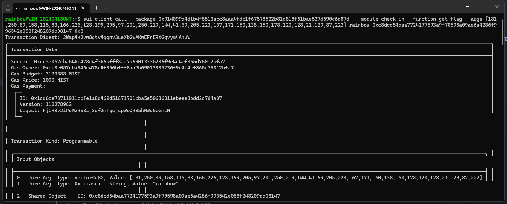

## 基本信息
- Sui钱包地址: `0xcc3e057cba646c478c4f356bfff8aa7b69013335236f9e4c4cf865d76012bfa7`
> 首次参与需要完成第一个任务注册好钱包地址才被合并，并且后续学习奖励会打入这个地址
- github: `rainbow`

## 个人简介
- 工作经验: 5年
- 技术栈:`Javascript、Typescript、Golang`
> 重要提示 请认真写自己的简介
- 在职打工仔，对Move和sui特别感兴趣，想通过Move入门区块链并了解sui
- 联系方式: Email: `87624931@qq.com`

## 任务

##   01 hello move  
- [] Sui cli version:sui 1.29.2-homebrew
- [] Sui钱包截图:
- [] package id: 0x8b2c2aa5d293bf8869b2f530a6645deecc843b1d6e9fcfabfe480da2742aafca
- [] package id 在 scan上的查看截图:

##   02 move coin
- [] My Coin package id : 0x5141c8439abcb4504de35932fa4bb97f08cb572e789203451291d54d294f2751
- [] Faucet package id : 0x4280d7b4218d048382b33c5e4ca907f69d140e3c4bb529d2ab6faa04f10f313f
- [] 转账 `My Coin` hash: GZa3qpibshUe1jqCtF5C4soEkz2kWQNTs47wq5takqR7
- [] `Faucet Coin` address1 mint hash:7xSs7jBDDXZ615o7zGAxCiYtxdRK7ZVgd6LrepGFkPYJ
- [] `Faucet Coin` address2 mint hash:35rRaGQSjQhEujV3xmQEQPGecanskqzXt2za9xtoBdTy

##   03 move NFT
- [] nft package id : 0x3532d8388f5b9bb382cb2f2569d279d437a253f29be503bdc602f03f0cdb1b7c
- [] nft object id : 0x9c00c8e57cd6fc0c97a1507933797a23ac177c084aa4d05750600c5cdf4b5db9
- [] 转账 nft  hash: A17Y2wY46xaxx36PMLmEY65t6nNEik5WnvTfN6MEQ9ZX
- [] scan上的NFT截图:

##   04 Move Game
- [] game package id : 0xc33f708e378c2bb53f62dcb70d40e25e95e221067d2cd0bb397e28d55e73ed41
- [] deposit Coin hash: DRqpjzwTiiSTixLj8jK8PJgejPr1KCvbCpeMxRCEG9ag
- [] withdraw `Coin` hash: 8Pjip62sqtpw4DSKq5E6h6SmqYtHmzbcfgWFDdUktLxm
- [] play game hash(devnet 环境的，因为0x8不能使用): 87mGkWf1d3NeDU6U99GyF583Em47a8rCbuWDVKzTKo5C

##   05 Move Swap
- [] swap package id : 0x74909d0331afcc1c9f8777d4d06cc3e540cd53e60659436cad2d588ab1f41008
- [] call swap CoinA-> CoinB  hash : GjxHQRyJKte43gyhzGhNC1oqnf6fi9wJsDnuhQ5xHvM7
- [] call swap CoinB-> CoinA  hash : GMxWLCXmW4HTPimGfmBSNwNwwTbeZfsCbcWpt5rvCWmz

##   06 Dapp-kit SDK PTB
- [] save hash : 8zTsA4GdX3np1GaFyZ25YDRjzKm1thMyLJkYzuMDavGj

##   07 Move CTF Check In
- [] CLI call 截图 : 
- [] flag hash : 2Wap4K2vw8gtv4qqmv3ueXbGwAKwEFnERXGgvym4AhuW

##   08 Move CTF Lets Move
- [] proof : [129,204,133,3,0,0,0,0]
- [] flag hash : 34EbjZ58Zv1mduPxr7P3BR8dQYEQyWyVcPJy3jSetUSb
