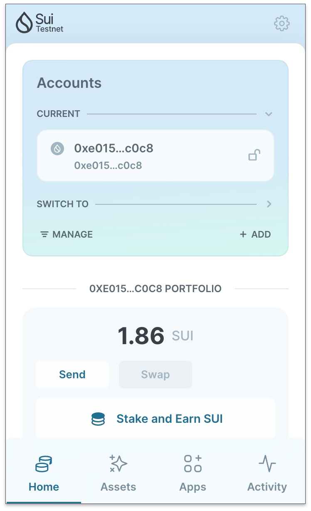
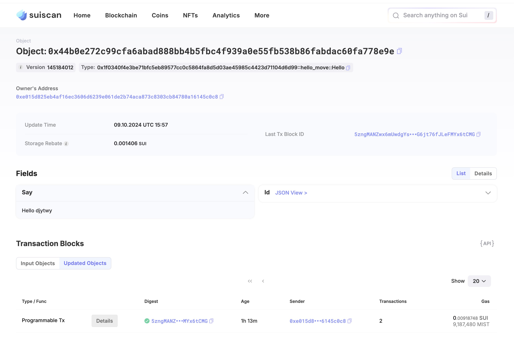

## 基本信息
- Sui钱包地址: `0xe015d825eb4af16ec3606d6239e061de2b74aca873c8303cb84780a16145c0c8`
> 首次参与需要完成第一个任务注册好钱包地址才被合并，并且后续学习奖励会打入这个地址
- github: `djytwy`

## 个人简介
- 工作经验: 5年
- 技术栈: `JavaScript` `Python`
> 重要提示 请认真写自己的简介
- 多年web2开发经验，对Move特别感兴趣，想通过Move入门区块链
- 联系方式: tg: `Rainer_Tian` 

## 任务

##   01 hello move  
- [] Sui cli version: 1.35.0
- [] Sui钱包截图: 
- [] package id: 0x1f0340f4e3be71bfc5eb89577cc0c5864fa8d5d03ae45985c4423d71104d6d99
- [] package id 在 scan上的查看截图:

##   02 move coin
- [] My Coin package id : 0x2dfd47780fab61591d6363cdfe8974ab7acd8f138063f8463d314ba938e67bd9
- [] Faucet package id : 0xab72fa5cd851998a9349d0dfde47f96f11e6b12d48d9be864d2b1d04bdd9cb2b
- [] 转账 `My Coin` hash:6RfsRtF9eXGHiKqXuD8AKQfrTf8LMMftHhxCrd8h9dKx
- [] `Faucet Coin` address1 mint hash: BaFN6GgyqsDe2CWG3enPHtEnG7HQiBSzDrZUfnvBNEEK
- [] `Faucet Coin` address2 mint hash: D2dAE8cYsf3JL3JrbB652TkWupdWsiMghzZBvaKeaAPy

##   03 move NFT
- [] nft package id :
- [] nft object id : 
- [] 转账 nft  hash:
- [] scan上的NFT截图:

##   04 Move Game
- [] game package id :
- [] deposit Coin hash:
- [] withdraw `Coin` hash:
- [] play game hash:

##   05 Move Swap
- [] swap package id :
- [] call swap CoinA-> CoinB  hash :
- [] call swap CoinB-> CoinA  hash :

##   06 Dapp-kit SDK PTB
- [] save hash :

##   07 Move CTF Check In
- [] CLI call 截图 : 
- [] flag hash :

##   08 Move CTF Lets Move
- [] proof : 
- [] flag hash :
