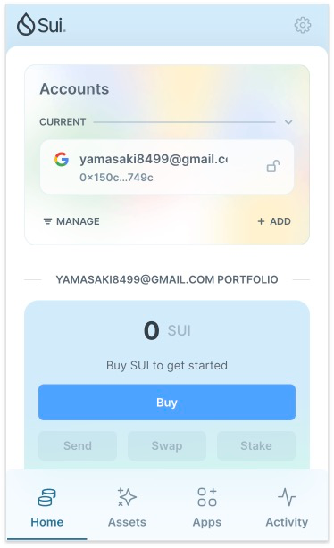
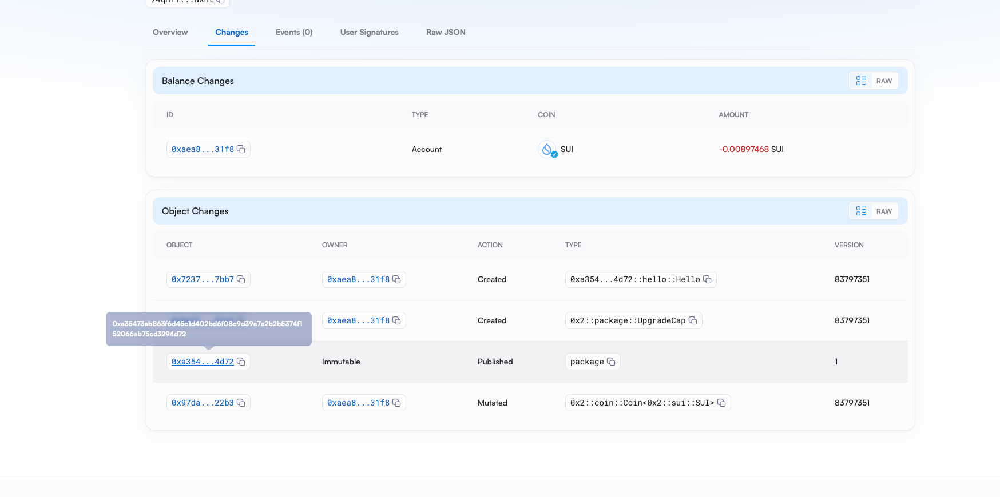

## 基本信息
- Sui钱包地址: `0x150c322e69fcae6299d523b9bb03b15769f094aa1aeb3a404337084467df749c`
> 首次参与需要完成第一个任务注册好钱包地址才被合并，并且后续学习奖励会打入这个地址
- github: `rayliu8499`

## 个人简介
- 工作经验: 10年+
- 技术栈: `Java`
> 重要提示 请认真写自己的简介
- 多年web2开发经验，对Move特别感兴趣，想通过Move入门区块链
- 联系方式: tg: `https://t.me/RayL0909` 

## 任务   

##   01 hello move  
- [x] Sui cli version: 1.30
- [x] Sui钱包截图: 
- [x] package id: 0xa35473ab863f6d45c1d402bd6f08c9d39a7e2b2b5374f152066ab75cd3294d72
- [x] package id 在 scan上的查看截图:

##   02 move coin
- [x] My Coin package id : 0x2694b86f735ff743669316a77b735ef2a30714fc4ddc82430eb65325296444cd
- [x] Faucet package id : 0x862d73c6997143441bba2fe25883efb291181cb9f84e38caaaadd97445fa926f
- [x] 转账 `My Coin` hash: HQwsGjW9kHWSeGtmw1qP8inn9Di2BjiumUhm5ShrK375
- [x] `Faucet Coin` address1 mint hash: C5fgn4PR6DfTsuySqrr3yPbXnLK2a4iEpGSE4eZuqWWH
- [x] `Faucet Coin` address2 mint hash: 2NkJ2tY8ufEfaZML3PukeXb8ueQXiK9PmYusmB3MFu9u

##   03 move NFT
- [] nft package id :
- [] nft object id : 
- [] 转账 nft  hash:
- [] scan上的NFT截图:

##   04 Move Game
- [] game package id :
- [] deposit Coin hash:
- [] withdraw `Coin` hash:
- [] play game hash:

##   05 Move Swap
- [] swap package id :
- [] call swap CoinA-> CoinB  hash :
- [] call swap CoinB-> CoinA  hash :

##   06 Dapp-kit SDK PTB
- [] save hash :

##   07 Move CTF Check In
- [] CLI call 截图 : 
- [] flag hash :

##   08 Move CTF Lets Move
- [] proof : 
- [] flag hash :
