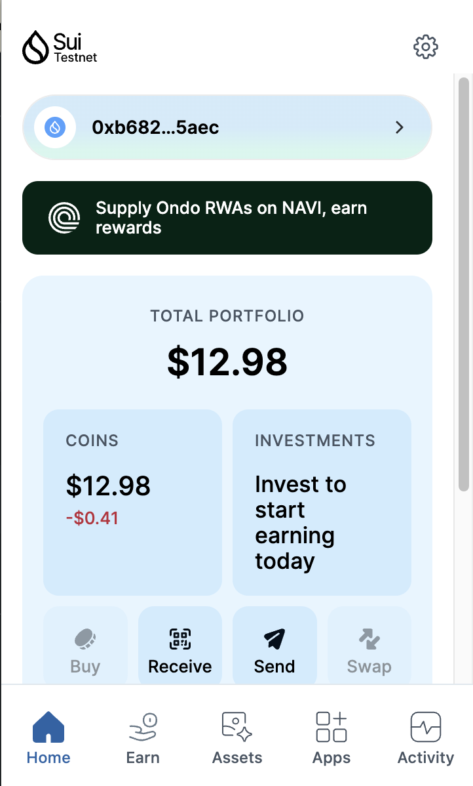
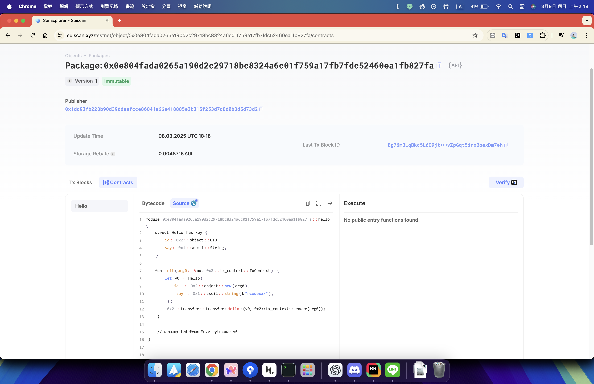

## 基本信息
- Sui钱包地址: `0xb68235d12c4ce59ffba1c64ad8e970e433418f91096c64c621da11e0e49a5aec`
- github: `rcodexxx`

## 个人简介
- 工作经验: 2年
- 技术栈: `Python` `Java`
- 對區塊鏈技術很感興趣, 想藉由sui move語言入門
- 联系方式: email: `chengithub77@gmail.com` 

## 任务

##   01 hello move  
- [x] Sui cli version: sui 1.44.3-b7c83d04c26a
- [x] Sui钱包截图: 
- [x] package id: 0x0e804fada0265a190d2c29718bc8324a6c01f759a17fb7fdc52460ea1fb827fa
- [] package id 在 scan上的查看截图:

##   02 move coin
- [] My Coin package id : 
- [] Faucet package id : 
- [] 转账 `My Coin` hash:
- [] `Faucet Coin` address1 mint hash:
- [] `Faucet Coin` address2 mint hash:

##   03 move NFT
- [] nft package id :
- [] nft object id : 
- [] 转账 nft  hash:
- [] scan上的NFT截图:

##   04 Move Game
- [] game package id :
- [] deposit Coin hash:
- [] withdraw `Coin` hash:
- [] play game hash:

##   05 Move Swap
- [] swap package id :
- [] call swap CoinA-> CoinB  hash :
- [] call swap CoinB-> CoinA  hash :

##   06 Dapp-kit SDK PTB
- [] save hash :

##   07 Move CTF Check In
- [] CLI call 截图 : 
- [] flag hash :

##   08 Move CTF Lets Move
- [] proof : 
- [] flag hash :

