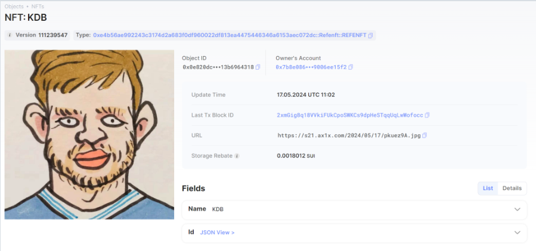

## 基本信息
- Sui钱包地址: `0xd20db33b6982c821421419a681b692edbc22a804419475604a01c40e35e2ab4b`
> 首次参与需要完成第一个任务注册好钱包地址才被合并，并且后续学习奖励会打入这个地址
- github: `refe123`

## 个人简介
- 工作经验: 0年
- 技术栈: `C` `python` `solidity`
> 重要提示 请认真写自己的简介
- 在校大学生计算机专业，喜爱区块链，希望了解更多区块链知识，希望未来从事web3行业
- 联系方式: qq: `2225059047` 

## 任务

##   01 hello move  
- [] Sui cli version:sui-client 1.22.0
- [] Sui钱包截图: 
- [] package id: 0xfc14f627632f65d50765cb99bda06c6d0566edcae000744a9bc578989094f8e4
- [] package id 在 scan上的查看截图:

##   02 move coin
- [] My Coin package id : 0xc4f5b40aa349c4749a7bcdc4289779e663cc807e9293064e3e2220bf2d2a32d4
- [] Faucet package id : 0xcc1b5e53d82c9382680dcb3b5e6d30c72d8c46224276ea1e6827d6dc3cf6b0b7
- [] 转账 `My Coin` hash:GLNEa1JKzXT9pB6A1uXXi21ZNT5ShZwq8V4iRPcQnVYL
- [] `Faucet Coin` address1 mint hash:5LroPAJazsxLKUsUJBrYztiTxAVLy5Sdk7dokN1oqyEC
- [] `Faucet Coin` address2 mint hash:HnUqTk7bJY4MKmCzqgSdpXdcRXUDiFRDxSCBGvcc3QfE

##   03 move NFT
- [] nft package id :0xe4b56ae992243c3174d2a683f0df960022df813ea4475446346a6153aec072dc
- [] nft object id : 0x0e820dc463928a998b1ceae0a67e8e3dabd47e116e406e378a7bdc13b6964318
- [] 转账 nft  hash:2xmGig8q18VVkiFUkCpoSWKCs9dpHeSTqqUqLwWofocc
- [] scan上的NFT截图:

##   04 Move Game
- [] game package id :
- [] deposit Coin hash:
- [] withdraw `Coin` hash:
- [] play game hash:

##   05 Move Swap
- [] swap package id :
- [] call swap CoinA-> CoinB  hash :
- [] call swap CoinB-> CoinA  hash :

##   06 SDK PTB
- [] save hash :
