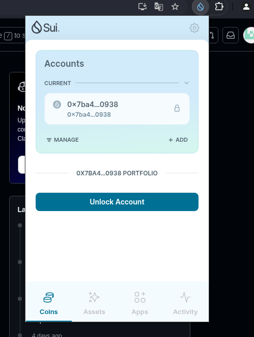
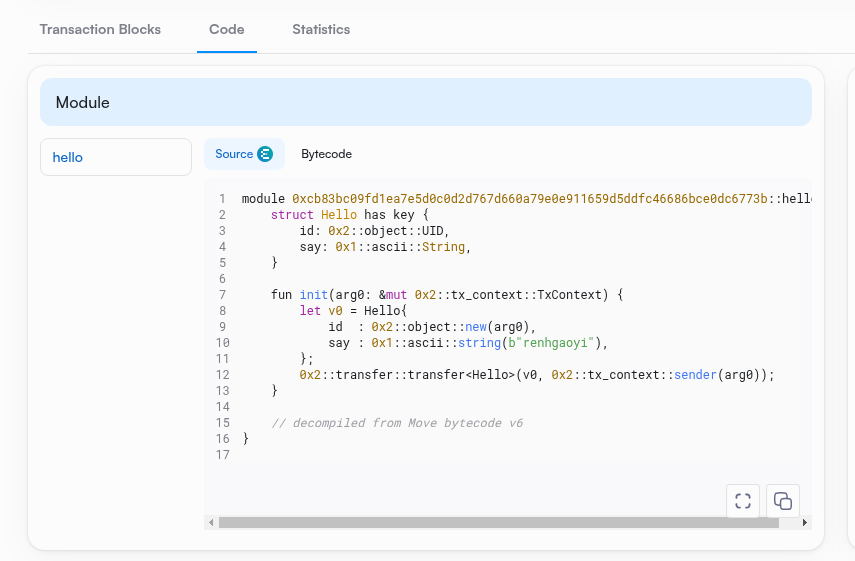
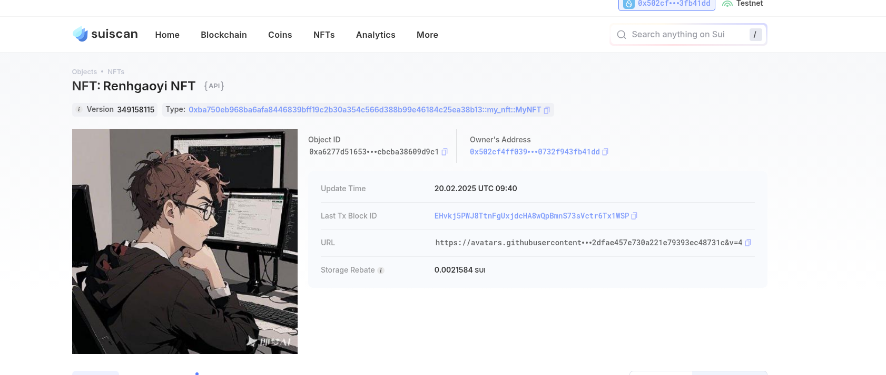

## 基本信息
- Sui钱包地址: `0x7ba47d8343cf5e358f81511a56bb694ca9f35dafeb0513fb5c1ca030a8340938`
> 首次参与需要完成第一个任务注册好钱包地址才被合并，并且后续学习奖励会打入这个地址
- github: `renhgaoyi`

## 个人简介
- 工作经验: x年
- 技术栈: `Rust` `C++`
> 重要提示 请认真写自己的简介
- 多年web2开发经验，对Move特别感兴趣，想通过Move入门区块链
- 联系方式: tg: `xxx` 

## 任务

##   01 hello move  
- [√] Sui cli version:sui 1.42.1-homebrew

- [√] Sui钱包截图: 
- [√] package id: 0xcb83bc09fd1ea7e5d0c0d2d767d660a79e0e911659d5ddfc46686bce0dc6773b
- [√] package id 在 scan上的查看截图:

##   02 move coin
- [] My Coin package id :
- [] Faucet package id :
- [] 转账 `My Coin` 
- [] `Faucet Coin` 
- [] `Faucet Coin` 

##   03 move NFT
- [√] nft package id :0xba750eb968ba6afa8446839bff19c2b30a354c566d388b99e46184c25ea38b13
- [√] nft object id : 0xa6277d51653c442ba00190d14f164799e1aa834aa32a470c83cbcba38609d9c1
- [√] 转账 nft  hash:tuRfsRiky8NuPpNeFqibsoccBHcsH1xeNX7M8cUmmhA
- [√] scan上的NFT截图:

##   04 Move Game
- [] game package id :
- [] deposit Coin hash:
- [] withdraw `Coin` hash:
- [] play game hash:

##   05 Move Swap
- [] swap package id :
- [] call swap CoinA-> CoinB  hash :
- [] call swap CoinB-> CoinA  hash :

##   06 Dapp-kit SDK PTB
- [] save hash :

##   07 Move CTF Check In
- [] CLI call 截图 : 
- [] flag hash :

##   08 Move CTF Lets Move
- [] proof : 
- [] flag hash :

