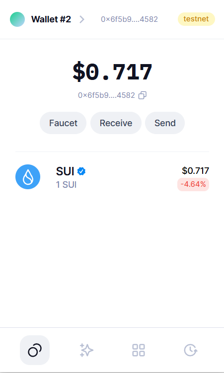
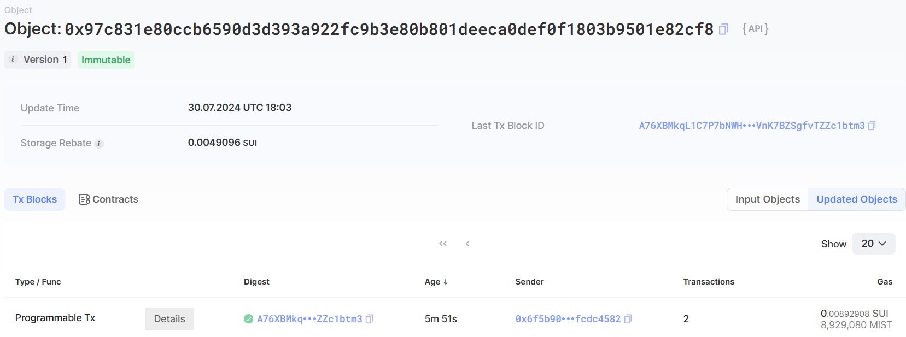
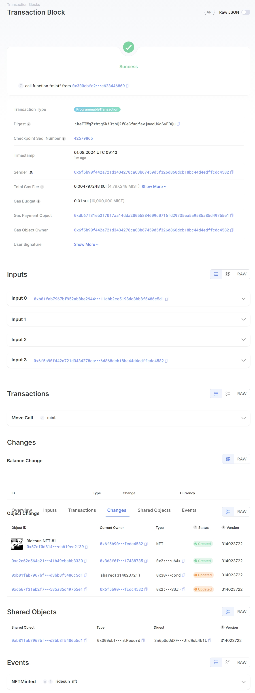
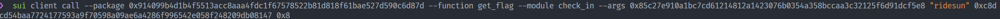

## 基本信息
- Sui钱包地址: `0x6f5b90f442a721d3434278ca03b67459d5f326d868dcb18bc44d4edffcdc4582`
> 首次参与需要完成第一个任务注册好钱包地址才被合并，并且后续学习奖励会打入这个地址
- github: `ridesun`

## 个人简介
- 工作经验: 0年
- 技术栈: `Rust`
> 重要提示 请认真写自己的简介
- 学生，有Rust开发经验，希望从Move入门Web3
- 联系方式: tg: `@ridesun` 

## 任务

##   01 hello move  
- [x] Sui cli version: sui 1.30.1-a4185da5659d
- [x] Sui钱包截图: 
- [x] package id: 0x97c831e80ccb6590d3d393a922fc9b3e80b801deeca0def0f1803b9501e82cf8
- [x] package id 在 scan上的查看截图:

##   02 move coin
- [x] My Coin package id : 0xe322464faf849bd2c56afb53350048389a4f3ff71eabf564097c8f175e856847
- [x] Faucet package id : 0x520cfde819014eaaf85e702c906565e368d9e9a32785c76ae7ac589e1395753a
- [x] 转账 `My Coin` hash: 9mbic71o1uwrHeUqtSKgYJwjcV64jsQsWgzHWDFVa9w8
- [x] `Faucet Coin` address1 mint hash: 7f2cLzddr1oBwRVpYRYTubrvPwUUsNZYD29UtJ2ZFnNS
- [x] `Faucet Coin` address2 mint hash: FMMzebLMpCwDixpaCot64mgCqceVb4CnwXP7WAWBZEvi

##   03 move NFT
- [x] nft package id : 0x300cbfd291205c7452c5c51d1cf8e60995227470879d59957a9107c623446869
- [x] nft object id : 0xb81fab7967bf952ab8be2944f7e1d6ed6f61211dbb2ce5198dd3bb8f5486c5d1
- [x] 转账 nft  hash: 4mQVheMhubqB7rrTfYkyeHypvyEmpCDoY4KgCwWtufxL
- [x] scan上的NFT截图:

##   04 Move Game
- [x] game package id : 0x842f18b508c738d757e046a8fcde39698ee8e7300040263a30ddea37ea0eb066
- [x] deposit Coin hash: 8PpUeVHcW6BeGjUzuoqhAD25G66CjD42NnJmmps8x6Vc
- [x] withdraw `Coin` hash: Eet8C4FSewr1Rrngm2ARgxom3P8dSGu4pWfTKSm84wYt
- [x] play game hash: CZDeXM4778xePE3wrT7TEzvWCD9diS9GCxNQsBthLUV2

##   05 Move Swap
- [x] swap package id : 0x60753f8477069f5de50c72453eff0c5fda851b01a299a4b137a1e4450bc2a45c
- [x] call swap CoinA-> CoinB  hash : 8jbN6uMnZUw4VWzkUQzhFkSLVtD8LnZp3MJQ5gsSLp6P
- [x] call swap CoinB-> CoinA  hash : 8Ty5duUj8KMvNQnBFjN6ADadRxyfUV4MmAVwGSa3duYJ

##   06 Dapp-kit SDK PTB
- [x] save hash : 9FtiwdNAoi4zo51idFUaayDStgdYqQXU3jWdXo5fhd4D

##   07 Move CTF Check In
- [x] CLI call 截图 : 
- [x] flag hash : FPfes22udv7VvXHsmXQARj4bAGoxravdEUeXc5b7ArDi

##   08 Move CTF Lets Move
- [x] proof : 530ae4
- [x] flag hash : GdfREreZoN8GLxqPxjhqLnYTVg8AsL9rH7bpWzbtUM7r
