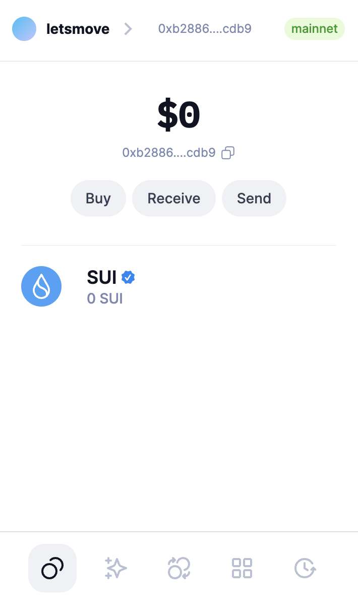
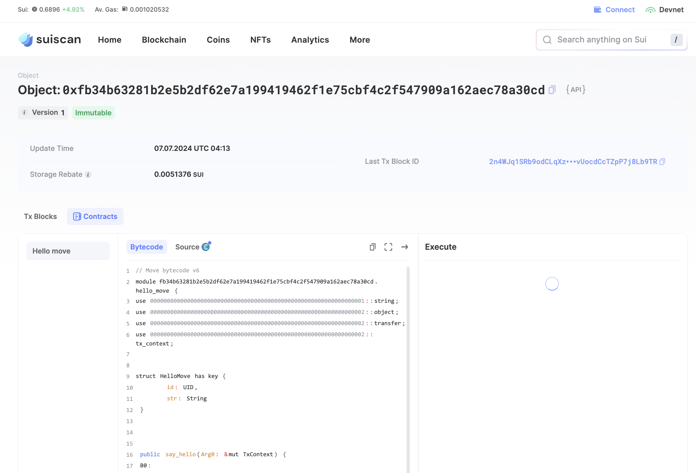
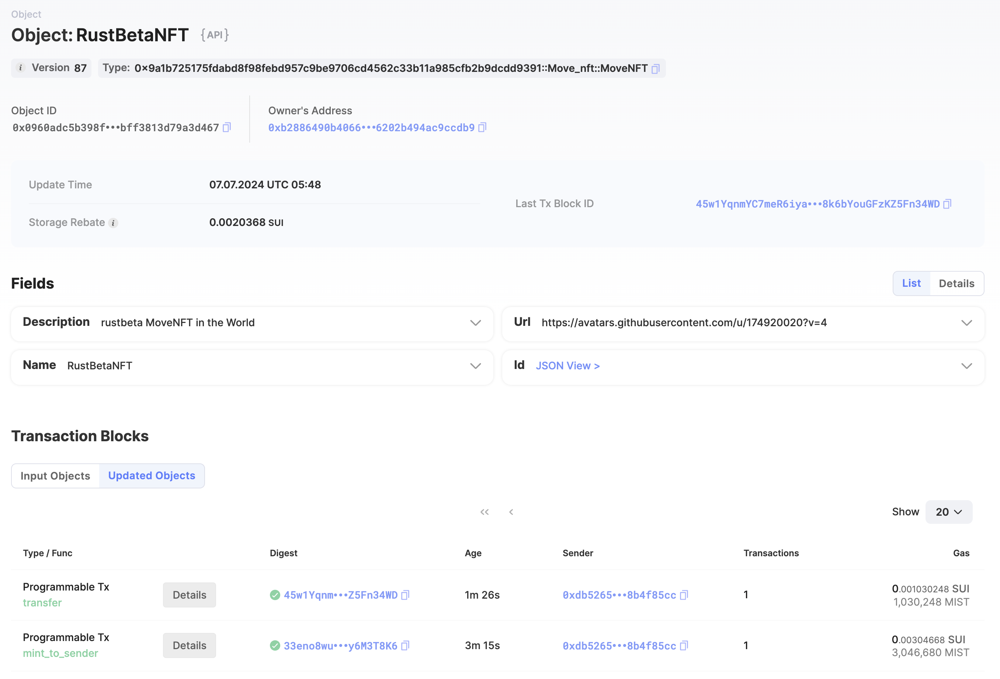

## 基本信息
- Sui钱包地址: `0xb2886490b40668a555515fa7faa9de0b590464a0868ef2876202b494ac9ccdb9`
> 首次参与需要完成第一个任务注册好钱包地址才被合并，并且后续学习奖励会打入这个地址
- github: `rustbeta`

## 个人简介
- 工作经验: 10+年
- 技术栈: `Rust`
> 重要提示 请认真写自己的简介
- 10+年 web2 开发老鸟，失业一年，因为超喜欢 Rust，于是对 Move 特别感兴趣，想通过 Move 入门区块链
- 联系方式: tg: `rustbeta` 

## 任务

##   01 hello move  
- [*] Sui cli version: sui 1.28.0-6a179c58a848
- [*] Sui钱包截图: 
- [*] package id: 0xfb34b63281b2e5b2df62e7a199419462f1e75cbf4c2f547909a162aec78a30cd
- [*] package id 在 scan上的查看截图:

##   02 move coin
- [*] My Coin package id : 0xad41c4fd85b1b8122a32be738ec0c1adff0ef65493a50f0047f6f33ce39a8267
- [*] Faucet package id : 0xad41c4fd85b1b8122a32be738ec0c1adff0ef65493a50f0047f6f33ce39a8267
- [*] 转账 `My Coin` hash: 4SW7smWcZp4sKS5o9vaSAUEjMojpsbkWQmxNrBbfnbUp
- [*] `Faucet Coin` address1 mint hash: H8tab1Wx7SazaPxQSzS4WCfDP58R2oWMqSPWwDnBYHWV
- [*] `Faucet Coin` address2 mint hash: BQPAyxHXXkxv61AF1KZxoV1dYb4JSbfFVfPyFHuVqHrR

##   03 move NFT
- [*] nft package id : 0x9a1b725175fdabd8f98febd957c9be9706cd4562c33b11a985cfb2b9dcdd9391
- [*] nft object id : 0x0960adc5b398f3fbbceee4a00561a31a418636fa64e95047bff3813d79a3d467
- [*] 转账 nft  hash: 45w1YqnmYC7meR6iya4ehQKEH8k6bYouGFzKZ5Fn34WD
- [*] scan上的NFT截图:

##   04 Move Game
- [*] game package id : 0x095ac56b94bb6e364809eb8e4f9e850b880899eb55f5de7da2ca3115c05eab48
- [*] deposit Coin hash:
- [*] withdraw `Coin` hash:
- [*] play game hash:

##   05 Move Swap
- [] swap package id :
- [] call swap CoinA-> CoinB  hash :
- [] call swap CoinB-> CoinA  hash :

##   06 Dapp-kit SDK PTB
- [] save hash :

##   07 Move CTF Check In
- [] CLI call 截图 : 
- [] flag hash :

##   08 Move CTF Lets Move
- [] proof : 
- [] flag hash :
