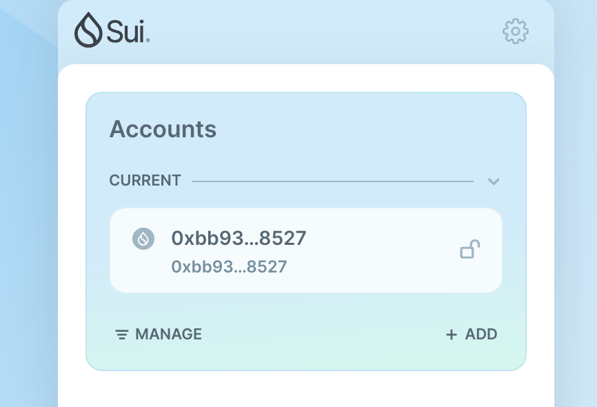
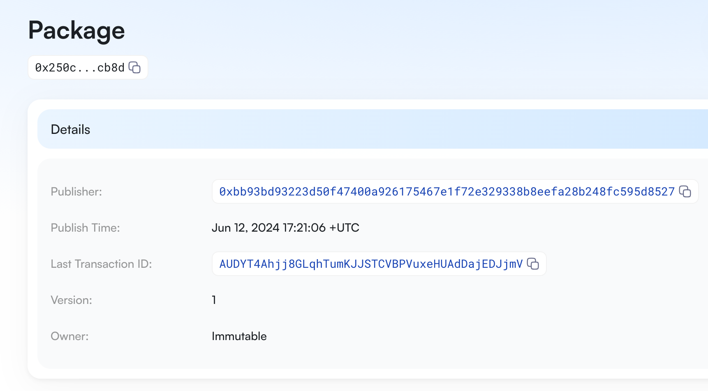
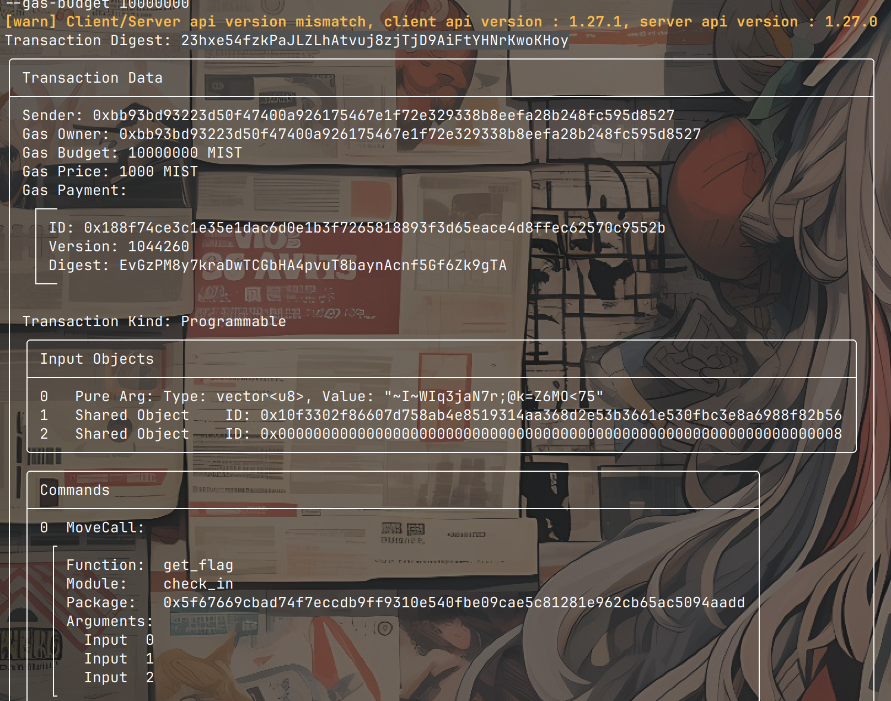

## 基本信息

- Sui钱包地址: `0xbb93bd93223d50f47400a926175467e1f72e329338b8eefa28b248fc595d8527`
  > 首次参与需要完成第一个任务注册好钱包地址才被合并，并且后续学习奖励会打入这个地址
- github: `s-chance`

## 个人简介

- 工作经验: 1年
- 技术栈: `Java` `Vue`
- 对区块链、智能合约感兴趣，想通过Move进一步学习
- 联系方式: tg: `zero trust`

## 任务

## 01 hello move

- [x] Sui cli version: sui 1.27.1-f4512b72bc77
- [x] Sui钱包截图: 
- [x] package id: `0x250c5458cee8d14c06dc7f3a38f6e7c2d7187a402887fbad35093228bcffcb8d`
- [x] package id 在 scan上的查看截图:

## 02 move coin

- [] My Coin package id :
- [] Faucet package id :
- [] 转账 `My Coin` hash:
- [] `Faucet Coin` address1 mint hash:
- [] `Faucet Coin` address2 mint hash:

## 03 move NFT

- [] nft package id :
- [] nft object id :
- [] 转账 nft hash:
- [] scan上的NFT截图:

## 04 Move Game

- [] game package id :
- [] deposit Coin hash:
- [] withdraw `Coin` hash:
- [] play game hash:

## 05 Move Swap

- [] swap package id :
- [] call swap CoinA-> CoinB hash :
- [] call swap CoinB-> CoinA hash :

## 06 Dapp-kit SDK PTB

- [] save hash :

## 07 Move CTF Check In

- [x] CLI call 截图 : 
- [x] flag hash : `23hxe54fzkPaJLZLhAtvuj8zjTjD9AiFtYHNrKwoKHoy`

## 08 Move CTF Lets Move

- [] proof :
- [] flag hash :
