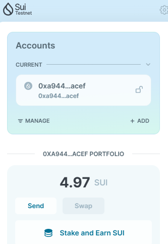
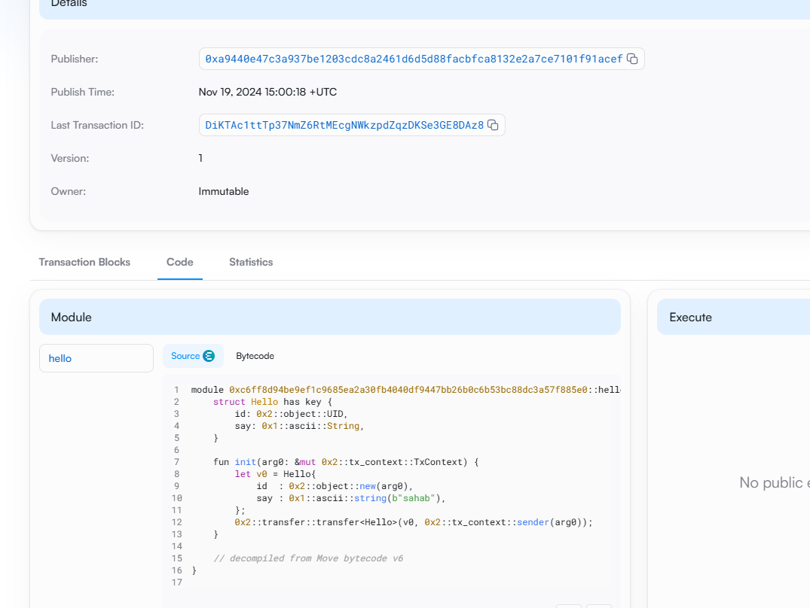
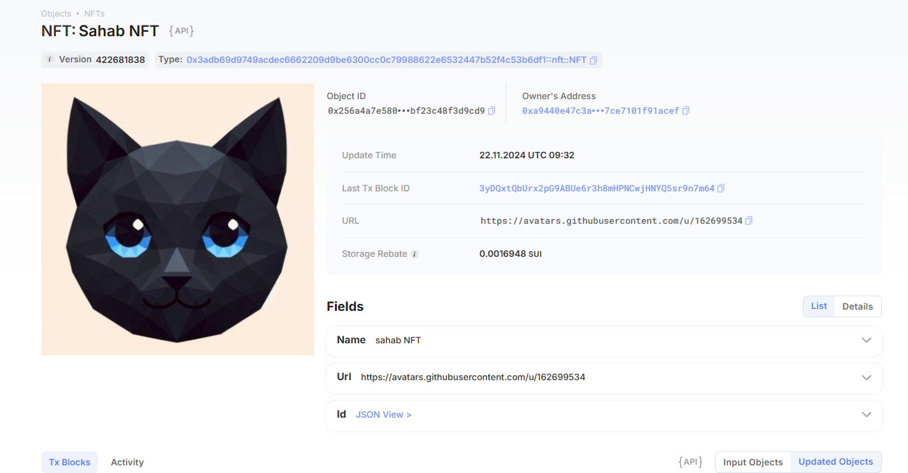
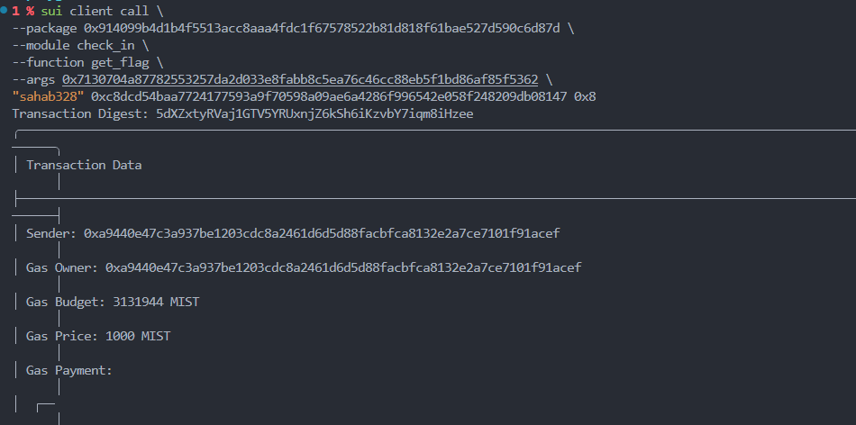

## 基本信息
- Sui钱包地址: `0xa9440e47c3a937be1203cdc8a2461d6d5d88facbfca8132e2a7ce7101f91acef`
> 首次参与需要完成第一个任务注册好钱包地址才被合并，并且后续学习奖励会打入这个地址
- github: `sahab328`

## 个人简介
- 工作经验: 0年
- 技术栈: `Python` `C++`
> 重要提示 请认真写自己的简介
- 研究生，对区块链感兴趣但没有相关经验，想通过学习move进入web3行业。
- 联系方式: tg: `assahab328` 

## 任务

##   01 hello move  
- [x] Sui cli version: sui 1.36.2-3ada97c109cc
- [x] Sui钱包截图: 
- [x] package id: 0xc6ff8d94be9ef1c9685ea2a30fb4040df9447bb26b0c6b53bc88dc3a57f885e0
- [x] package id 在 scan上的查看截图:

##   02 move coin
- [x] My Coin package id : 0x6fad4e0f5f68ed70e322aca3dc36f9d09da758bdcdb8e06661aa18bd8da5ed6a
- [x] Faucet package id : 0x6fad4e0f5f68ed70e322aca3dc36f9d09da758bdcdb8e06661aa18bd8da5ed6a
- [x] 转账 `My Coin` hash: ZcV7yM6YVHLHLmHGQiKWsSuVnNgYCrRvssvVjRudJvD
- [x] `Faucet Coin` address1 mint hash: Bw1nfWS7yS676DbTcd8FBsM7smog3dvyXEXmLTBY9uaq
- [x] `Faucet Coin` address2 mint hash: 9YwG3XNQdMvECpUGTCeHPwYr1dDU45E2YvnoGeenCTmP

##   03 move NFT
- [x] nft package id : 0x3adb69d9749acdec6662209d9be6300cc0c79988622e6532447b52f4c53b6df1
- [x] nft object id : 0x256a4a7e580d0db4613ea2440ac12dbbbe7fda165aab054164bf23c48f3d9cd9
- [x] 转账 nft  hash: 5AJXFajzDP8ji3qmEyJjeB6nMQpFn6oc2KPxNngaiScW
- [x] scan上的NFT截图:

##   04 Move Game
- [x] game package id : 0x90c9955a7f6bf5eadabe0df7d3d029c6a59fe84f0d0ddf05724d8568814e9b57
- [x] deposit Coin hash: GMNxbvHA7aLAPrSBEdhtuvUB8N9hAWfTKUKms8R2TTgW
- [x] withdraw `Coin` hash: EEiQdohPFJZj9RWjRYqdcN7j2ybJ5WhTpJZ4MSxiUTAV
- [x] play game hash: BuwnM2J7hQu4GWXsxkeevfoWVcT2Pfxhjz8BTZzyaWPK

##   05 Move Swap
- [x] swap package id : 0x280c8d9b3f86ef7999f71f201009731655379cf5991d499b1d24798e79c635f3
- [x] call swap CoinA-> CoinB  hash : HhaPr54RFuv2Tjcd67GkuvTAxFDiaHjpDTidzvzzCSZc
- [x] call swap CoinB-> CoinA  hash : 9VPSWSRo2GKPo9dUhrVJLswWEkCSnoJBpjSh96TkVS5H

##   06 Dapp-kit SDK PTB
- [x] save hash : 7BtvbgzfTzRc9U2vKEtoSaA9No5r1vj1W8tGsoeLoiJk

##   07 Move CTF Check In
- [x] CLI call 截图 : 
- [x] flag hash : 5dXZxtyRVaj1GTV5YRUxnjZ6kSh6iKzvbY7iqm8iHzee
##   08 Move CTF Lets Move
- [x] proof : [43,50,34,18,126,133]
- [x] flag hash : 5Hfnn298TfvXT6gMzBiNuLpCtVFN3Rx88HPh9uB1zsmK

