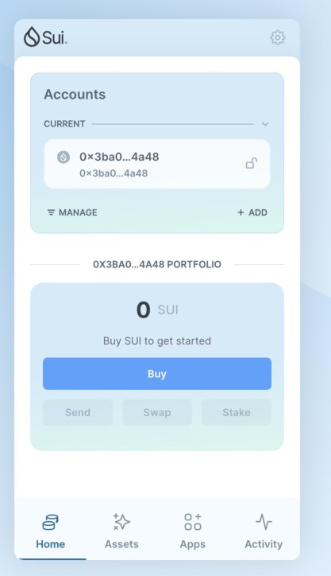
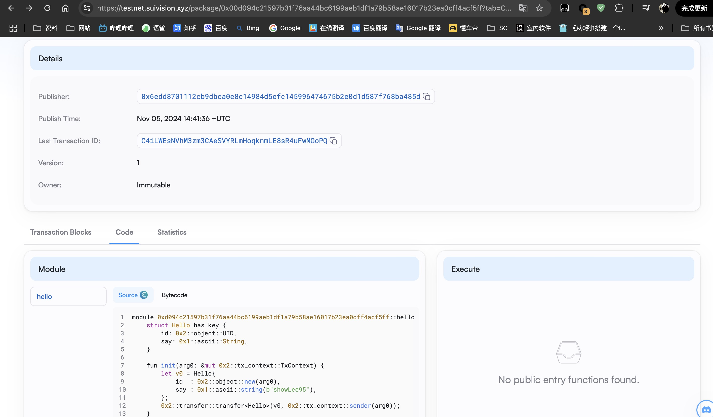

## 基本信息
- Sui钱包地址: `0x3ba03ae62c317aeb4b97b691ab7168db680fd9d04e42bbe8688026b7cd244a48`
> 首次参与需要完成第一个任务注册好钱包地址才被合并，并且后续学习奖励会打入这个地址
- github: `showLee95`

## 个人简介
- 工作经验: 5年
- 技术栈: `go` `python`
> 重要提示 请认真写自己的简介
- 多年传统互联网公司，想寻找新的方向
- 联系方式: tg: `showLee95` 

## 任务

##   01 hello move  
- [x] Sui cli version: sui 1.36.2-homebrew
- [x] Sui钱包截图: 
- [x] package id: 0x00d094c21597b31f76aa44bc6199aeb1df1a79b58ae16017b23ea0cff4acf5ff
- [x] package id 在 scan上的查看截图:

##   02 move coin
- [] My Coin package id : 
- [] Faucet package id : 
- [] 转账 `My Coin` hash:
- [] `Faucet Coin` address1 mint hash:
- [] `Faucet Coin` address2 mint hash:

##   03 move NFT
- [] nft package id :
- [] nft object id : 
- [] 转账 nft  hash:
- [] scan上的NFT截图:

##   04 Move Game
- [] game package id :
- [] deposit Coin hash:
- [] withdraw `Coin` hash:
- [] play game hash:

##   05 Move Swap
- [] swap package id :
- [] call swap CoinA-> CoinB  hash :
- [] call swap CoinB-> CoinA  hash :

##   06 Dapp-kit SDK PTB
- [] save hash :

##   07 Move CTF Check In
- [] CLI call 截图 : 
- [] flag hash :

##   08 Move CTF Lets Move
- [] proof : 
- [] flag hash :
