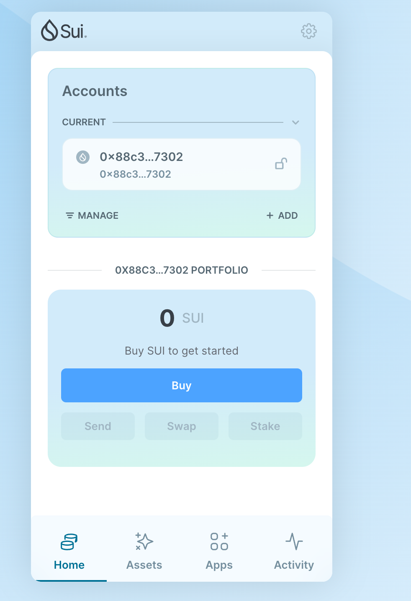
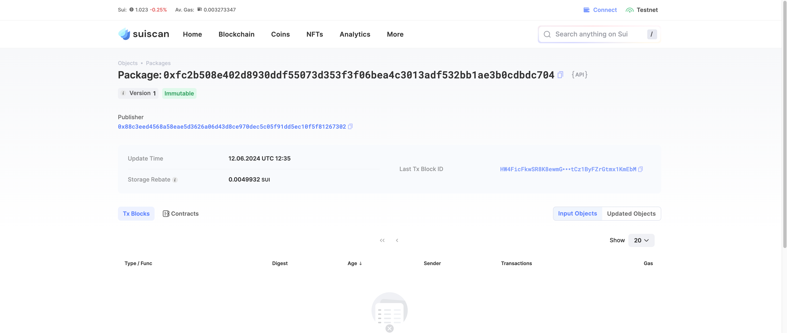
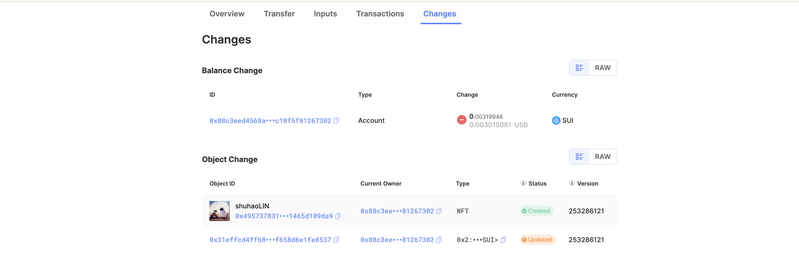
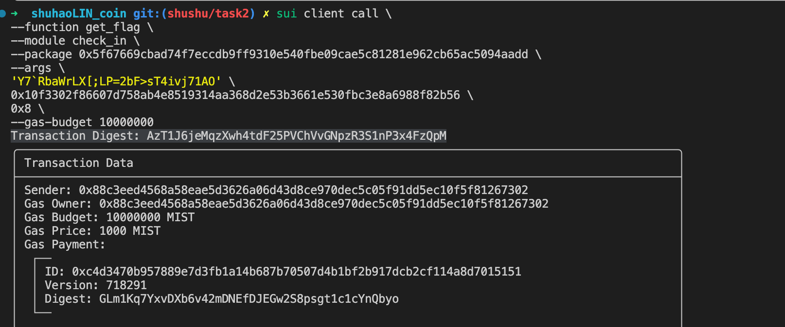

## 基本信息

- Sui钱包地址: 0x88c3eed4568a58eae5d3626a06d43d8ce970dec5c05f91dd5ec10f5f81267302

  > 首次参与需要完成第一个任务注册好钱包地址才被合并，并且后续学习奖励会打入这个地址
- github: shuhaoLIN

## 个人简介

- 工作经验: 3年
- 技术栈: Java\Kotlin
- 希望通过move学习Sui
- 联系方式: linshuhao1017@gmail.com

## 任务

## 01 hello move

- [x] Sui cli version: 1.27.0
- [x] package id: 0xfc2b508e402d8930ddf55073d353f3f06bea4c3013adf532bb1ae3b0cdbdc704
- [x] Sui钱包截图: 
- [x] package id 在 scan上的查看截图:

##   02 move coin
- [x] My Coin package id : 0xe25e1f8480617d0d7919e1487ce60f8b53a87bb6861551bcc1ab92a36ec0c6b7
- [x] Faucet package id : 0xfc99fcf6b305b2d8ace7166a7894980d3ebd5d04fe4827884d4983cb0cf2c0f4
- [x] 转账 `My Coin` hash: 2NqydmWF5r2YZhbonoQPFGBctcKpCpgu9zbo9b8YLoB3
- [x] `Faucet Coin` address1 mint hash: 4qnQXWMQuMBY1EEfqtqSxaRY85eakxpV6mdGVDKFeKz4
- [x] `Faucet Coin` address2 mint hash: 4yHWhs3M5w3QTBtXyCQqSaDBRcttaEV9QUkUmPoGSazC

##   03 move NFT
- [x] nft package id : 0x70cdad7f38b09648a9d9ffbc6872af7c2be6931f84e63363568517d83d06a03e
- [x] nft object id : 0xb3dc2eb170bf63577b4bef49977a2501462ab40f8f09b7bc48c95564ca3cd2bf
- [x] 转账 nft  hash: 7dBeeQ2k6JzZ2UV17iiBd9RLwFBdyxRUXGgRfCwq9CE8
- [x] mint 到自己地址的截图 hash：Bv94n3uVZ5ikfYC11jxGcPpZDvJHRfd9uMKY5LwUqdku 以及截图：

##   07 Move CTF Check In
- [x] CLI call 截图 : 
- [x] flag hash : AzT1J6jeMqzXwh4tdF25PVChVvGNpzR3S1nP3x4FzQpM

##   08 Move CTF Lets Move
- [x] proof : 90510229
- [x] flag hash :8VRjuvCH5pCJepzeYujLCwmxN3TxLcW1F8i4kiCs7Lij
