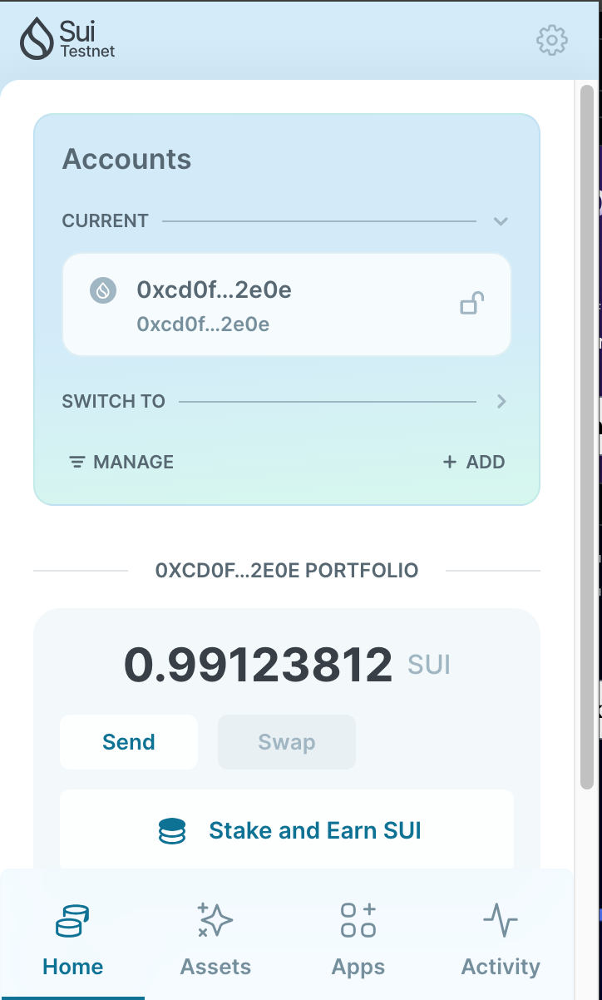
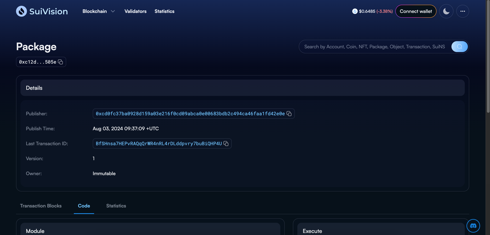
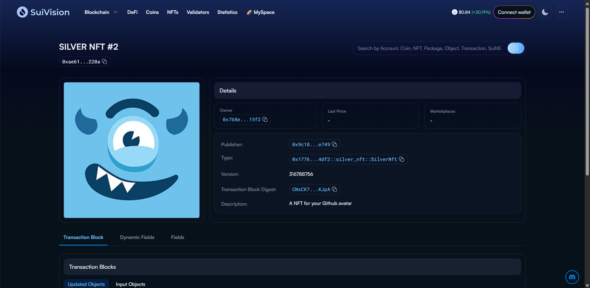

## 基本信息
- Sui钱包地址: `0xf3c4b7e1c61dbefaf6f2ba471fb4d674565ba8156785a3471231788eda91b395`
> 首次参与需要完成第一个任务注册好钱包地址才被合并，并且后续学习奖励会打入这个地址
- github: `silver-x`

## 个人简介
- 工作经验: 8年
- 技术栈: `golang` `java` `nodejs`
> 重要提示 请认真写自己的简介
- 多年game,web2开发经验，对Move特别感兴趣
- 联系方式: tg: `暂无` 

## 任务

##   01 hello move  
- [x] Sui cli version: sui 1.30.1-a4185da5659d
- [x] Sui钱包截图: 
- [x] package id: 0xc12d84f3437b023cb7247abce727f6c4c5cf8e1fd2e48b86de7deb943df2505e
- [x] package id 在 scan上的查看截图:

##   02 move coin
- [x] My Coin package id : 0x45f5bf429676267e8d15571fd8a65a8faa9b3459259627391d9d6eba0a4af392
- [x] Faucet package id : 0x8becd5b8c45664395dc486e4b7e39bf55c89d840b376316ed9605c941ff4a938
- [x] 转账 `My Coin` hash: 2icbcjAh8ceKCnt9MLeigMXaUVHFRh1cMQnVZFPEbQqb
- [x] `Faucet Coin` address1 mint hash: 7FK28jRA2TbASqJzn8vKEXzhVAk3SVqkEFvKCcwx4SZp
- [x] `Faucet Coin` address2 mint hash: GqnE7ekrAKQz72S6Y4QnAJPS1BKtqsjRQZS5wjabgTG

##   03 move NFT
- [x] nft package id : 0x1776fdc1833ecb232f287c44d494b9e61ed954c8764a707be044b882e3dc4df2
- [x] nft object id : 0xe3f5cde078cdd46b5857b1082e46838f2fe3f29cee82a53cb228c7e13f943db2
- [x] 转账 nft  hash: CNxCK7ucmzHCU7GLZzwSrq4KeoS2XyExq81tgpFAKJpA
- [x] scan上的NFT截图:

##   04 Move Game
- [] game package id :
- [] deposit Coin hash:
- [] withdraw `Coin` hash:
- [] play game hash:

##   05 Move Swap
- [] swap package id :
- [] call swap CoinA-> CoinB  hash :
- [] call swap CoinB-> CoinA  hash :

##   06 Dapp-kit SDK PTB
- [] save hash :

##   07 Move CTF Check In
- [] CLI call 截图 : 
- [] flag hash :

##   08 Move CTF Lets Move
- [] proof : 
- [] flag hash :
