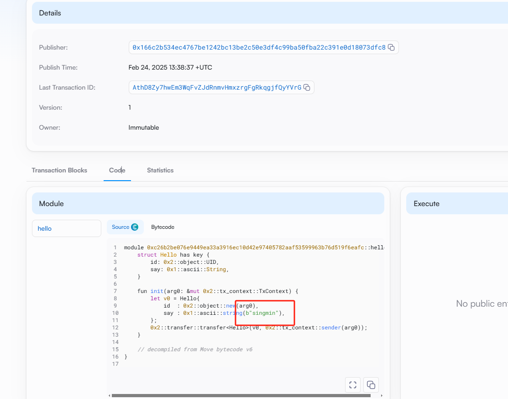

 ## 基本信息
- Sui钱包地址: `0x90ebcdad368bdb78b30a90bd8e24d9a69befa72bf85a17adb7e84fe6d7092ef9`
> 首次参与需要完成第一个任务注册好钱包地址才被合并，并且后续学习奖励会打入这个地址
- github: `singmin`

## 个人简介
- 工作经验: 3年
- 技术栈: `React``VUE2` `VUE3``Typescript`
> 重要提示 请认真写自己的简介
- 多年web2开发经验，对Move特别感兴趣，想通过Move入门区块链
- 联系方式: email: `singminchueng@gmail.com` 

## 任务

##   01 hello move  
- [X] Sui cli version: sui-client 1.43.1-2f52a7283e5f
- [X] Sui钱包截图: 
- [X] package id: 0xc26b2be076e9449ea33a3916ec10d42e97405782aaf53599963b76d519f6eafc 
- [X] package id 在 scan上的查看截图:

##   02 move coin
- [X] My Coin package id : 0x65b40bbac41f161e9049be55fb4f7d2f12cc82fa049433565f366623af9ebaba
- [X] Faucet package id : 0x6a77b56330b3917e3648617aa84cf05a898b6633f51473206b58ccfb01e00034
- [X] 转账 `My Coin` hash: D5aGLmUJK5ZrvsbTr39ern2Rw78yYiPAUQXuuf8GpwUD
- [X] `Faucet Coin` address1 mint hash:5tqT52m7mB3tPkCUkHWjvtKHgLwWmp1jULy4BruPQgiF
- [X] `Faucet Coin` address2 mint hash:4jgQnPgMso7bCj9P6LTo9sDehLjBUHNsxduk9FTiM3m9

##   03 move NFT
- [X] nft package id :0x2d89cfd774f7dc5a4ac6f4cdd8dd8be92294453cc006a03b5dc03b03d1509b9b
- [X] nft object id : 0x51f384b58fcc03401e630bfa30285c0ddb677dfe6899724ac96f77403b0333db
- [X] 转账 nft  hash: BPtFEYnjLERHtxNUXeDpfTuzZPC5xHep3BJQ2ukDCXQK
- [X] scan上的NFT截图:(./images/nft.png)

##   04 Move Game
- [] game package id :
- [] deposit Coin hash:
- [] withdraw `Coin` hash:
- [] play game hash:

##   05 Move Swap
- [] swap package id :
- [] call swap CoinA-> CoinB  hash :
- [] call swap CoinB-> CoinA  hash :

##   06 Dapp-kit SDK PTB
- [] save hash :

##   07 Move CTF Check In
- [] CLI call 截图 : 
- [] flag hash :

##   08 Move CTF Lets Move
- [] proof : 
- [] flag hash :

