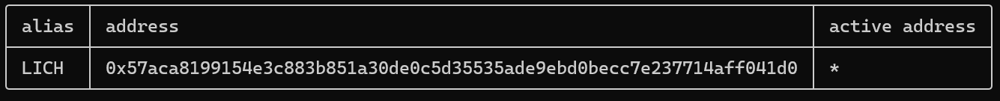
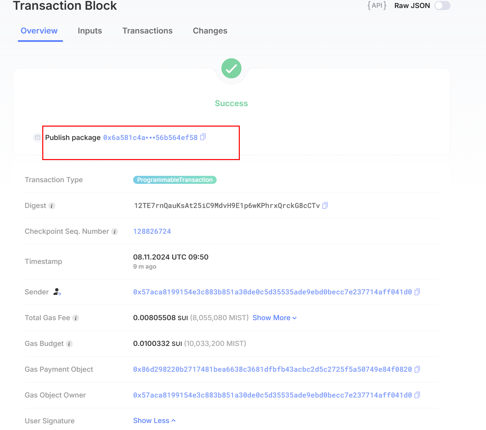

## 基本信息
- Sui钱包地址: `0x57aca8199154e3c883b851a30de0c5d35535ade9ebd0becc7e237714aff041d0`
- github: `sleepingF0x`

## 个人简介
- 工作经验: 5年
- 技术栈: `Go` `Python` `Javascript`
- 对Move特别感兴趣，想通过Move入门区块链，持续为MOVE社区BUILD
- 联系方式: tg: `bgky2` 

## 任务

##   01 hello move  
- [] Sui cli version: sui 1.37.1-7839b9501066
- [] Sui钱包截图: 
- [] package id: 0x6a581c4aa11d136cb79a5cc7aeedff1190e384fdd72a4e77a6a64556b564ef58
- [] package id 在 scan上的查看截图:

##   02 move coin
- [] My Coin package id : 
- [] Faucet package id : 
- [] 转账 `My Coin` hash:
- [] `Faucet Coin` address1 mint hash:
- [] `Faucet Coin` address2 mint hash:

##   03 move NFT
- [] nft package id :
- [] nft object id : 
- [] 转账 nft  hash:
- [] scan上的NFT截图:

##   04 Move Game
- [] game package id :
- [] deposit Coin hash:
- [] withdraw `Coin` hash:
- [] play game hash:

##   05 Move Swap
- [] swap package id :
- [] call swap CoinA-> CoinB  hash :
- [] call swap CoinB-> CoinA  hash :

##   06 Dapp-kit SDK PTB
- [] save hash :

##   07 Move CTF Check In
- [] CLI call 截图 : 
- [] flag hash :

##   08 Move CTF Lets Move
- [] proof : 
- [] flag hash :
