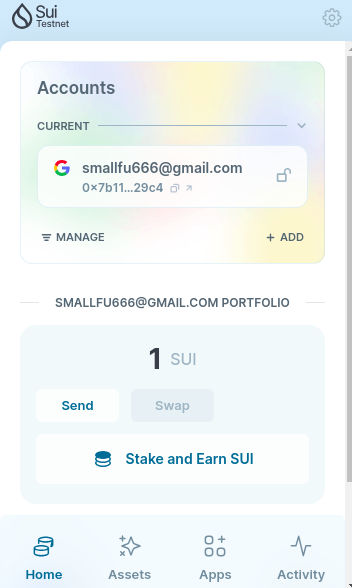
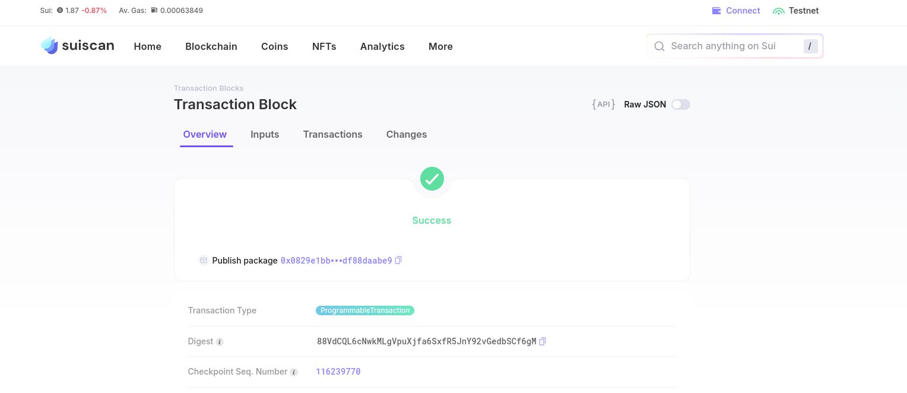

## 基本信息
- Sui钱包地址: `0x7b11abed6c92936453b46a29b836ccfbdcda58a26658b1ffe851dbd0f3bf29c4`
> 首次参与需要完成第一个任务注册好钱包地址才被合并，并且后续学习奖励会打入这个地址
- github: `smallfu6`

## 个人简介
- 工作经验: 5年
- 技术栈: `Golang` `Solidity` `React` 
> 重要提示 请认真写自己的简介
- 多年web2开发经验，喜欢钻研技术，All in Web3，正在学习Solidity，Move, Ton
- 联系方式: 
	email: `smallfu666@gmail.com`

## 任务

##   01 hello move  
- [X] Sui cli version: sui 1.34.2-c9ae0f9282a0
- [X] Sui钱包截图: 
- [X] package id: `0x0829e1bba17aca0584e03b211fa1ab3f0887a8f3dcfb025201595cdf88daabe9`
- [X] package id 在 scan上的查看截图:

##   02 move coin
- [] My Coin package id : 
- [] Faucet package id : 
- [] 转账 `My Coin` hash:
- [] `Faucet Coin` address1 mint hash:
- [] `Faucet Coin` address2 mint hash:

##   03 move NFT
- [] nft package id :
- [] nft object id : 
- [] 转账 nft  hash:
- [] scan上的NFT截图:

##   04 Move Game
- [] game package id :
- [] deposit Coin hash:
- [] withdraw `Coin` hash:
- [] play game hash:

##   05 Move Swap
- [] swap package id :
- [] call swap CoinA-> CoinB  hash :
- [] call swap CoinB-> CoinA  hash :

##   06 Dapp-kit SDK PTB
- [] save hash :

##   07 Move CTF Check In
- [] CLI call 截图 : 
- [] flag hash :

##   08 Move CTF Lets Move
- [] proof : 
- [] flag hash :
