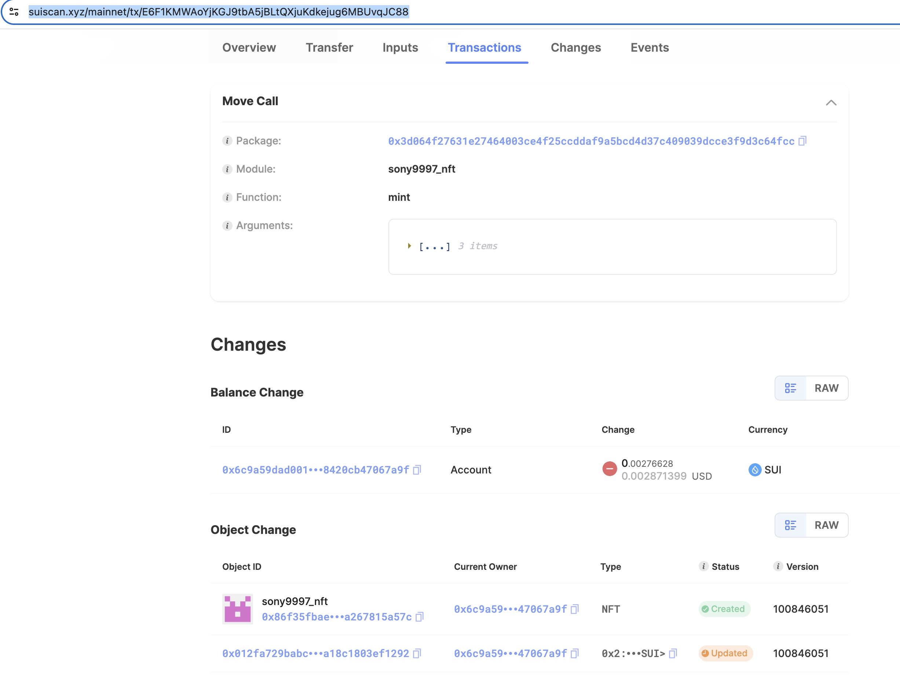

## 基本信息
- Sui钱包地址: `0x6c9a59dad0019e848593c43ba9080a3dfcaf9b2f23c2964a778420cb47067a9f`
> 首次参与需要完成第一个任务注册好钱包地址才被合并，并且后续学习奖励会打入这个地址
- github: `sony9997`

## 个人简介
- 工作经验: 20年
- 技术栈: `Java` `JavaScript` `Python` `Shell` `Android` `Vue` `Big Data`
- 多年Web2开发经验，喜欢研究技术，一直对区块链感兴趣，希望从Sui Move开始切入区块链这个行业。
- 联系方式: tg:[@sony9997](https://t.me/sony9997)

## 任务

##   01 hello move  
- [x] package id: (testnet) `0x9162eddf7265f050491f1f983840eac894acf43ef6011b312501ca33c7e371c4`
https://suiscan.xyz/testnet/tx/GfyZhPrw62qEsBYG9djSGiGuujpCuCudZpknH99Le6Xb

##   02 move coin
- [x] My Coin package id : [0x5b9f8eda9662027d7ec113f55d500ac8f1a1861547a3acb62f0fe6c28ec5bae2](https://suiscan.xyz/mainnet/object/0x5b9f8eda9662027d7ec113f55d500ac8f1a1861547a3acb62f0fe6c28ec5bae2/txs)
- [x] Faucet package id : [0x00192acee9f7ea45cc08f5eaf84dad1f3d79287f7b5cfb10b41ec241de8c8505](https://suiscan.xyz/mainnet/object/0x00192acee9f7ea45cc08f5eaf84dad1f3d79287f7b5cfb10b41ec241de8c8505/txs)
- [x] 转账 `My Coin` hash: [2pKuiqMf6XMxWu4xefzVuiKkFzbTUEgdHxuSF6cjRiDt](https://suiscan.xyz/mainnet/tx/2pKuiqMf6XMxWu4xefzVuiKkFzbTUEgdHxuSF6cjRiDt)
- [x] 转账 `Faucet Coin` hash1: [ivQLc9cRUJvhvXSfzn5A3Fes6V81wzojZLZQSPnVSRH](https://suiscan.xyz/mainnet/tx/ivQLc9cRUJvhvXSfzn5A3Fes6V81wzojZLZQSPnVSRH)
- [x] 转账 `Faucet Coin` hash2: [9b32ZJuDysR8qayqogZqzNvrGkX7LUHDtFzN9KdnS1Q](https://suiscan.xyz/mainnet/tx/9b32ZJuDysR8qayqogZqzNvrGkX7LUHDtFzN9KdnS1Q)

##   03 move NFT
- [x] nft package id : [0x3d064f27631e27464003ce4f25ccddaf9a5bcd4d37c409039dcce3f9d3c64fcc](https://suiscan.xyz/mainnet/object/0x3d064f27631e27464003ce4f25ccddaf9a5bcd4d37c409039dcce3f9d3c64fcc/txs)
- [x] nft object id : [0x86f35fbaefc1a059d0fecc6906ceb553f9886c6de546ad9716aeaa267815a57c](https://suiscan.xyz/mainnet/object/0x86f35fbaefc1a059d0fecc6906ceb553f9886c6de546ad9716aeaa267815a57c)
- [x] 转账 nft hash: [81C2npmjUzMxdTz4M9PMVNL6NRaEVib7gTxPBBaukfKH](https://suiscan.xyz/mainnet/tx/81C2npmjUzMxdTz4M9PMVNL6NRaEVib7gTxPBBaukfKH)
- [x] mint nft hash: [E6F1KMWAoYjKGJ9tbA5jBLtQXjuKdkejug6MBUvqJC88](https://suiscan.xyz/mainnet/tx/E6F1KMWAoYjKGJ9tbA5jBLtQXjuKdkejug6MBUvqJC88)
- [x] mint 浏览器截图：

##   04 Move Game
- [] game package id :
- [] call game hash:

##   05 Move Swap
- [x] swap package id : [0x7b9f30cdf2c48755fc339af2c1e0701a47af1b8e42a3af991c0124edf8c70ffa](https://suiscan.xyz/mainnet/object/0x7b9f30cdf2c48755fc339af2c1e0701a47af1b8e42a3af991c0124edf8c70ffa/txs)
- [x] call swap hash(a to b): [J8EtReZJ6WFkAEJa8CeyrFGP2qsSMqbLCUzfvpADVWeb](https://suiscan.xyz/mainnet/tx/J8EtReZJ6WFkAEJa8CeyrFGP2qsSMqbLCUzfvpADVWeb)
- [x] call swap hash(b to a): [FxnE3wH7yaYxdB9BeUAt8kwfAtPNhXRwNUcPkSiBSoUK](https://suiscan.xyz/mainnet/tx/FxnE3wH7yaYxdB9BeUAt8kwfAtPNhXRwNUcPkSiBSoUK)

##   06 SDK PTB
- [] save hash :
