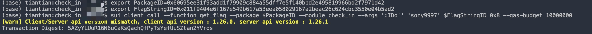

## 基本信息

- Sui钱包地址: `0x6c9a59dad0019e848593c43ba9080a3dfcaf9b2f23c2964a778420cb47067a9f`

> 首次参与需要完成第一个任务注册好钱包地址才被合并，并且后续学习奖励会打入这个地址

- github: `sony9997`

## 个人简介

- 工作经验: 20年
- 技术栈: `Java` `JavaScript` `Python` `Shell` `Android` `Vue` `Big Data`
- 多年Web2开发经验，喜欢研究技术，一直对区块链感兴趣，希望从Sui Move开始切入区块链这个行业。
- 联系方式: tg:[@sony9997](https://t.me/sony9997)

## 任务

## 01 hello move

- [X] package id: (testnet) `0x9162eddf7265f050491f1f983840eac894acf43ef6011b312501ca33c7e371c4`
  https://suiscan.xyz/testnet/tx/GfyZhPrw62qEsBYG9djSGiGuujpCuCudZpknH99Le6Xb

## 02 move coin

- [X] My Coin package id : [0x5b9f8eda9662027d7ec113f55d500ac8f1a1861547a3acb62f0fe6c28ec5bae2](https://suiscan.xyz/mainnet/object/0x5b9f8eda9662027d7ec113f55d500ac8f1a1861547a3acb62f0fe6c28ec5bae2/txs)
- [X] Faucet package id : [0x00192acee9f7ea45cc08f5eaf84dad1f3d79287f7b5cfb10b41ec241de8c8505](https://suiscan.xyz/mainnet/object/0x00192acee9f7ea45cc08f5eaf84dad1f3d79287f7b5cfb10b41ec241de8c8505/txs)
- [X] 转账 `My Coin` hash: [2pKuiqMf6XMxWu4xefzVuiKkFzbTUEgdHxuSF6cjRiDt](https://suiscan.xyz/mainnet/tx/2pKuiqMf6XMxWu4xefzVuiKkFzbTUEgdHxuSF6cjRiDt)
- [X] 转账 `Faucet Coin` hash1: [ivQLc9cRUJvhvXSfzn5A3Fes6V81wzojZLZQSPnVSRH](https://suiscan.xyz/mainnet/tx/ivQLc9cRUJvhvXSfzn5A3Fes6V81wzojZLZQSPnVSRH)
- [X] 转账 `Faucet Coin` hash2: [9b32ZJuDysR8qayqogZqzNvrGkX7LUHDtFzN9KdnS1Q](https://suiscan.xyz/mainnet/tx/9b32ZJuDysR8qayqogZqzNvrGkX7LUHDtFzN9KdnS1Q)

## 03 move NFT

- [X] nft package id : [0x3d064f27631e27464003ce4f25ccddaf9a5bcd4d37c409039dcce3f9d3c64fcc](https://suiscan.xyz/mainnet/object/0x3d064f27631e27464003ce4f25ccddaf9a5bcd4d37c409039dcce3f9d3c64fcc/txs)
- [X] nft object id : [0x86f35fbaefc1a059d0fecc6906ceb553f9886c6de546ad9716aeaa267815a57c](https://suiscan.xyz/mainnet/object/0x86f35fbaefc1a059d0fecc6906ceb553f9886c6de546ad9716aeaa267815a57c)
- [X] 转账 nft hash: [81C2npmjUzMxdTz4M9PMVNL6NRaEVib7gTxPBBaukfKH](https://suiscan.xyz/mainnet/tx/81C2npmjUzMxdTz4M9PMVNL6NRaEVib7gTxPBBaukfKH)
- [X] mint nft hash: [E6F1KMWAoYjKGJ9tbA5jBLtQXjuKdkejug6MBUvqJC88](https://suiscan.xyz/mainnet/tx/E6F1KMWAoYjKGJ9tbA5jBLtQXjuKdkejug6MBUvqJC88)
- [X] mint 浏览器截图：

## 04 Move Game

- [X] game package id : [0x16da5f3b60b187eefe9bd10e739ed4654a1d5c7e9230cf2a7a61b49f01754477](https://suiscan.xyz/mainnet/object/0x16da5f3b60b187eefe9bd10e739ed4654a1d5c7e9230cf2a7a61b49f01754477/txs)
- [X] call game hash: [5gCLYms5GwSm78AMa91ZVp1dDhVr5YkZN7kxrwzM1Y8m](https://suiscan.xyz/mainnet/tx/5gCLYms5GwSm78AMa91ZVp1dDhVr5YkZN7kxrwzM1Y8m)

## 05 Move Swap

- [X] swap package id : [0x7b9f30cdf2c48755fc339af2c1e0701a47af1b8e42a3af991c0124edf8c70ffa](https://suiscan.xyz/mainnet/object/0x7b9f30cdf2c48755fc339af2c1e0701a47af1b8e42a3af991c0124edf8c70ffa/txs)
- [X] call swap hash(a to b): [J8EtReZJ6WFkAEJa8CeyrFGP2qsSMqbLCUzfvpADVWeb](https://suiscan.xyz/mainnet/tx/J8EtReZJ6WFkAEJa8CeyrFGP2qsSMqbLCUzfvpADVWeb)
- [X] call swap hash(b to a): [FxnE3wH7yaYxdB9BeUAt8kwfAtPNhXRwNUcPkSiBSoUK](https://suiscan.xyz/mainnet/tx/FxnE3wH7yaYxdB9BeUAt8kwfAtPNhXRwNUcPkSiBSoUK)

## 06 SDK PTB

- [X] save hash : [EZrUBehd493gVopozs4Qf5vHYricQyLkqWPcYhbC6QWt](https://suiscan.xyz/mainnet/tx/EZrUBehd493gVopozs4Qf5vHYricQyLkqWPcYhbC6QWt)

## 07 Move CTF Check In

export PackageID=0x60695ee31f93add1f79909c884a55dff7e5f140bbd2e495819966bd2f7971d42
export FlagStringID=0x011f9404e6f167e549b617a53eea058029167a2beac26c624cbc3550e04b5ad2
sui client call --function get_flag --package $PackageID --module check_in --args ':IDo`' 'sony9997' $FlagStringID 0x8 --gas-budget 10000000

- [X] CLI call 截图 : 

- [X] flag hash : [5AZyYLUuR16N6uCaKsQachQfPyTsYefUuSZtan2YVros](https://suiscan.xyz/testnet/tx/5AZyYLUuR16N6uCaKsQachQfPyTsYefUuSZtan2YVros)

## 08 Move CTF Lets Move

- [X] Proof : 0x026ee72d
- [X] Transaction block : [8oJk3uG9kaaDpchoetiWKLSx859mPsYU7yjNqPhn3yeT](https://suiscan.xyz/testnet/tx/8oJk3uG9kaaDpchoetiWKLSx859mPsYU7yjNqPhn3yeT)

