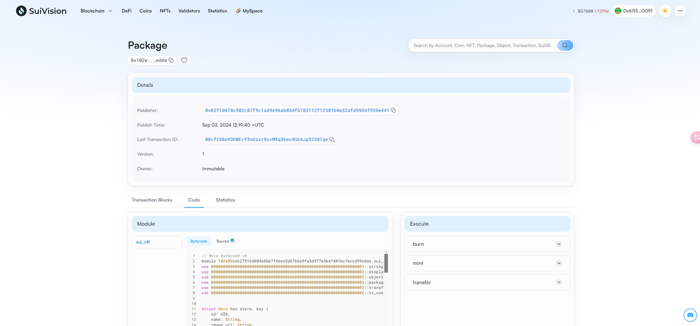
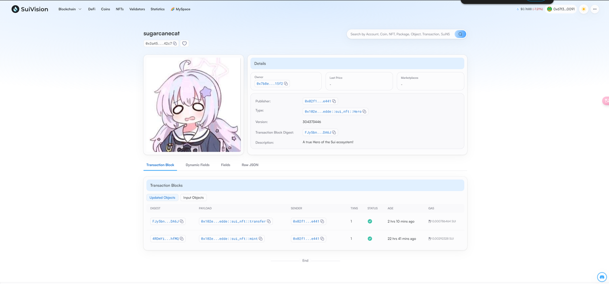
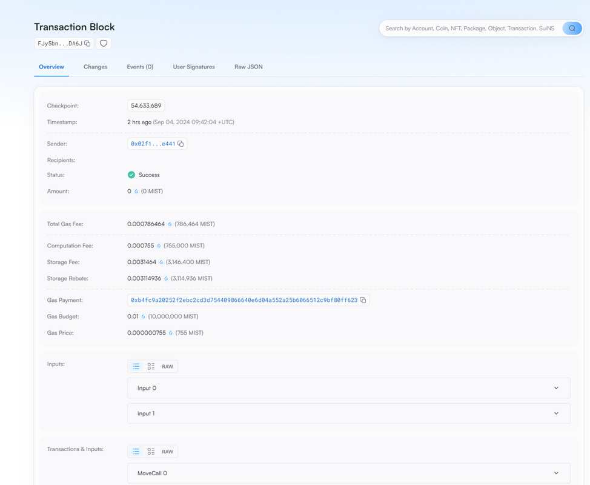

## 基本信息
- Sui钱包地址: `0x67f369488052e732552f2ed37ecb77c890772cd7186ed11587def8a57d8f0091`
> 首次参与需要完成第一个任务注册好钱包地址才被合并，并且后续学习奖励会打入这个地址
- github: `sugarcanecat`

## 个人简介
- 工作经验: 0年(目前是学生)
- 技术栈: Python
> 重要提示 请认真写自己的简介
- 对Move感兴趣，想通过Move入门区块链
- 联系方式: tg: [2220961868@qq.com](mailto:2220961868@qq.com)

## 任务

##   01 hello move  
- [] Sui cli version: sui 1.28.3-3781a7e6b56c-dirty
- [] Sui钱包截图:  https://i.postimg.cc/9Xtvcp9M/Sui02.png
- [] package id: 0x6c4e48b4efe1d4d113819173bd137e00910fdac8ccb80bd031e97a69443673ad
- [] package id 在 scan上的查看截图: https://i.postimg.cc/WbNxzkm7/Sui01.png

##   02 move coin
- [] My Coin package id :  0xf2fd9f472dc7d6c4c62142971d3cd4deb81e3eaaf5f5a8343c55e84783103d67
- [] Faucet package id :  0x875714b2340bf21d20af5dab41827eefe8482e169116d1cf37c1b20a10edcb87
- [] 转账 `My Coin` hash: 7tYAEgu2AWksXzS1NWtXJKxtQjzqT1MDZ6jae8qtPnFj
- [] `Faucet Coin` address1 mint hash: EWZaTSycmsti8uU45YpYhcuz8tLwCfNVhzutvGEoJ6Yy
- [] `Faucet Coin` address2 mint hash: HHMiHb4HphvBJ8jFPLzzrCNgWvBf6JDsPPFRFxUDZRLy

##   03 move NFT
- [] nft package id : 0x102e036dc275164004a8bb7f4dee5d6766a9fa5d977e3b4f401bc1bccd99edde

- [] nft object id :  0x3a4513c9bf72c71f127068e5ca4e1a4ba299489934e6b9dec0e333cb69e442c7

- [] 转账 nft  hash: FJy5bnbrtY8N1RW2BBpSLULAUv9LULF6i5oobjcpDA6J

- [] scan上的NFT截图: 

  

##   04 Move Game
- [] game package id :
- [] deposit Coin hash:
- [] withdraw `Coin` hash:
- [] play game hash:

##   05 Move Swap
- [] swap package id :
- [] call swap CoinA-> CoinB  hash :
- [] call swap CoinB-> CoinA  hash :

##   06 Dapp-kit SDK PTB
- [] save hash :

##   07 Move CTF Check In
- [] CLI call 截图 : 
- [] flag hash :

##   08 Move CTF Lets Move
- [] proof : 
- [] flag hash :
