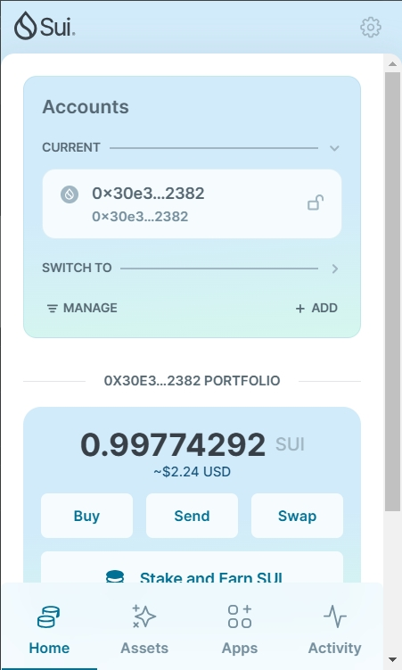
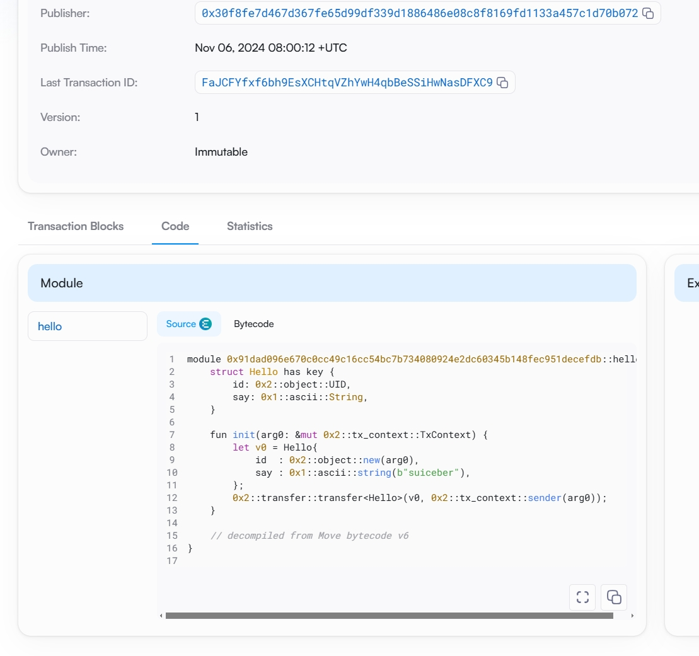
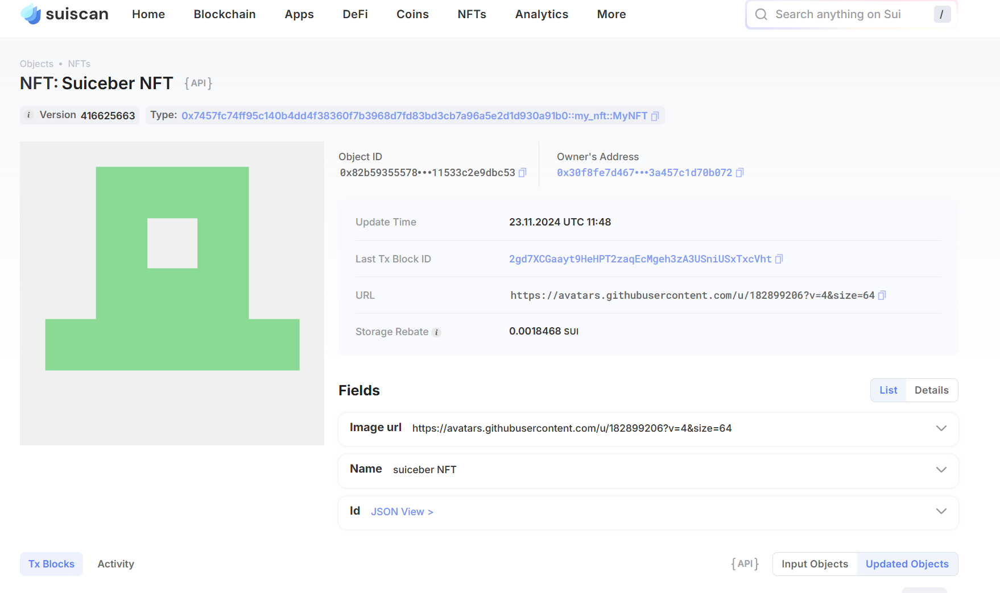

## 基本信息
- Sui钱包地址: `0x30e32bac060d1a5df981674d62e4cd9ca8763b8774a13233bafebd7df2852382`
> 首次参与需要完成第一个任务注册好钱包地址才被合并，并且后续学习奖励会打入这个地址
- github: `suiceber`

## 个人简介
- 工作经验: 0年
- 技术栈: 无
> 重要提示 请认真写自己的简介
- 对Move特别感兴趣，想通过Move入门区块链
- 联系方式: qq: `626058035` 

## 任务

##   01 hello move  
- [x] Sui cli version:sui 1.37.1-7839b9501066
- [x] Sui钱包截图: 
- [x] package id: 0x91dad096e670c0cc49c16cc54bc7b734080924e2dc60345b148fec951decefdb
- [x] package id 在 scan上的查看截图:

##   02 move coin
- [x] My Coin package id : 0x1d7b599b6057756f0a080cbae63637f4960d4dbfc34b084d0984475e298ad95f
- [X] Faucet package id : 0xf5f1f09b51d4a7b7e654cb044a63fd0270b89acbb94f72e013aeb10d6409aba8
- [x] 转账 `My Coin` hash:BDHD4qBxvArNi8ZFGJiBL8BUS1q4ig7Bto3RkRrnG2Re
- [X] `Faucet Coin` address1 mint hash:Bcf5ziocvHMYPSeB6dkpomafnuY51wMqPGwCtpHQ11YZ
- [X] `Faucet Coin` address2 mint hash:3zyE62rihornP8kLHHdmc1URfyHifYf7RvuNbLaQYuoc

##   03 move NFT
- [x] nft package id :0x7457fc74ff95c140b4dd4f38360f7b3968d7fd83bd3cb7a96a5e2d1d930a91b0
- [x] nft object id : 0x82b59355578222b2fbda80b3b11fe07323e6c1ca25ae2430c711533c2e9dbc53
- [x] 转账 nft  hash:BXSfoCXZr4oxRmgT2NiCsYaJ6me2Q96zvpS9X1HWbDmC
- [x] scan上的NFT截图:

##   04 Move Game
- [] game package id :
- [] deposit Coin hash:
- [] withdraw `Coin` hash:
- [] play game hash:

##   05 Move Swap
- [] swap package id :
- [] call swap CoinA-> CoinB  hash :
- [] call swap CoinB-> CoinA  hash :

##   06 Dapp-kit SDK PTB
- [] save hash :

##   07 Move CTF Check In
- [] CLI call 截图 : 
- [] flag hash :

##   08 Move CTF Lets Move
- [] proof : 
- [] flag hash :
