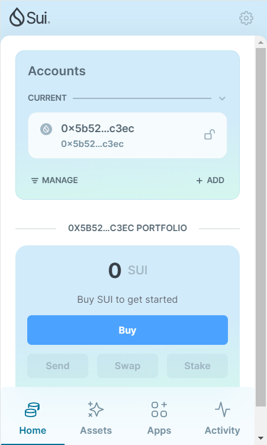
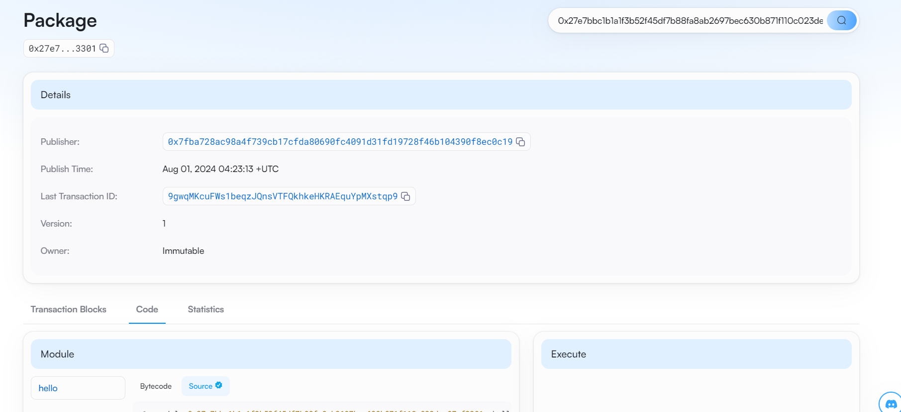
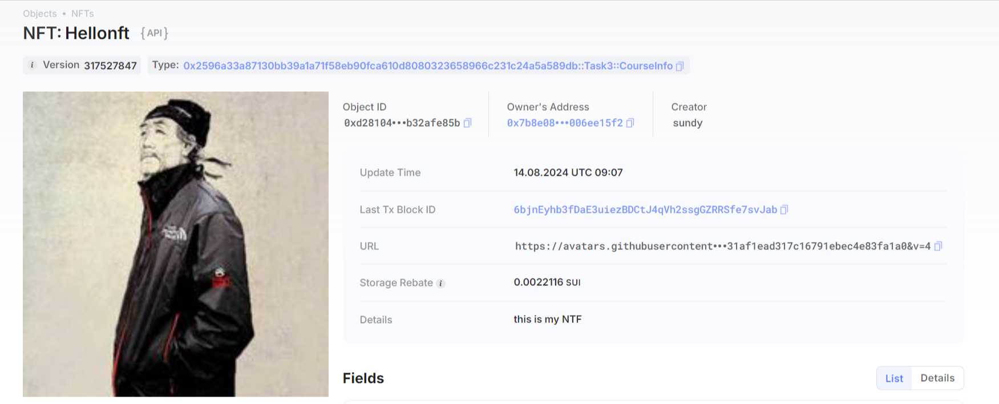

## 基本信息
- Sui钱包地址: `0x5b52a95502ee81a4b8b7f767cb7083476fb77dd353b650df479b36a3da0fc3ec`
> 首次参与需要完成第一个任务注册好钱包地址才被合并，并且后续学习奖励会打入这个地址
- github: `sundyloveme`

## 个人简介
- 工作经验: 4年
- 技术栈: `Python` `C++`
> 重要提示 请认真写自己的简介
- 写了一年多的C++游戏服务端开发 三年多的Python web服务器开发。也能写写前端。对web3很感兴趣，对 x to learn 思想很认同。希望通过这个活动逼迫自己做出点web3的项目，也能结交点朋友，最后希望能找到一个remote工作最好了。
- 联系方式:  tg: `https://t.me/aichizaofan`

## 任务

##   01 hello move  
- [x] Sui cli version:1.30.1
- [x] Sui钱包截图: 
- [x] package id: 0x27e7bbc1b1a1f3b52f45df7b88fa8ab2697bec630b871f110c023dea97ef3301
- [x] package id 在 scan上的查看截图:

##   02 move coin
- [x] My Coin package id : 0xbd674532f7350680e72f0ceb3d485a1fec0e2839e3a252ec85cebbc28f05881e
- [x] Faucet package id : 0xe3ec8779917c9023feb4dfbe92d20fd2d97f786c02918729d5d0afa041ec56a8
- [x] 转账 `My Coin` hash: 4hSbfJooxPYvQVZntxMFQyvT4TYuJ6YNqjyM6Hez9utf
- [x] `Faucet Coin` address1 mint hash: A8wvcwMgN79i9iDuKXtfGEEMUNziFWZdwtDN66AQ2qsF
- [x] `Faucet Coin` address2 mint hash: J4joFGZbcB1BtwTokdTanaFezE6uigH1s9JbwFhJ4MqJ

##   03 move NFT
- [x] nft package id :0x2596a33a87130bb39a1a71f58eb90fca610d8080323658966c231c24a5a589db
- [x] nft object id : 0xd2810492ef47b4dd53c1e06a6c269d063de72caaf241b619fbc7396b32afe85b
- [x] 转账 nft  hash:6bjnEyhb3fDaE3uiezBDCtJ4qVh2ssgGZRRSfe7svJab
- [x] scan上的NFT截图:

##   04 Move Game
- [] game package id :
- [] deposit Coin hash:
- [] withdraw `Coin` hash:
- [] play game hash:

##   05 Move Swap
- [] swap package id :
- [] call swap CoinA-> CoinB  hash :
- [] call swap CoinB-> CoinA  hash :

##   06 Dapp-kit SDK PTB
- [] save hash :

##   07 Move CTF Check In
- [] CLI call 截图 : 
- [] flag hash :

##   08 Move CTF Lets Move
- [] proof : 
- [] flag hash :
