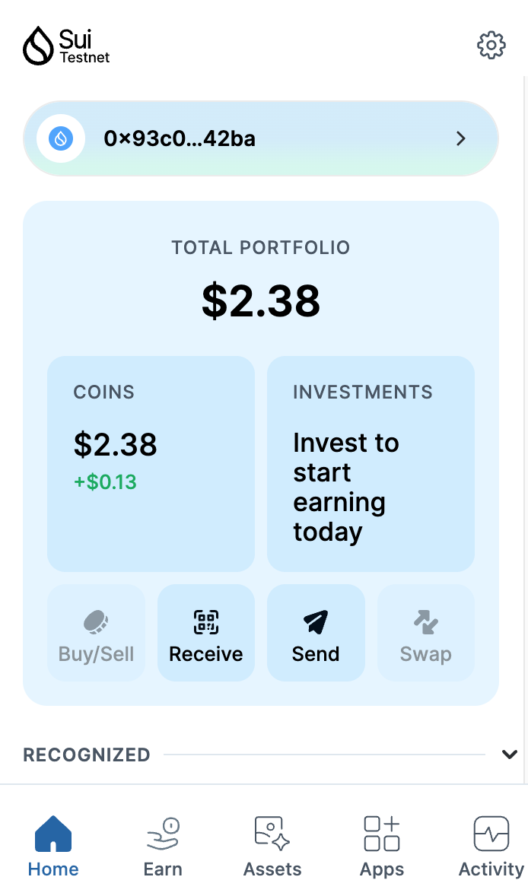
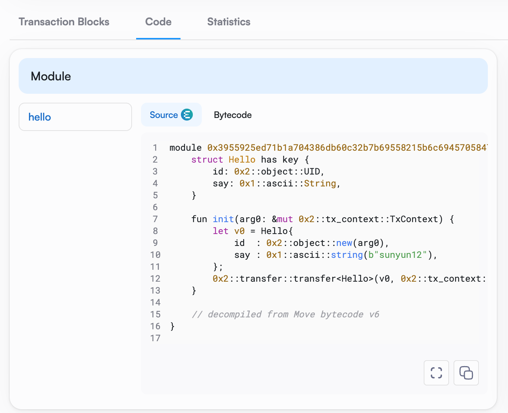
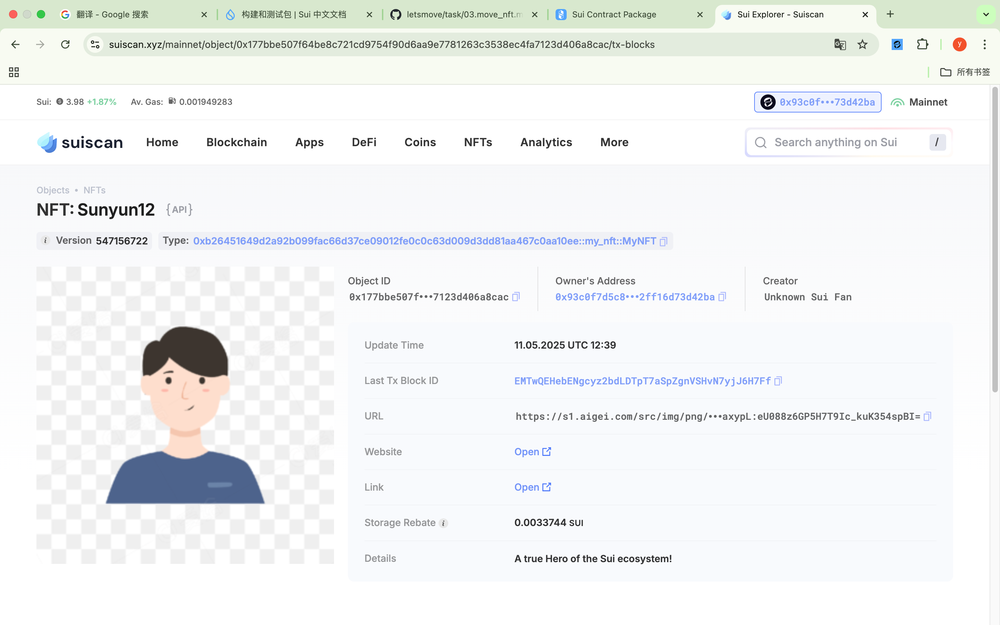

hup## 基本信息
- Sui钱包地址: `0x93c0f7d5c88dad710d134e92a133c6e4d1cc4b03147222e6df02ff16d73d42ba`
> 首次参与需要完成第一个任务注册好钱包地址才被合并，并且后续学习奖励会打入这个地址
- github: `sunyun12`

## 个人简介
- 工作经验: 0年
- 技术栈:
> 重要提示 请认真写自己的简介
- 对Move特别感兴趣，想通过Move入门区块链
- 联系方式: sunyun78db@gmail.com

## 任务

##   01 hello move  
- [√] Sui cli version: sui 1.45.2-homebrew
- [√] Sui钱包截图: 
- [√] package id: 0xc1d4ff161ea84e62edd8bc63cea791cb61b8940c8a06f1162783acf3320a254a
- [√] package id 在 scan上的查看截图:

##   02 move coin
- [√] My Coin package id : 0x98c5f159c16d72bb798fd8a62943fd6d573651cb62b654b4b971195f6fc5933e
- [√] Faucet package id : 0xdb9b66b7c1ad3805a18f4df1437f714e9883a2b64cda410ddc30683875520837
- [√] 转账 `My Coin` hash: 6shWYyvEpfTbF8FJMhNi7cXo5TSrUmeP35ge3qfYFREE
- [√] `Faucet Coin` address1 mint hash:6bn7fzhqWwkSVD42RiwCVM4TTPzWMrhgAHSdks4rjpr7
- [√] `Faucet Coin` address2 mint hash:7qeXUPDiFSeqzKygr6kj55ucMv9c6WpU523xk7a7WHrL

##   03 move NFT
- [√] nft package id : 0xb26451649d2a92b099fac66d37ce09012fe0c0c63d009d3dd81aa467c0aa10ee
- [√] nft object id : 0x34051d4d448039093690506f2fbb8127347c250862c3f4714d62889cf634df65
- [√] 转账 nft  hash: 6kMTTv91hD56tY5YprLfeZd6XGPssnKQVv5RvzbbeVrb
- [√] scan上的NFT截图:

##   04 Move Game
- [] game package id :
- [] deposit Coin hash:
- [] withdraw `Coin` hash:
- [] play game hash:

##   05 Move Swap
- [] swap package id :
- [] call swap CoinA-> CoinB  hash :
- [] call swap CoinB-> CoinA  hash :

##   06 Dapp-kit SDK PTB
- [] save hash :

##   07 Move CTF Check In
- [] CLI call 截图 : 
- [] flag hash :

##   08 Move CTF Lets Move
- [] proof : 
- [] flag hash :

