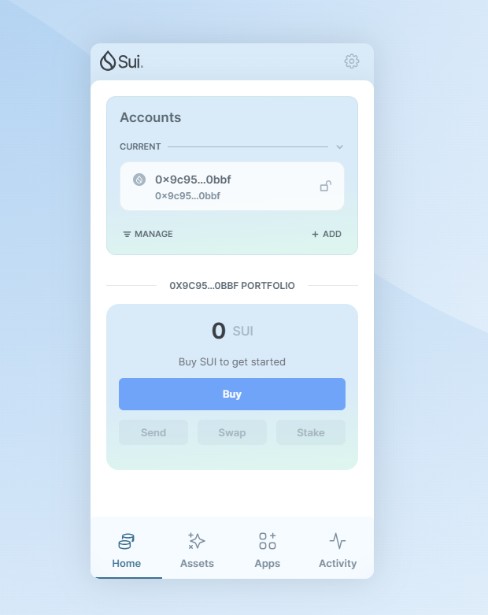
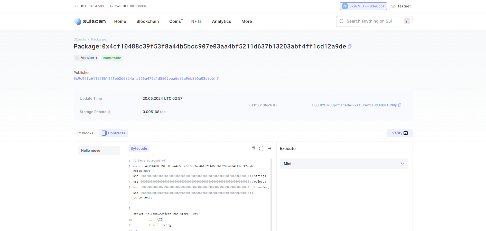

## 基本信息
- Sui钱包地址: `0x9c95fc611378611ffeb2d0324afa956a476a1d5562baa6e05a9eb306a03e0bbf`
> 首次参与需要完成第一个任务注册好钱包地址才被合并，并且后续学习奖励会打入这个地址
- github: `suqwe`

## 个人简介
- 工作经验:1年
- 技术栈: `Python`
> 重要提示 请认真写自己的简介
- 新人小白，对Move特别感兴趣，想通过Move入门区块链
- 联系方式: tg: `xxx` 

## 任务

##   01 hello move  
- [] Sui cli version:sui 1.24.1-2d7f294f7
- [] Sui钱包截图: 
- [] package id:0x4cf10488c39f53f8a44b5bcc907e03aa4bf5211d637b13203abf4ff1cd12a9de 
- [] package id 在 scan上的查看截图:

##   02 move coin
- [] My Coin package id : 
- [] Faucet package id : 
- [] 转账 `My Coin` hash:
- [] `Faucet Coin` address1 mint hash:
- [] `Faucet Coin` address2 mint hash:

##   03 move NFT
- [] nft package id :
- [] nft object id : 
- [] 转账 nft  hash:
- [] scan上的NFT截图:

##   04 Move Game
- [] game package id :
- [] deposit Coin hash:
- [] withdraw `Coin` hash:
- [] play game hash:

##   05 Move Swap
- [] swap package id :
- [] call swap CoinA-> CoinB  hash :
- [] call swap CoinB-> CoinA  hash :

##   06 SDK PTB
- [] save hash :
