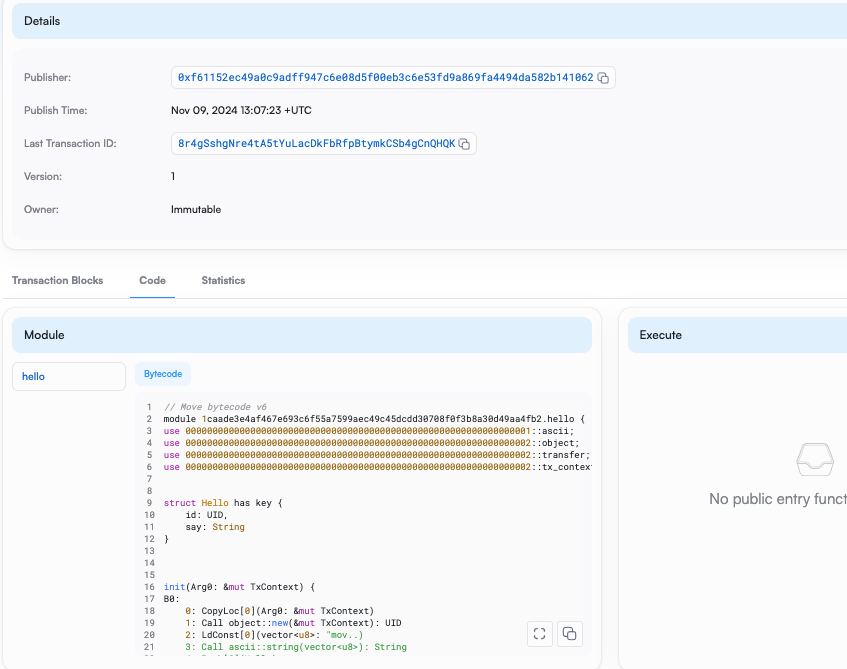

## 基本信息
- Sui钱包地址: `0x607cb006563483c84ae7b4fc0da3cd65b0f9b47e77dd6b8bb24415b476fcdb1b`
> 首次参与需要完成第一个任务注册好钱包地址才被合并，并且后续学习奖励会打入这个地址
- github: `swanzhou-1`

## 个人简介
- 工作经验: 暂无相关工作经验，从零学习中
- 技术栈: `python`
> 重要提示 请认真写自己的简介
- 想转行，对区块链运营感兴趣，也想学一门web3开发语言

## 任务

##   01 hello move  
- [✓] Sui cli version: sui 1.36.2-3ada97c109cc
- [✓] [Sui钱包截图](./images/sui.png)
- [✓] package id : 0x01caade3e4af467e693c6f55a7599aec49c45dcdd30708f0f3b8a30d49aa4fb2
- [✓]在 scan上的查看截图:

##   02 move coin
- [] My Coin package id : 
- [] Faucet package id : 
- [] 转账 `My Coin` hash:
- [] `Faucet Coin` address1 mint hash:
- [] `Faucet Coin` address2 mint hash:

##   03 move NFT
- [] nft package id :
- [] nft object id : 
- [] 转账 nft  hash:
- [] scan上的NFT截图:

##   04 Move Game
- [] game package id :
- [] deposit Coin hash:
- [] withdraw `Coin` hash:
- [] play game hash:

##   05 Move Swap
- [] swap package id :
- [] call swap CoinA-> CoinB  hash :
- [] call swap CoinB-> CoinA  hash :

##   06 Dapp-kit SDK PTB
- [] save hash :

##   07 Move CTF Check In
- [] CLI call 截图 : 
- [] flag hash :

##   08 Move CTF Lets Move
- [] proof : 
- [] flag hash :
