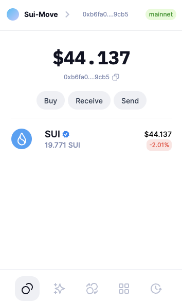
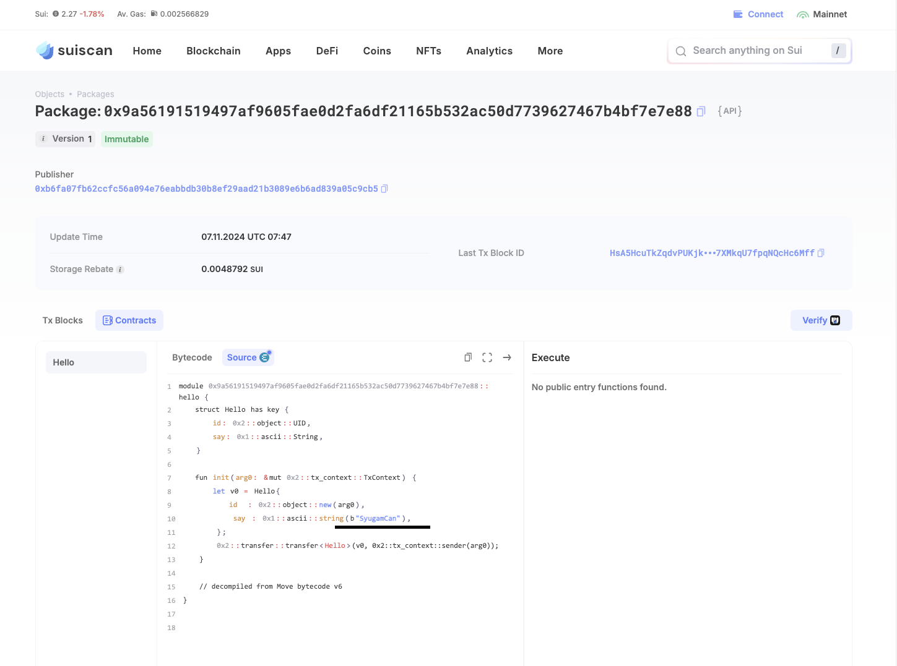

## 基本信息

- Sui 钱包地址: `0xb6fa07fb62ccfc56a094e76eabbdb30b8ef29aad21b3089e6b6ad839a05c9cb5`
  > 首次参与需要完成第一个任务注册好钱包地址才被合并，并且后续学习奖励会打入这个地址
- github: `SyugamCan`

## 个人简介

- 工作经验: 2 年
- 技术栈: `Solidity` `Golang` `JavaScript`
  > 重要提示 请认真写自己的简介
- 区块链开发者，冲狗爱好者，熟悉EVM(合约、后端)、TG Bot，对Solana、Ton链等开发也有着一定的了解，想要深入研究Sui。
- 联系方式: tg: `@Syu212`

## 任务

## 01 hello move
- [x] Sui cli version: sui 1.35.1-homebrew
- [x] Sui 钱包截图: 
- [x] package id: `0x9a56191519497af9605fae0d2fa6df21165b532ac50d7739627467b4bf7e7e88` [*Mainnet*](https://suiscan.xyz/mainnet/object/0x9a56191519497af9605fae0d2fa6df21165b532ac50d7739627467b4bf7e7e88/contracts)
- [x] package id 在 scan 上的查看截图:

## 02 move coin

- [] My Coin package id :
- [] Faucet package id :
- [] 转账 `My Coin` hash:
- [] `Faucet Coin` address1 mint hash:
- [] `Faucet Coin` address2 mint hash:

## 03 move NFT

- [] nft package id :
- [] nft object id :
- [] 转账 nft hash:
- [] scan 上的 NFT 截图:

## 04 Move Game

- [] game package id :
- [] deposit Coin hash:
- [] withdraw `Coin` hash:
- [] play game hash:

## 05 Move Swap

- [] swap package id :
- [] call swap CoinA-> CoinB hash :
- [] call swap CoinB-> CoinA hash :

## 06 Dapp-kit SDK PTB

- [] save hash :

## 07 Move CTF Check In

- [] CLI call 截图 : 
- [] flag hash :

## 08 Move CTF Lets Move

- [] proof :
- [] flag hash :