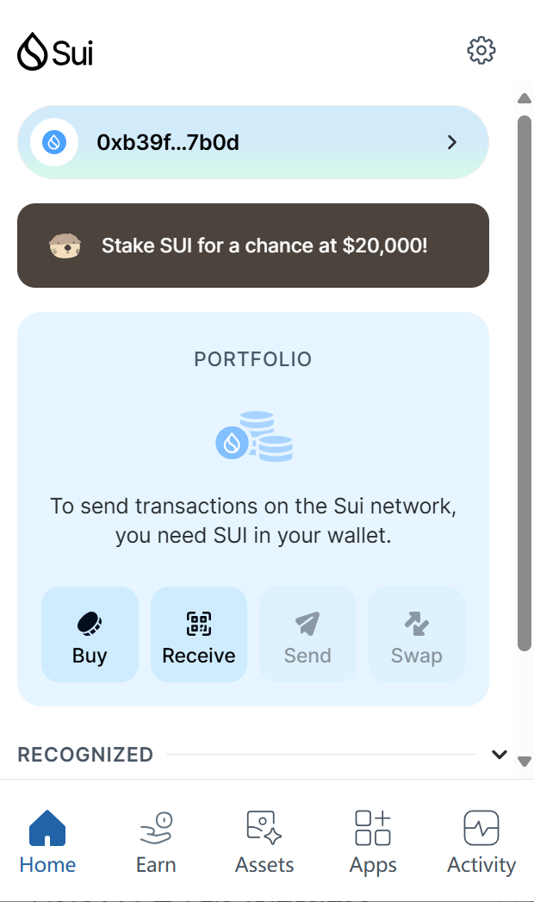
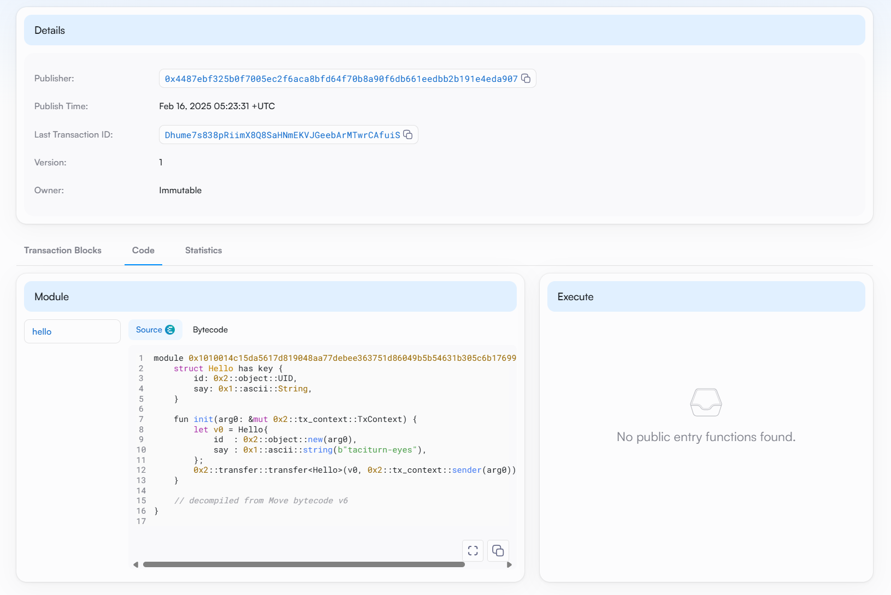
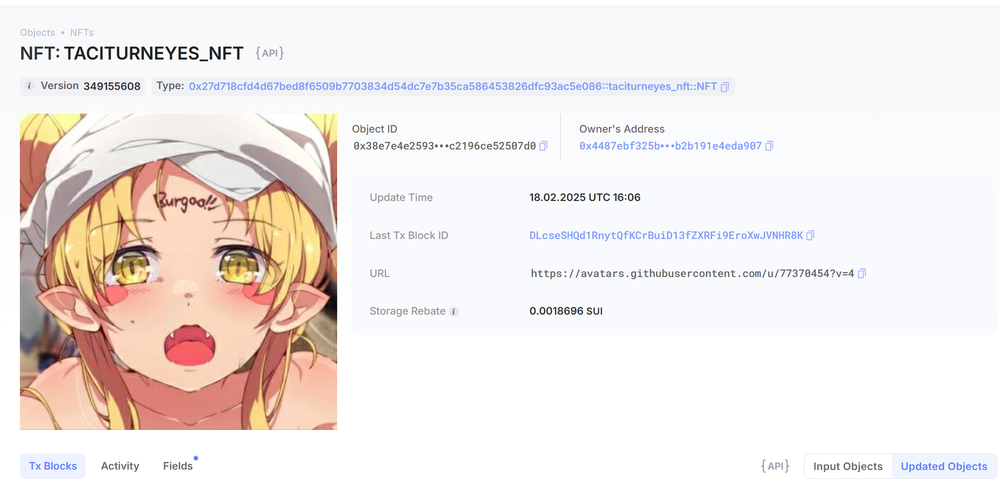

## 基本信息

- Sui 钱包地址: 0xb39fddbbfbc12a5a4e79c83fc9f56ee6b9ae996b24b77e0355b0e77e56907b0d

  > 首次参与需要完成第一个任务注册好钱包地址才被合并，并且后续学习奖励会打入这个地址

- github: [taciturn-eyes (Zk Jane)](https://github.com/taciturn-eyes)

## 个人简介

- 工作经验: 2 年
- 技术栈: `Rust` `Python` `C++`

> 重要提示 请认真写自己的简介

- 多年 web2 实习经验，熟悉对 Move 特别感兴趣，想通过 Move 入门区块链,开启 Web3 dev career
- 算法工程师，主持一项 CV 方向国家级实训项目，曾获 ICPC 银奖、数模国一、数竞国一、kaggle 铜牌等荣誉
- Crypto Native，去中心化的忠实信徒，币圈老韭菜，想要深入了解 Sui 这种高性能链
- 联系方式: tg: @SapienRiver

## 任务

## 01 hello move

- [x] Sui cli version: sui 1.42.2-55ba9e9399eb
- [x] Sui 钱包截图: 
- [x] package id:
  > 0x1010014c15da5617d819048aa77debee363751d86049b5b54631b305c6b17699
- [x] package id 在 scan 上的查看截图:

## 02 move coin

- [x] My Coin package id :0x117153df0042b9182ad0d4ebb558893d37907b2498f415ba9cb2d04a2b5524cc
- [x] Faucet package id : 0x2ad09537ce03278571eda137c2fd779bb4715d9d5b4a4defeebbcd4deffc38ff
- [x] 转账 `My Coin` hash: APoozx3ZLY7SCVtgmjZVmtQnDZ36ynRc5EnGfKv3REdK
- [x] `Faucet Coin` address1 mint hash:27GJ9eP8xhnmHQu5LR3beD8Z9M4fqXtgKNiSQGUMYu8E
- [x] `Faucet Coin` address2 mint hash:AzCVrHFf2pMoqzYy8PqSuVZRdN3mcmAPApzsk7Sj9erZ

## 03 move NFT

- [x] nft package id :0x968763e8653d29345327273a0a2602029499c141ae5b8487ad766ed715cae179
- [x] nft object id :0x84f5470143ed89154d9a958ace5a547fa5b57340ca6cf22f483c8c0962c2610a
- [x] 转账 nft hash:5HZgWXETZqsBpvqUSiSCUP7a3g57SzWkBFaaL88xWPDm
- [x] scan 上的 NFT 截图:
<!--
  给地址0x7b8e0864967427679b4e129f79dc332a885c6087ec9e187b53451a9006ee15f2
  mint NFT 哈希：HX5Gzn77Sh3uL63RSLco4AvfPMhqDgvjDSRUR8CLxjLK
 -->

## 04 Move Game

- [] game package id :
- [] deposit Coin hash:
- [] withdraw `Coin` hash:
- [] play game hash:

## 05 Move Swap

- [] swap package id :
- [] call swap CoinA-> CoinB hash :
- [] call swap CoinB-> CoinA hash :

## 06 Dapp-kit SDK PTB

- [] save hash :

## 07 Move CTF Check In

- [] CLI call 截图 : 
- [] flag hash :

## 08 Move CTF Lets Move

- [] proof :
- [] flag hash :
