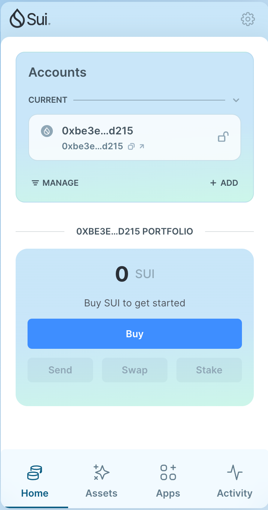
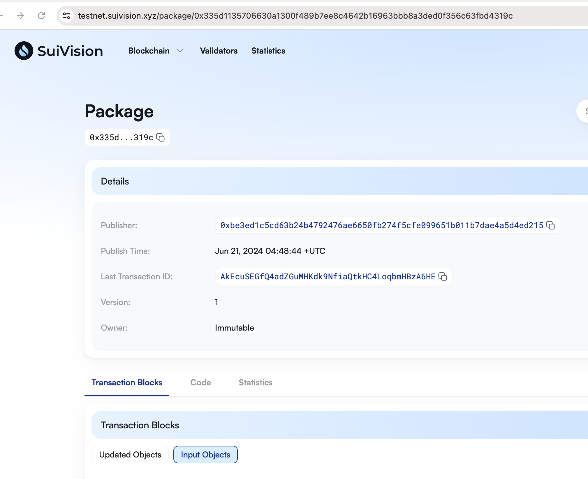
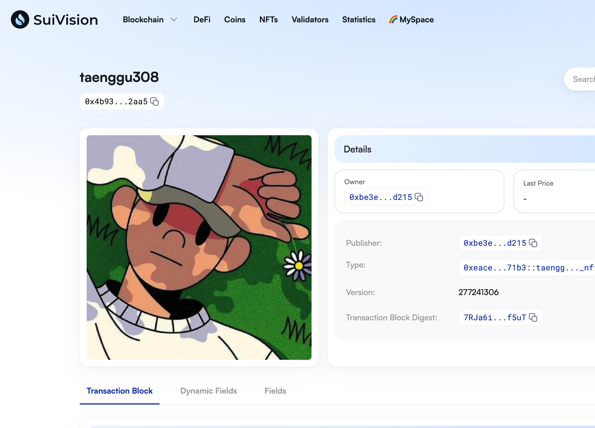
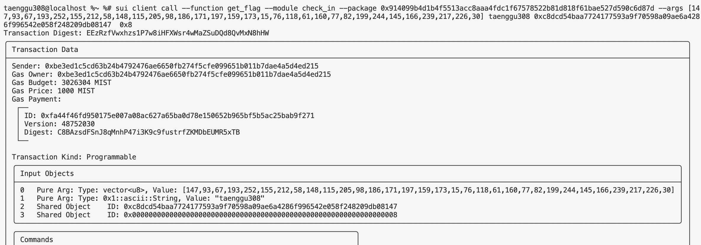

## 基本信息
- Sui钱包地址: `0xbe3ed1c5cd63b24b4792476ae6650fb274f5cfe099651b011b7dae4a5d4ed215`
> 首次参与需要完成第一个任务注册好钱包地址才被合并，并且后续学习奖励会打入这个地址
- github: `taenggu308`

## 个人简介
- 工作经验: 0年
- 技术栈: `C++`
> 重要提示 请认真写自己的简介
- 对Move语言感兴趣，想通过Move入门区块链和Web3
- 联系方式: tg: `tangue3` 

## 任务

##   01 hello move  
- [x] Sui cli version: sui-client 1.27.2
- [x] Sui钱包截图: 
- [x] package id: 
- [x] package id 在 scan上的查看截图:

##   02 move coin
- [x] My Coin package id : 0x5d1e79142c2f6cb453f5c660e0760fdf069875bd5cafc50ac00593b6acdf8efb
- [x] Faucet package id : 0x5d1e79142c2f6cb453f5c660e0760fdf069875bd5cafc50ac00593b6acdf8efb
- [x] 转账 `My Coin` hash: 8Kcj9gRaZSHSgeBLPDcgRUtfdnRYyFEoZ6km8CLegUtg
- [x] `Faucet Coin` address1 mint hash: Faf7gmKNZpDwCvfQDTNpXxrnYbdQufejiVjoDxFtn8RN
- [x] `Faucet Coin` address2 mint hash: H3yxTLRUAqGuXJZeThtgqvRxSApo4kaXbPW3iPt6hMNX

##   03 move NFT
- [x] nft package id : 0xeace002148dfefdd3ea8a01982b29a3db8f70c31d102ee58d86bdc62c14d71b3        
- [x] nft object id :  0x4b93a6e65ed348467bfcea518c083ec9a0ea16010c5ee78038ffbe7c4fdf2aa5      
- [x] 转账 nft  hash : EG7Kwsgc52K9Ss2XGvxJaNSGN8GbMs1Pt3YnPQfqQApT
- [x] scan上的NFT截图 :

##   04 Move Game
**在testnet下完成，mainnet没有0x8的Random**
- [x] game package id : **`testnet`** 0x80e6a69966b921171b0911c6a7646b6cbd16b51b4fa256099dfa6d735554a295  
- [x] deposit Coin hash: **`testnet`** iNbhTJJA9v8ZmPQfxQvqAQN4tr1TXvqJJx5UCF5Zzf7
- [x] withdraw `Coin` hash: **`testnet`** B9suHP2Cb2JNEZ6hYkC871sa2bT32HVrrzpFL3TQKwve
- [x] play game hash: **`testnet`** J1S3aL1k315EDDwVebUQHCNcSZifxAVcJntTdfDgkj8B

##   05 Move Swap
- [x] swap package id : 0xed74bdf69591f6338307b57936a3b5c0bd515f75af3952aa9d8d2c3ce4568a72 
- [x] call swap CoinA-> CoinB  hash : AZNGLroFfZNyzwZCJEhnZUndXr7gMiDKMD9u553X1vS2
- [x] call swap CoinB-> CoinA  hash :  29jtMhmzcxHMwCYXzKLXUWKFQGkYquiwYJjFe79cwCJK

##   06 Dapp-kit SDK PTB
- [x] save hash : GbFhTZEfe9YFGdmke7a7zgHXpBscTaNPknYxyvy9kkLw

##   07 Move CTF Check In
- [x] CLI call 截图 : 
- [x] flag hash : EEzRzfVwxhzs1P7w8iHFXWsr4wMaZSuDQd8QvMxN8hHW

##   08 Move CTF Lets Move
- [x] proof : 4ee24de869425f42ea5e
- [x] flag hash : 8WmN7H1hq4vmyVcM7uUN8HmMJizU4CxUXjrHE2w4zK7k
