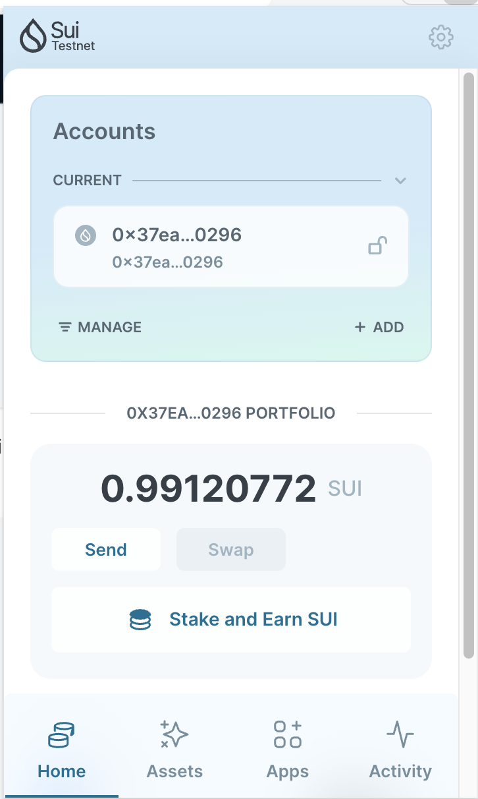
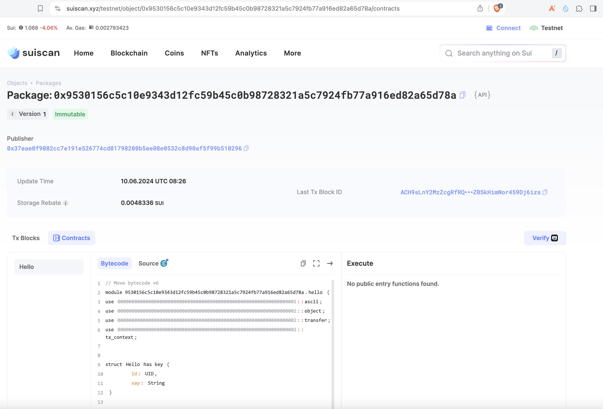
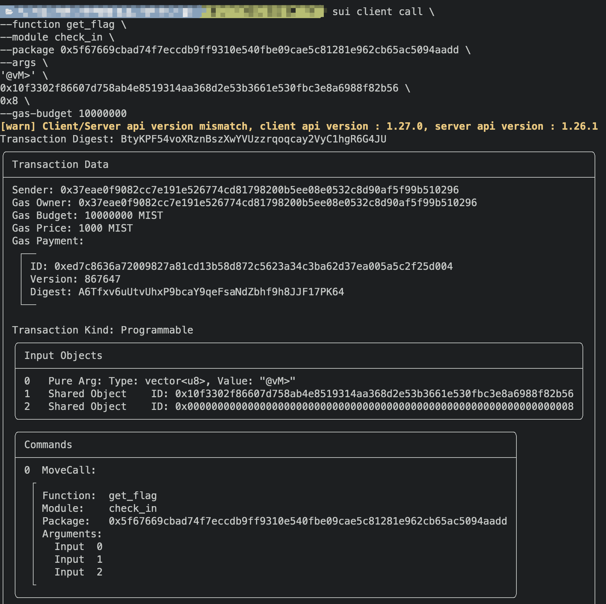

## 基本信息

- Sui钱包地址: 0x37eae0f9082cc7e191e526774cd81798200b5ee08e0532c8d90af5f99b510296
  
  > 首次参与需要完成第一个任务注册好钱包地址才被合并，并且后续学习奖励会打入这个地址

- github: tgz

## 个人简介

- 工作经验: 10年
- 技术栈: Swift\Objective-c\C++\Node.js\Rust\Python\Go
- 刚接触sui链，希望通过move学习能进入sui链生态
- 联系方式: imqsc@ik.me

## 任务

## 01 hello move

- [x] Sui cli version: 1.25.1
- [x] package id: 0x9530156c5c10e9343d12fc59b45c0b98728321a5c7924fb77a916ed82a65d78a 
- [x] Sui钱包截图: 
- [x] package id 在 scan上的查看截图:

## 07 Move CTF Check in

- [x] CLI call 截图 : 
- [x] flag hash: BtyKPF54voXRznBszXwYVUzzrqoqcay2VyC1hgR6G4JU