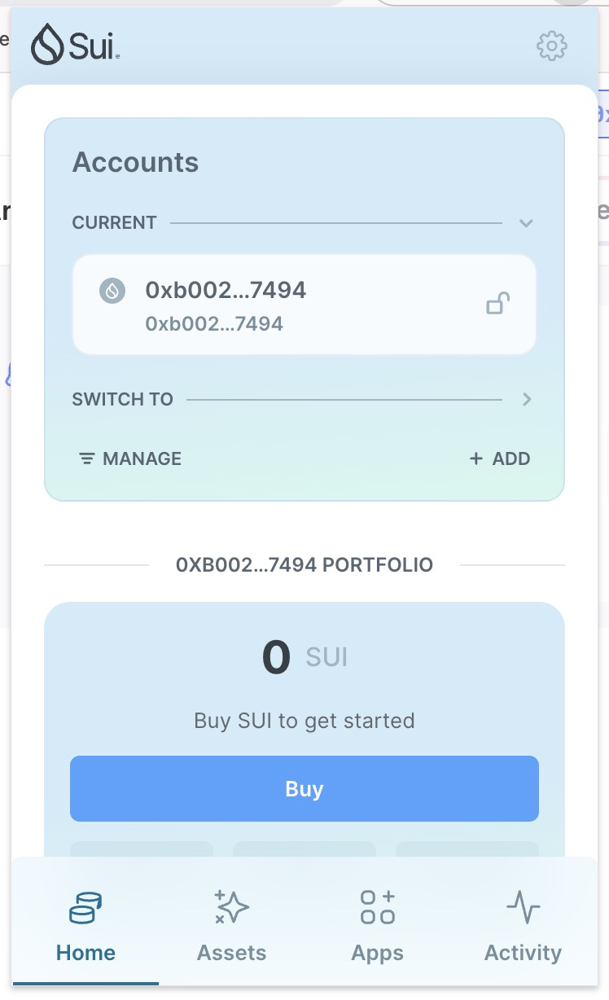
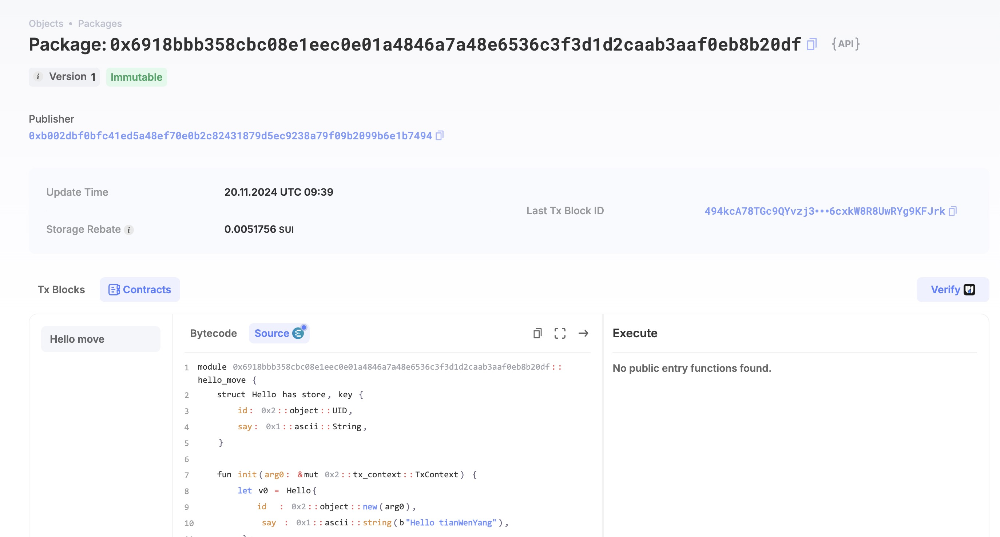
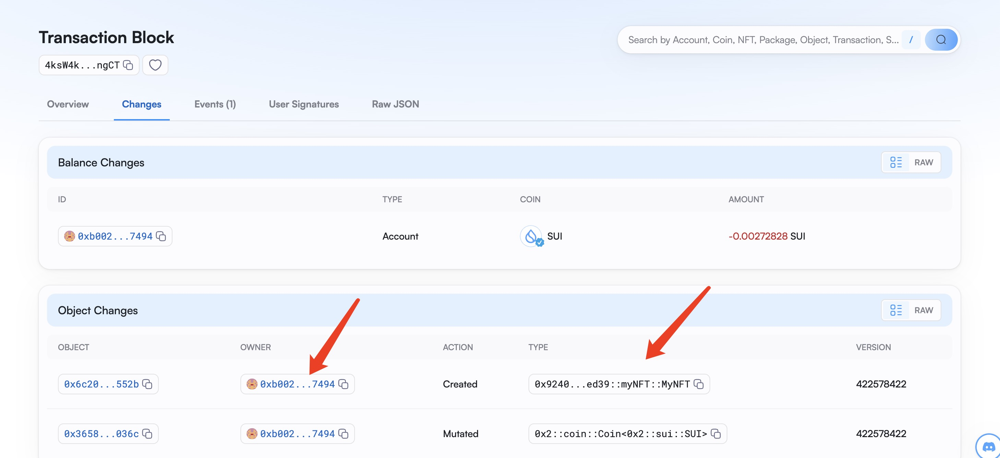

## 基本信息
- Sui钱包地址: `0xb002dbf0bfc41ed5a48ef70e0b2c82431879d5ec9238a79f09b2099b6e1b7494`
> 首次参与需要完成第一个任务注册好钱包地址才被合并，并且后续学习奖励会打入这个地址
- github: `tianWenYang`

## 个人简介
- 工作经验: 5年
- 技术栈: `JavaScript` `Python`
> 重要提示 请认真写自己的简介
- 多年web2开发经验，对Move特别感兴趣，想通过Move入门区块链
- 联系方式: tg: `Rainer_Tian` 

## 任务

##   01 hello move  
- [] Sui cli version: 1.36.2
- [] Sui钱包截图: 
- [] package id: 0x6918bbb358cbc08e1eec0e01a4846a7a48e6536c3f3d1d2caab3aaf0eb8b20df
- [] package id 在 scan上的查看截图:

##   02 move coin
- [] My Coin package id : 0x22533baf732161c2bccc1f45100851baa744784a5e676cc73ffc75aae9723b87
- [] Faucet package id : 0xe864b3ef8aa33013715bf3ec23c4f296d75be72f9a00ab426619340dafd65d30
- [] 转账 `My Coin` hash:9dQAWKKqxVgZET4mFq9W531p9Cf9RZyJETsPw8Knd37G
- [] `Faucet Coin` address1 mint hash: Ek4SZke7XJgHNbwnyFZxoZ6fhjNoqXYg6uy5nbHgoj8E
- [] `Faucet Coin` address2 mint hash: 2WfVDaM3xxkaQ75jUeSG5A7rqTMHmU5teCvtvHcsjwYi

##   03 move NFT
- [] nft package id :0x9240897fb0e1730f75cb1e922b2ab32596e3a89a21838189378d7f39450ced39
- [] nft object id : 0x6c203dc97b38e092ecb937247d7e78614e0cedbdf21efd635f68fd86e627552b
- [] 转账 nft  hash: 3mg8yacfJTXbh1NyCzmjryfnTMo2Z1Y1n2EB6iFapEKH
- [] scan上的NFT截图:

##   04 Move Game
- [] game package id :
- [] deposit Coin hash:
- [] withdraw `Coin` hash:
- [] play game hash:

##   05 Move Swap
- [] swap package id :
- [] call swap CoinA-> CoinB  hash :
- [] call swap CoinB-> CoinA  hash :

##   06 Dapp-kit SDK PTB
- [] save hash :

##   07 Move CTF Check In
- [] CLI call 截图 : 
- [] flag hash :

##   08 Move CTF Lets Move
- [] proof : 
- [] flag hash :
