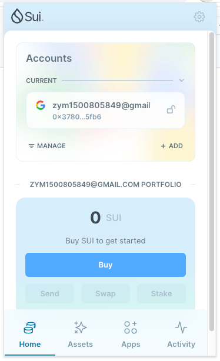
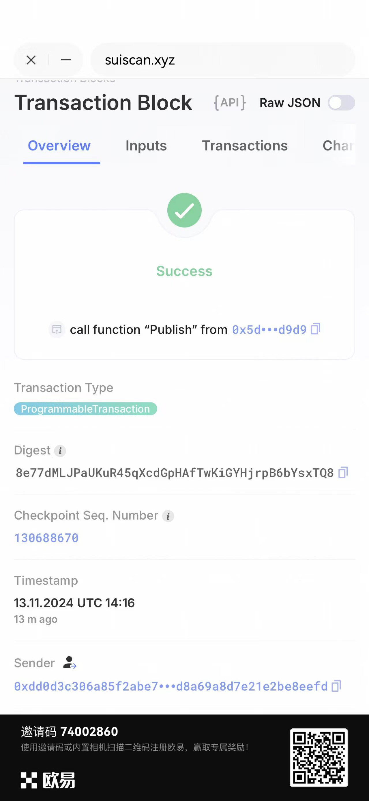

## 基本信息
- Sui钱包地址: `0x3780117e3781549a86289e9750edaf60df3c4b8498e3052d9e958735dae95fb6`
> 首次参与需要完成第一个任务注册好钱包地址才被合并，并且后续学习奖励会打入这个地址
- github: `timecool-cpu`

## 个人简介
- 工作经验: 0年
- 技术栈: `go` `java`
> buaa研二在校生，主攻区块链开发，开发经验4年，三段大厂实习，目前在字节实习，熟悉智能合约以及区块链的热点话题，欢迎交流
- 
- 联系方式: tg: `15070691699` 

## 任务

##   01 hello move  
- [✅] Sui cli version: sui 1.37.3-homebrew
- [✅] Sui钱包截图: 
- [✅] package id: 7QeyYAeKfbTf6Bd88nBxLbTtkLnLiNy4td9ZCBuCohR4
- [❓] package id 在 scan上的查看截图:![sui scan崩了进不去后面再补一下]

##   02 move coin
- [] My Coin package id : 
- [] Faucet package id : 
- [] 转账 `My Coin` hash:
- [] `Faucet Coin` address1 mint hash:
- [] `Faucet Coin` address2 mint hash:

##   03 move NFT
- [] nft package id :
- [] nft object id : 
- [] 转账 nft  hash:
- [] scan上的NFT截图:

##   04 Move Game
- [] game package id :
- [] deposit Coin hash:
- [] withdraw `Coin` hash:
- [] play game hash:

##   05 Move Swap
- [] swap package id :
- [] call swap CoinA-> CoinB  hash :
- [] call swap CoinB-> CoinA  hash :

##   06 Dapp-kit SDK PTB
- [] save hash :

##   07 Move CTF Check In
- [] CLI call 截图 : 
- [] flag hash :

##   08 Move CTF Lets Move
- [] proof : 
- [] flag hash :
