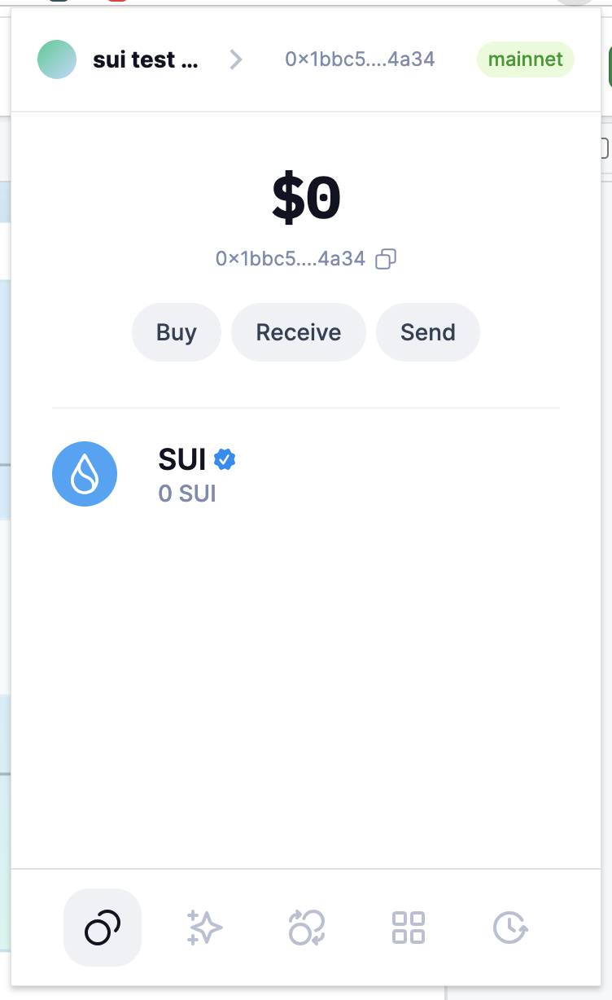
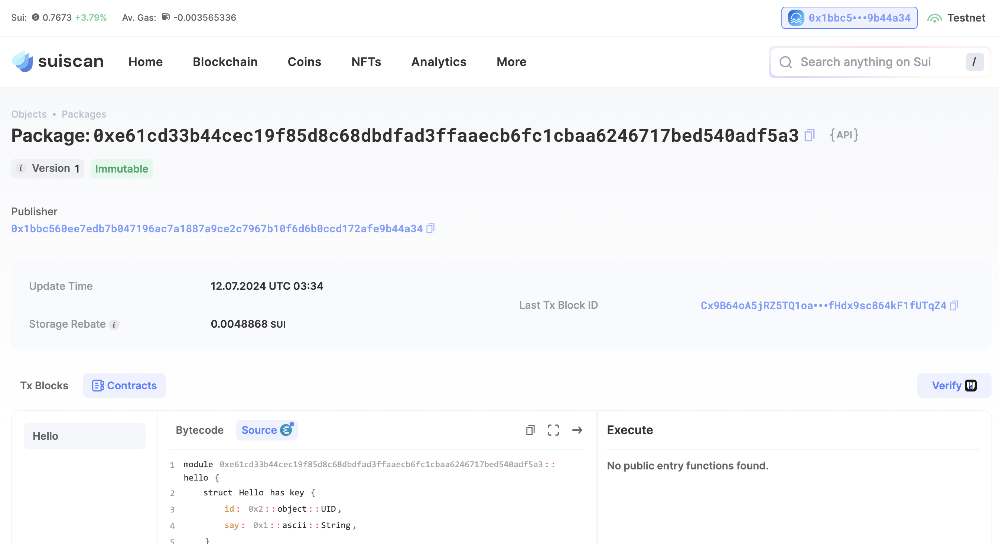
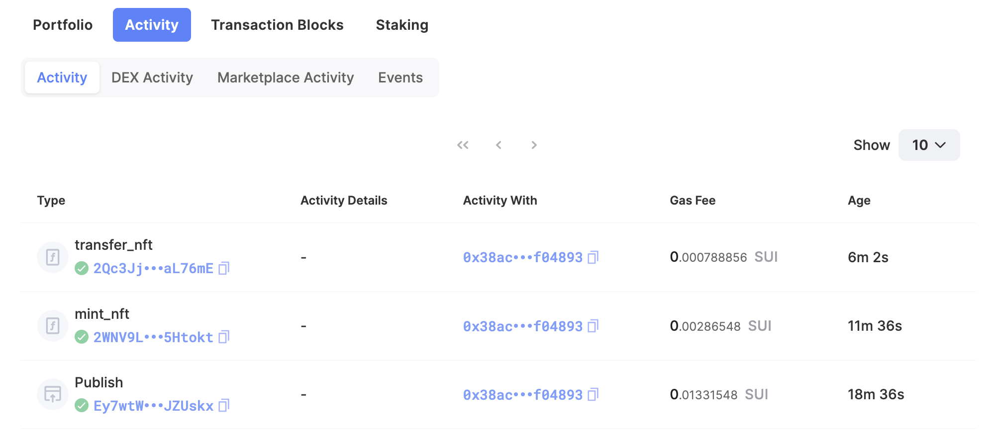

## 基本信息
- Sui钱包地址: `0x1bbc560ee7edb7b047196ac7a1887a9ce2c7967b10f6d6b0ccd172afe9b44a34`
> 首次参与需要完成第一个任务注册好钱包地址才被合并，并且后续学习奖励会打入这个地址
- github: `tutu-stack`

## 个人简介
- 工作经验: 8年
- 技术栈: `React` `lua` `nodejs` `Javascript`
- 网安web小白，对Move特别感兴趣，想通过Move入门区块链
- 联系方式: email: `tzjvon@gmail.com` 

## 任务

##   01 hello move  
- [x] Sui cli version: sui 1.28.2-08b50387a184
- [x] Sui钱包截图: 
- [x] package id: `0xe61cd33b44cec19f85d8c68dbdfad3ffaaecb6fc1cbaa6246717bed540adf5a3`
- [x] package id 在 scan上的查看截图:

##   02 move coin
- [x] My Coin package id : 0xd0e013e834f9b832da96936e4306019ca50de6a4601cfc6fa2995f05ba990462 
- [x] Faucet package id : 0xd0e013e834f9b832da96936e4306019ca50de6a4601cfc6fa2995f05ba990462
- [x] 转账 `My Coin` hash: HZA4QqF58VmZHpT1nLFyTZt3SfoDnjDoRZuDaZbN3oxr
- [x] `Faucet Coin` address1 mint hash: 5Fq43TfQ3BrAB7Bm7KzpjGg6jXxgTm2CMjtWyyGtMBzw
- [x] `Faucet Coin` address2 mint hash: 2jSAHu4VkiUuoEpUFc7syX2wzdPojToUM7DwnMDsc2sz

##   03 move NFT
- [x] nft package id :0x38acd0378b9badb7f8d22395623d5c5b33aea27ca3adbe14d81b40f5cef04893
- [x] nft object id : 0x6cc4431fb16ae3a77d2de72777616a9aa547bab25b3693e8275f3015451b6ae3
- [x] 转账 nft  hash: 2Qc3JjyahEjjPL3GdkXiWJsuzFAMDtFNPPisnYaL76mE
- [x] scan上的NFT截图:

##   04 Move Game
- [x] game package id : 0xb88a0f3c2667d1820b7a8e0fc780e8715094194d14dc9f69f1c2322f44a7305c
- [x] deposit Coin hash: GN8GFsh7AVNjV69zACgoeF239vVm8vjBtKahPfbtKP6n
- [x] withdraw `Coin` hash: JDbjnKsR6GutnixbnUeVVAA1PfmMeGDJkBhq7Cac7TU1
- [x] play game hash: HPkU6SDDPcmhxCAD8hi9iWyC3JA8XSjG2ty5ssErNc6F
