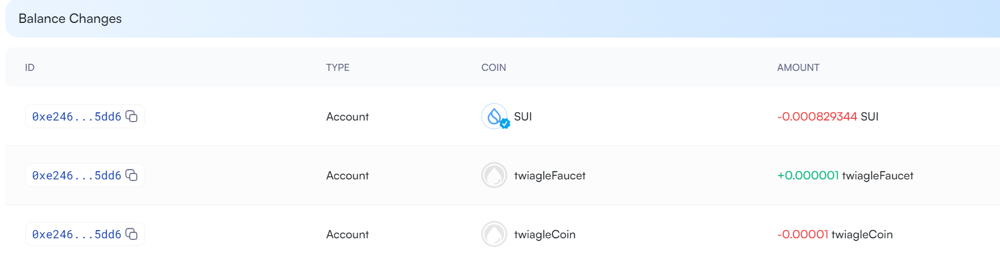

测试网 0xe34f375a8a64a137024c2893e031d5c5a95d6f493c8fab1936de985fbe28ac72  
### 央行模式 twiaglecoin 1000  
sui client call --function mint_and_transfer --module twiaglecoin --package 0x892bf3a4fcb00c8e8e4a03073d29f3f8a413f2c01e7e16f7753a9e8c907f5850 --args 0x2141a90ccac58704e688150611f853585f195f886fc559150d7855cbdc855f5d 1 0xe34f375a8a64a137024c2893e031d5c5a95d6f493c8fab1936de985fbe28ac72   
export twiaglecoin=0xf3776b91c5bd0ba0fb0bed6207762f0bc5dc9a5394c1895afbf17fe085ca6062  
### 水龙头模式 twiaglefaucet 10000
sui client call --function mint_and_transfer --module twiaglefaucet --package  0x1dff8ee913ca2a5e5441b273025bb5fccc304c37cbbd9b128f5620f0e4b5a57b --args 0xe4d837ab3e8e4e96c9c39fa961f8dfb7febf8b260732bf064930ef00d5db0c60 10000 0xe34f375a8a64a137024c2893e031d5c5a95d6f493c8fab1936de985fbe28ac72   
export twiaglefaucet=0x5f54c61ada6d41ac82e1e82adc917bbce47a61bf0224f73e42ff8191b2b3e474
export PACKAGEID=0xf2180c0dd361547a2063cac7acca8de601859b4795eef2b9a214248d4c58259f  
### create_liquidity_pool twiaglecoin 1000 水龙头模式 twiaglefaucet 100
sui client call --function create_liquidity_pool --module swap --package $PACKAGEID --args  $twiaglecoin  $twiaglefaucet --type-args 0x892bf3a4fcb00c8e8e4a03073d29f3f8a413f2c01e7e16f7753a9e8c907f5850::twiaglecoin::TWIAGLECOIN 0x1dff8ee913ca2a5e5441b273025bb5fccc304c37cbbd9b128f5620f0e4b5a57b::twiaglefaucet::TWIAGLEFAUCET   
export LIQUIDITYPOOL=0xe1af3e3170ff2f73fab6d20e79088badca676e8d55643f5ef91f4b802ddbb556  
export LPCOIN=0x29c7a57effbfa32b181e0662a002a3e96e1922f965c1ffe938d6a281a137139a  
### swap 10 twiaglecoin for twiaglefaucet

sui client call --function mint_and_transfer --module twiaglecoin --package 0x892bf3a4fcb00c8e8e4a03073d29f3f8a413f2c01e7e16f7753a9e8c907f5850 --args 0x2141a90ccac58704e688150611f853585f195f886fc559150d7855cbdc855f5d 1 0xe34f375a8a64a137024c2893e031d5c5a95d6f493c8fab1936de985fbe28ac72   
export COINA=0x87857d10283c569067bd42d5a3162d04e72b772e182ebb8f6943401cde3a2773  
sui client call --function swap_exact_a_for_b --module swap --package $PACKAGEID --args $COINA $LIQUIDITYPOOL 5 --type-args 0x892bf3a4fcb00c8e8e4a03073d29f3f8a413f2c01e7e16f7753a9e8c907f5850::twiaglecoin::TWIAGLECOIN 0x1dff8ee913ca2a5e5441b273025bb5fccc304c37cbbd9b128f5620f0e4b5a57b::twiaglefaucet::TWIAGLEFAUCET   

### mainnet
export PACKAGEID=0x0f5d2937653a9dcd24e45ede258efbe24b69ed8774d0923d7d828c9f3d0d5fcc
export twiagleCoinPID=0xbea2b5fdc52a58271004d9488ae303db146f82c8b9f0cd45fbdb9e3460d531bc  
export faucetCoinPID=0x2152eb58395b4d7d5eba797f47942c4bfad2868cb3d45bc9219415ec6f5b1cfc  
### 央行模式 twiaglecoin 10000
sui client call --function mint_and_transfer --module twiaglecoin --package $twiagleCoinPID --args 0x4e5fa42b23976ff9dabf09f21d426d37ebb69c4416231e4e572ee5a051326f2c 10000 0xe2469bd8dcba6c0218e653771e5aa44f4f54b4399e313f90db8b80fa2cb55dd6   
### 水龙头模式 twiaglefaucet 1000
sui client call --function mint_and_transfer --module twiaglefaucet --package  $faucetCoinPID --args 0x18e7fd30768c0d738b1ecc5da810c118e76469141c62c25986badbf5bfba3869 1000 0xe2469bd8dcba6c0218e653771e5aa44f4f54b4399e313f90db8b80fa2cb55dd6   
export twiaglecoin=0xbd414f567c489bac27be0d6f7ff4d2b17302a947c4d8f2978d4bad9927351047  
export twiaglefaucet=0xcb24c245d97c944cd668ab729539902b200fb34571e0aaf6c5eaf802f7ae2b3f  
### create_liquidity_pool
sui client call --function create_liquidity_pool --module swap --package $PACKAGEID --args  $twiaglecoin  $twiaglefaucet --type-args 0xbea2b5fdc52a58271004d9488ae303db146f82c8b9f0cd45fbdb9e3460d531bc::twiaglecoin::TWIAGLECOIN 0x2152eb58395b4d7d5eba797f47942c4bfad2868cb3d45bc9219415ec6f5b1cfc::twiaglefaucet::TWIAGLEFAUCET   
export LIQUIDITYPOOL=0x812dcbbd276c928c71dd71897e40b2a33492e5030a3c0df497fa2fd5a06c729d  
export LPCOIN=0xd83ff47f83b6dc84b440ba958b324321d88d1955b079423b14ff15fb29d09ed6  
### swap 10 twiaglecoin for 1 twiaglefaucet
sui client call --function mint_and_transfer --module twiaglecoin --package $twiagleCoinPID --args 0x4e5fa42b23976ff9dabf09f21d426d37ebb69c4416231e4e572ee5a051326f2c 10 0xe2469bd8dcba6c0218e653771e5aa44f4f54b4399e313f90db8b80fa2cb55dd6   
export COINA=0x1e0cb469f6e8b2d4c25189c9d9193772209a25282b20c30626ef958e7f663207    
sui client call --function swap_exact_a_for_b --module swap --package $PACKAGEID --args $COINA $LIQUIDITYPOOL 1 --type-args 0xbea2b5fdc52a58271004d9488ae303db146f82c8b9f0cd45fbdb9e3460d531bc::twiaglecoin::TWIAGLECOIN 0x2152eb58395b4d7d5eba797f47942c4bfad2868cb3d45bc9219415ec6f5b1cfc::twiaglefaucet::TWIAGLEFAUCET   

