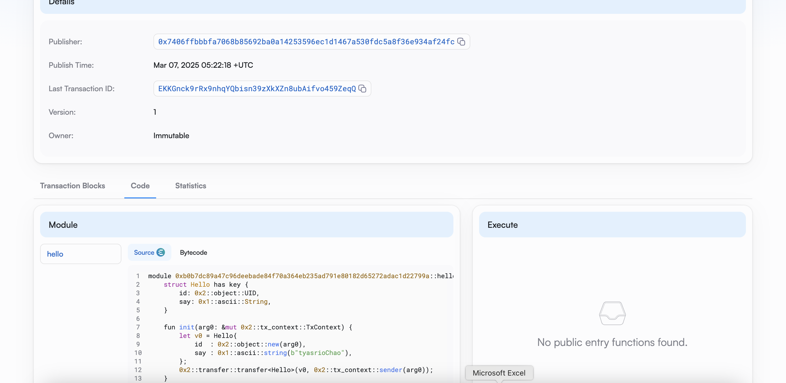

## 基本信息
- Sui钱包地址: `0x7406ffbbbfa7068b85692ba0a14253596ec1d1467a530fdc5a8f36e934af24fc`
> 首次参与需要完成第一个任务注册好钱包地址才被合并，并且后续学习奖励会打入这个地址
- github: `tyasrioChao`

## 个人简介
- 工作经验: 5年
- 技术栈: React Typescript Java Fullstack
> 重要提示 请认真写自己的简介
- 多年web2开发经验，对Move特别感兴趣，想通过Move入门区块链
- 联系方式: tg: elvis_bbb wechat: tyasrio

## 任务

##   01 hello move  
- [✔] Sui cli version: sui 1.42.2-homebrew
- [✔] Sui钱包截图: 
- [✔] package id: 0xb0b7dc89a47c96deebade84f70a364eb235ad791e80182d65272adac1d22799a
- [✔] package id 在 scan上的查看截图:

##   02 move coin
- [✔] My Coin package id : `0xc49669ad5956fba19cc5b0f204e6dd80bcf0cd91992ef98a52033eb44775c3a6`
- [✔] Faucet package id : `0xc49669ad5956fba19cc5b0f204e6dd80bcf0cd91992ef98a52033eb44775c3a6`
- [✔] 转账 `My Coin` hash: `3RawEA5NAp8LV3yLvtaGvrGPRUvhFQyCu8pJ3QN8rxGt`
- [✔] `Faucet Coin` address1 mint hash: `2oaDtBGPcTVhBJay2LftAfUqt9Vgmire29TaCMCjV7G3`
- [✔] `Faucet Coin` address2 mint hash: `GcAyQ829SCDd64sVRNy7HxZHh5xKTFFRRg9EdLuLuzW`

##   03 move NFT
- [✔] nft package id : `0x126377d1dee14627d19bea75ee8eed5633cbc5a4e0038bcdd3ee4369a2262b8f`
- [✔] nft object id : `0xcc56b75f22875355839cf3267e1fc0921bd840ab0a039aba43450a697eb59f00`
- [✔] 转账 nft  hash: `EduZpp5FKyGUUaZHDGoufWHsAy7JRY4CUCk3BXQvc4L6`
- [✔] scan上的NFT截图: 

##   04 Move Game
- [] game package id :
- [] deposit Coin hash:
- [] withdraw `Coin` hash:
- [] play game hash:

##   05 Move Swap
- [] swap package id :
- [] call swap CoinA-> CoinB  hash :
- [] call swap CoinB-> CoinA  hash :

##   06 Dapp-kit SDK PTB
- [] save hash :

##   07 Move CTF Check In
- [] CLI call 截图 : 
- [] flag hash :

##   08 Move CTF Lets Move
- [] proof : 
- [] flag hash :

