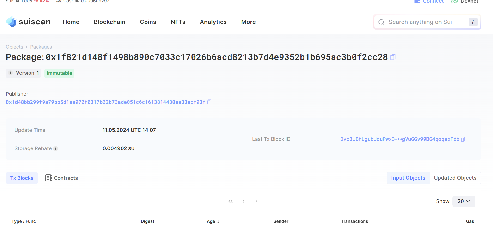
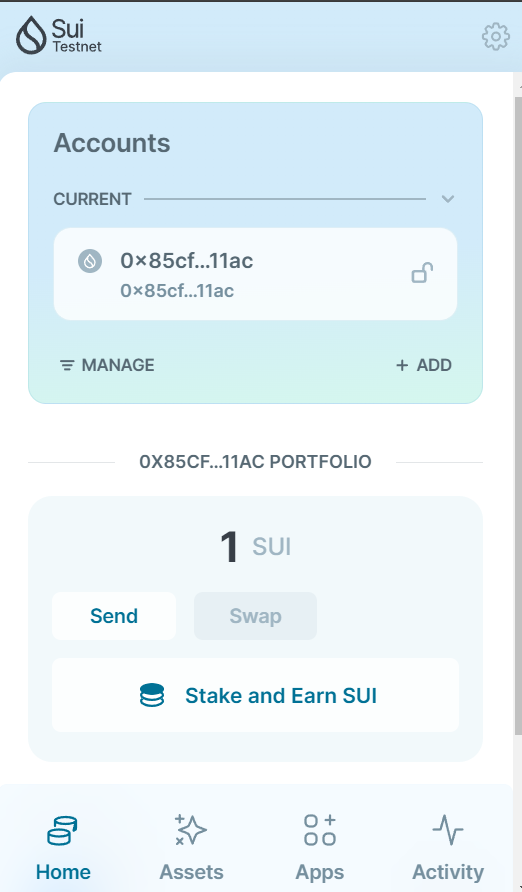

## 基本信息
- Sui钱包地址: `0x85cf7a47e9221be413bd2ea3da966d7f20de542b8b1f791d53155635470711ac`
> 首次参与需要完成第一个任务注册好钱包地址才被合并，并且后续学习奖励会打入这个地址
- github: `tzy168`

## 个人简介
- 工作经验: 0年
- 技术栈: `solidity` `javascript` `go` 
> 重要提示 请认真写自己的简介
- 区块链本科在读，系统学习区块链，对区块链的兴趣十分浓厚
- 联系方式: tg: `@tzy888168` 
           qq: `3265577395`

## 任务

##   01 hello move  
- [] Sui cli version:sui 1.22.0-0362997
- [] Sui钱包截图: 
- [] package id: 0x1f821d148f1498b890c7033c17026b6acd8213b7d4e9352b1b695ac3b0f2cc28
- [] package id 在 scan上的查看截图:

##   02 move coin
- [] My Coin package id : 
- [] Faucet package id : 
- [] 转账 `My Coin` hash:
- [] `Faucet Coin` address1 mint hash:
- [] `Faucet Coin` address2 mint hash:

##   03 move NFT
- [] nft package id :
- [] nft object id : 
- [] 转账 nft  hash:
- [] scan上的NFT截图:

##   04 Move Game
- [] game package id :
- [] deposit Coin hash:
- [] withdraw `Coin` hash:
- [] play game hash:

##   05 Move Swap
- [] swap package id :
- [] call swap CoinA-> CoinB  hash :
- [] call swap CoinB-> CoinA  hash :

##   06 SDK PTB
- [] save hash :
