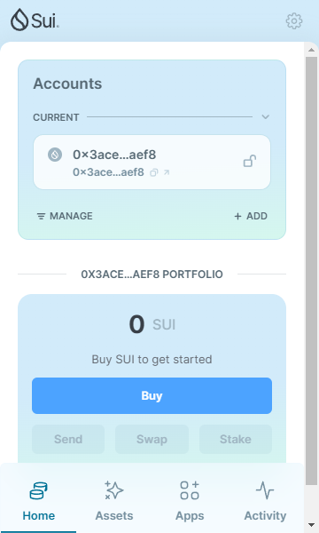
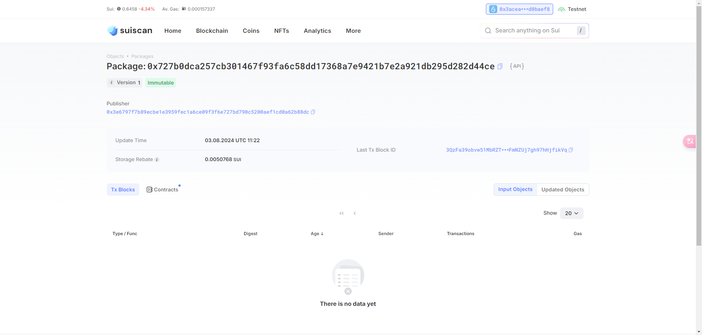
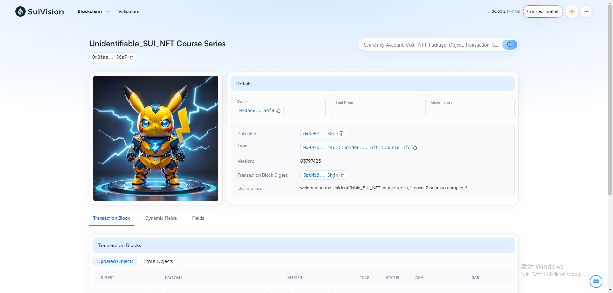

## 基本信息
- Sui钱包地址: `0x3acea86b2bbb2fd240c747603ef82e58fc26e4e47d87d728ef29adea8d0baef8`
> 首次参与需要完成第一个任务注册好钱包地址才被合并，并且后续学习奖励会打入这个地址
- github: `https://github.com/unidentifiable`

## 个人简介
- 工作经验: 5年
- 技术栈: `Java`
> 重要提示 请认真写自己的简介
- 多年web2电商开发经验，熟练使用Java，会Vue2，学过React、solidity，对Move特别感兴趣，想通过Move入门区块链
- 联系方式: wx: `king1992_` 

## 任务

##   01 hello move  
- [x] Sui cli version: sui 1.30.1-a4185da5659d
- [x] Sui钱包截图: 
- [x] package id: 0x727b0dca257cb301467f93fa6c58dd17368a7e9421b7e2a921db295d282d44ce
- [x] package id 在 scan上的查看截图:

##   02 move coin
- [x] My Coin package id : 0xddce61e0c237285f269a5dbe07bd6bfbedc93e21cdee4ab32af3e335b40ac4b2
- [x] Faucet package id : 0x3e11ad5aa875254b022ca62ec44a9b799798335b32e9d0bf1aca172fae449746
- [x] 转账 `My Coin` hash: C4MnkjnZRFix8XjiY4aJSGvQ2QToc6xK8TKz48ePhmaS
- [x] `Faucet Coin` address1 mint hash: 6kbNLNXhCZPfNnpWYKgsgyv8TrQF5Zngd183nzqdGw6d
- [x] `Faucet Coin` address2 mint hash: H2hVwAYEWN1JpTMuyQ7w6AphXpHVNrB89mW8kz7XZyYn

##   03 move NFT
- [x] nft package id : 0x991b12499aa37aa5d99375c2c9853cde031afa0a7732d420353127952250440c
- [x] nft object id : 0x8fae183d6b75e59c5d3b1dae0b52b431ae3ff067880bcd625c9af3dc245496a7
- [x] 转账 nft  hash: 5ptMc8GWAG23UAZxCHxS1JtG6zrXuWMb4J9g78kuShjh
- [x] scan上的NFT截图:

##   04 Move Game
- [] game package id : 
- [] deposit Coin hash:
- [] withdraw `Coin` hash:
- [] play game hash:

##   05 Move Swap
- [] swap package id :
- [] call swap CoinA-> CoinB  hash :
- [] call swap CoinB-> CoinA  hash :

##   06 Dapp-kit SDK PTB
- [] save hash :

##   07 Move CTF Check In
- [] CLI call 截图 : 
- [] flag hash :

##   08 Move CTF Lets Move
- [] proof : 
- [] flag hash :
