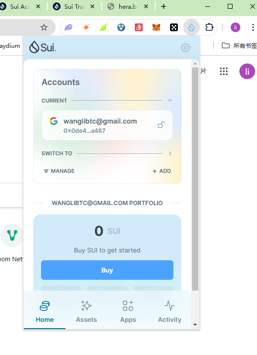
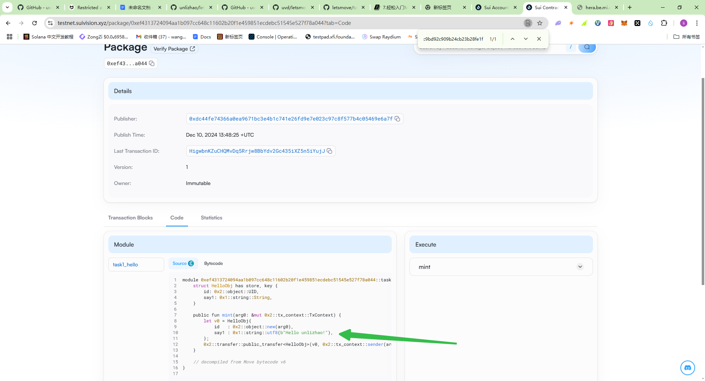
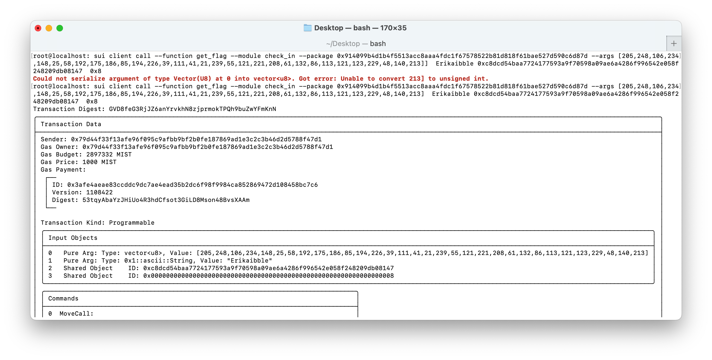

## 基本信息
- Sui钱包地址: `0x0de4e7e6c5d35784f146194bcf6ee6f570280c45089f86bdcdaf9e367d57a487 `
> 首次参与需要完成第一个任务注册好钱包地址才被合并，并且后续学习奖励会打入这个地址
- github: `unlizhao`

## 个人简介
- 工作经验: 8年
- 技术栈: `Java`
> 重要提示 请认真写自己的简介
- 多年 Java 开发经验，就职国内某互联网公司。最近sui大涨，学习下，哈哈
- 联系方式: tg: `https://t.me/lizhao996` 

## 任务

##   01 hello move  
- [x] Sui cli version: sui 1.38.2-99fcadf4f738
- [x] Sui钱包截图: 
- [x] package id:   0xef4313724094aa1b097cc648c11602b20f1e459851ecdebc51545e527f78a044
- [x] package id 在 scan上的查看截图:

##   02 move coin
coin name: unlizhao_coin, unlizhao_faucet_coin
- [x] My Coin package id : 0x7e8741cbf64779d0c83971b756bc153926d89f2882be3b08ec6946f503c4e669
- [x] Faucet package id : 0x7e8741cbf64779d0c83971b756bc153926d89f2882be3b08ec6946f503c4e669
- [x] 转账 `My Coin` hash: 6e3V92JapJcc6FS7bvuSjcqTDJWP45UUT1m3R1xVBrct
- [x] `Faucet Coin` address1 mint hash: rotpAcJXhk5b24S4bjFp3jpJ73keo9Y6DfpAudzMAuT
- [x] `Faucet Coin` address2 mint hash: 2yRvtpv8s722UXcum5d4YvyyFDe1qCgFJUSgPKLYz1g7

##   03 move NFT
- [x] nft package id : 0x57397cb46abbc21cd4399e6a6d4fcce538f3b6934d2208e55d8041f89ad9c3f4     
- [x] nft object id :  0x34cf1ae9a7b4556b611732ed20a08c56106d359480a03a44e39953bf4f44c9c0
- [x] 转账 nft  hash: B19VJWivSaDeDntKzx2G7pwzMQMSVdPCgEevQcpM7g28
- [x] scan上的NFT截图:
<!-- 
##   04 Move Game
- [x] game package id : 0xedf9aad195e01bbb8e421df49f69b15a5328141b7514e4c11d40d83437fa74c2
- [x] deposit Coin hash: GBo5xh21HNiZVet4wcCWDD1wbk5T9M2T8yMtVpPFwGL2
- [x] withdraw `Coin` hash: 4GbCUiaJj7z15iMgiizXNQjLRooSKFNNrixYWzJ2xpC6
- [x] play game hash: 5R4WmD4CY2YCg8Scpbzqebb5EqJTaEi9pgWAcKPtEyiV

##   05 Move Swap
- [x] swap package id : 0x125e446c3486cb5ee0e61078e12cff4f6ac5923a7daff3b1a2a0102e09693600
- [x] call swap CoinA-> CoinB  hash : H4VnSqsPuapZTj31fNXGbU9RmFjj5wNUNSuErFqUXgbd
- [x] call swap CoinB-> CoinA  hash : 6nwFqfepFENe3omnL7dmig11qABxVEwsAxHLftiaKUjw

##   06 Dapp-kit SDK PTB
- [x] save hash : 6MVpKVjB1EK22UkiMHLcnTSiFrpFRmvXU2txz6bad9bd

##   07 Move CTF Check In
- [x] CLI call 截图 : 
- [x] flag hash : GVD8feG3RjJZ6anYrvkhN8zjprmokTPQh9buZwYFmKnN

##   08 Move CTF Lets Move
- [x] proof : ae49485f6941f67f180a
- [x] flag hash : Ae2i7T34sXmnERhQW9dDdUgN5Vjf8RDHncNRUDQFvRc9  -->
