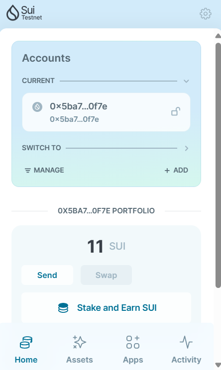
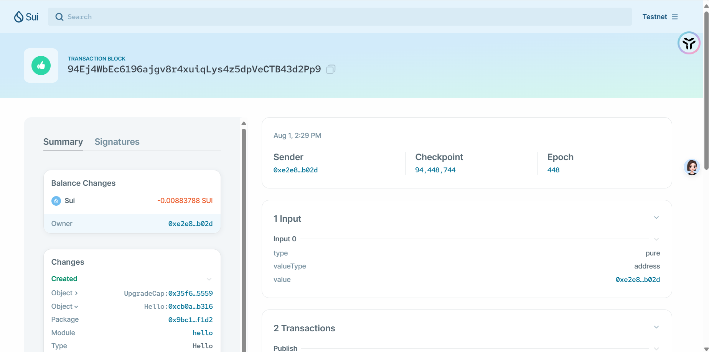

## 基本信息
- Sui钱包地址: `0xae37d5ecd711607c8ab94835fd7fd56f1460a799896f258a9614541fa3051574`
- github: `veithly`

## 个人简介
- 工作经验: 1.5年
- 技术栈: `React` `Vue` `JavaScript` `TypeScript` `Node.js` `Java` `Python`
- Web2工程师，熟悉前端开发，希望能向区块链方向转型
- 联系方式: tg: `@RickyShao`

## 任务

##   01 hello move
- [x] Sui cli version: sui 1.27.0-e5f080922d56-dirty
- [x] Sui钱包截图: 
- [x] package id:94Ej4WbEc6196ajgv8r4xuiqLys4z5dpVeCTB43d2Pp9
- [x] package id 在 scan上的查看截图:

##   02 move coin
- [x] My Coin package id : 0xb4ff3de86eea396715afcd1d0f6aeca2752b025743edd0ef4bed0bcf5945de68
- [x] Faucet package id : 0x7cf93a5063fab4b9a6d1828c5be044b42024d026002fc25cfad2b110728fab3b
- [] 转账 `My Coin` hash: 7qSfT7Y61qF5Gmn3wmFopfmhkPyv1tAfC4z9hXRKnRze
- [] `Faucet Coin` address1 mint hash:
- [] `Faucet Coin` address2 mint hash:

##   03 move NFT
- [] nft package id :
- [] nft object id :
- [] 转账 nft  hash:
- [] scan上的NFT截图:

##   04 Move Game
- [] game package id :
- [] deposit Coin hash:
- [] withdraw `Coin` hash:
- [] play game hash:

##   05 Move Swap
- [] swap package id :
- [] call swap CoinA-> CoinB  hash :
- [] call swap CoinB-> CoinA  hash :

##   06 Dapp-kit SDK PTB
- [] save hash :

##   07 Move CTF Check In
- [] CLI call 截图 : 
- [] flag hash :

##   08 Move CTF Lets Move
- [] proof :
- [] flag hash :
