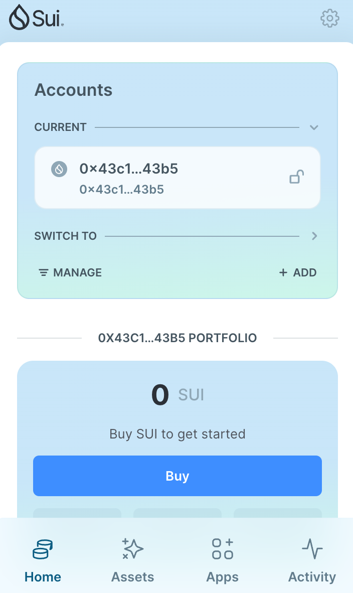
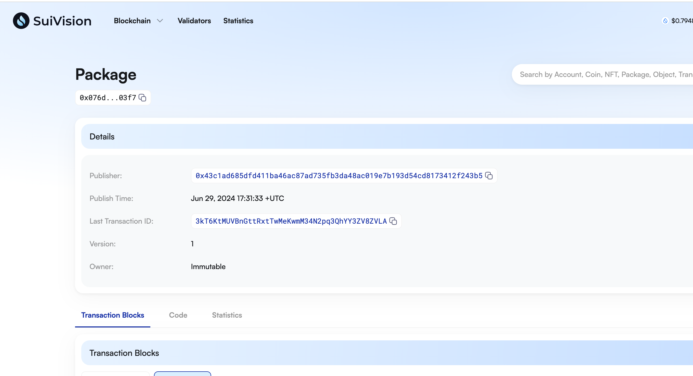
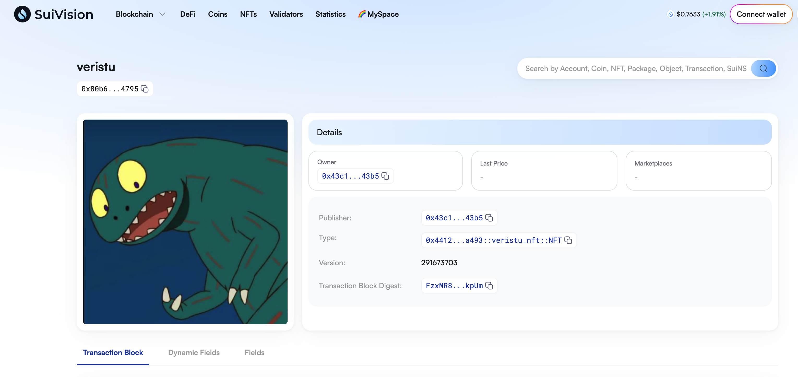

## 基本信息
- Sui钱包地址: `0x43c1ad685dfd411ba46ac87ad735fb3da48ac019e7b193d54cd8173412f243b5`
> 首次参与需要完成第一个任务注册好钱包地址才被合并，并且后续学习奖励会打入这个地址
- github: `veristu`

## 个人简介
- 工作经验: 0年
- 技术栈: `C`
> 重要提示 请认真写自己的简介
- C语言经验，对Move特别感兴趣，想通过Move入门区块链
- 联系方式: tg: `无` 

## 任务

##   01 hello move  
- [x] Sui cli version: 1.28.1
- [x] Sui钱包截图: 
- [x] package id: [0x076dd3358124f1d6dc359726b97832b2fd3abbde11b3c8380a3d0bd86f4e03f7](https://testnet.suivision.xyz/package/0x076dd3358124f1d6dc359726b97832b2fd3abbde11b3c8380a3d0bd86f4e03f7)
- [x] package id 在 scan上的查看截图:

##   02 move coin
- [x] My Coin package id :  0xd2450acc700e0ce4638f66e80598e440288ad9f09d35dc8dd1f592922760ebbd             
- [x] Faucet package id :  0xd2450acc700e0ce4638f66e80598e440288ad9f09d35dc8dd1f592922760ebbd             
- [x] 转账 `My Coin` hash: Hv1GRKeMbjRatDnri7S5rBhwwRn1Mjda6d3sS66P8foo
- [x] `Faucet Coin` address1 mint hash: B6U3wQMMYmm4smuTsgoZ3zonsLtrTtpZkM2qtEZnnjvC
- [x] `Faucet Coin` address2 mint hash: AJAaoboVLtGjrKDpgS6KjMRHavzSzMPgQCRL28Xux3Ugs

##   03 move NFT
- [x] nft package id : 0x4412e428d5a4606db60b8188fef980419efda1f4a51a24d819f1309c19b0a493              
- [x] nft object id : 0x80b650d513394bdfc8041db0fa43206b275217886fcc87ba59722c4126904795
- [x] 转账 nft  hash : 5HSi4fUWqzGyEpZcGhk6gvzJcj5JKUupNgi6htm8gtLs
- [x] scan上的NFT截图 : 

##   04 Move Game
- [x] game package id : 0xbf85ac59b42b379a71955cfadf806f2e3ad67a9ef8db527d2aa3a456c7634ca3                
- [x] deposit Coin hash: 6enSJpQf39zshsVPj9xxG3ktomENmJYBrJdU5ovixKh6
- [x] withdraw `Coin` hash: 4e6vnGBmRJK5TVr5ieo2NFJyzcwHBmQrs7dfJ6TEbGUc
- [x] play game hash: A2EfDW2smAAxJdhxSZSard9kwszq63huJ6AfKaM5DnY8

##   05 Move Swap
- [x] swap package id : 0x1bea4759df76e177267180fdb358fa469a099cf25b6124d0f55919d23d6484f9
- [x] call swap CoinA-> CoinB  hash : Bg9zSoBEFyebZDaY8TSnsEvLuLt8zuE38dwtFJWJXZPE
- [x] call swap CoinB-> CoinA  hash : B3c2d4RJaWjzDyrkK1bvivTR9ypd4pXH4LuSnPjjDkZo

##   06 Dapp-kit SDK PTB
- [x] save hash : 7Yak9doknHKohvhneqFt3t1THDB5NVvmaw8kaSsduTMN

##   07 Move CTF Check In
- [x] CLI call 截图 : 
- [x] flag hash : FG3K1P1QNrsKQn2Mp13oryTShDCPYQv7TPj2usHGjsPw

##   08 Move CTF Lets Move
- [x] proof : 9a0d895e291c55d701ab
- [x] flag hash : G7iNv3UpeqHRT1pRqhEBrph5j32mKggu8KydHQHZ2J6L
