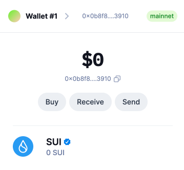
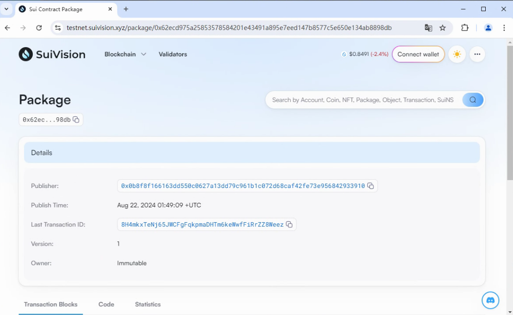
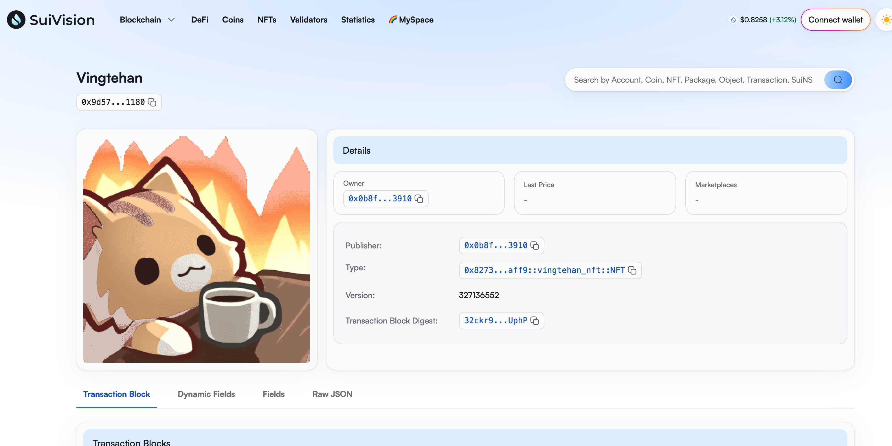
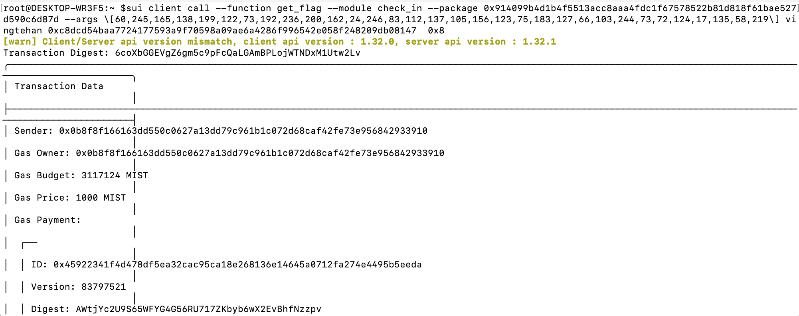

## 基本信息
- Sui钱包地址: `0x0b8f8f166163dd550c0627a13dd79c961b1c072d68caf42fe73e956842933910`
> 首次参与需要完成第一个任务注册好钱包地址才被合并，并且后续学习奖励会打入这个地址
- github: `vingtehan`

## 个人简介
- 工作经验: 6年
- 技术栈: `C#`
> 重要提示 请认真写自己的简介
- 多年ERP开发经验，对Move特别感兴趣，想通过Move入门区块链
- 联系方式: tg: `vingtehan` 

## 任务

##   01 hello move  
- [x] Sui cli version: 1.31.1
- [x] Sui钱包截图: 
- [x] package id: [0x62ecd975a25853578584201e43491a895e7eed147b8577c5e650e134ab8898db](https://testnet.suivision.xyz/package/0x62ecd975a25853578584201e43491a895e7eed147b8577c5e650e134ab8898db)
- [x] package id 在 scan上的查看截图:

##   02 move coin
- [x] My Coin package id :  0x5b11d7f4bb6091700c62e8e02d27dc25f8ba391f983b2a26ad9b7c6588ac3d48
- [x] Faucet package id :  0x5b11d7f4bb6091700c62e8e02d27dc25f8ba391f983b2a26ad9b7c6588ac3d48
- [x] 转账 `My Coin` hash: 6KyhrHVC28tKEiDVEL9wTVYdXAbxQEriaf4SpBHkDn6r
- [x] `Faucet Coin` address1 mint hash: w6QxwvTyfT4k3wfR23DDFoDeW21tRrGAJfG6XYXxg2E
- [x] `Faucet Coin` address2 mint hash: 34CUt5Jc6nohsCVKdLGFc6uovKpZKDxUGzeEcePziKkR

##   03 move NFT
- [x] nft package id : 0x8273c8d66e8ed7b068729c5b0e43b08f59fbf71389132baa5ebf5760734baff9
- [x] nft object id :  0x9d575f83a6b99a3032cb5e5e965b0366327d6535097f0f41990466e71dec1180
- [x] 转账 nft  hash: 2AH69wfcEg1LCKeYGRh9sg7rFJGC6K7dQExjs4cQKqBK
- [x] scan上的NFT截图:

##   04 Move Game
- [x] game package id : 0x9377f240474976e577d32ea7f36bb8add6b50a5206e66baf292434872911d13e
- [x] deposit Coin hash: 8dnmFofBVhpK9AvfeY8LSiieVqivtvTj1HDKEy4e6Cpv
- [x] withdraw `Coin` hash: BsyzGXw1MCQQACjyKMTZcmupqscba5kaWJ7KEZ58r6n2
- [x] play game hash: DRqwxkxqLu1gjCZQFMU1gHifMFKKnjVSWCEG6L6a2txK

##   05 Move Swap
- [x] swap package id : 0x488f2857386e29f265cdb1ce5a9dff034696091f429b748953499266a79193c1
- [x] call swap CoinA-> CoinB  hash :  CFfSGd4u9vRqtDpJ4Z1dKEpqurdv2gktEvwNrraPKUUD
- [x] call swap CoinB-> CoinA  hash :  A3ALQ5tseTBTGqgak6EE7TFTXNjQnXvJEFLKzsdHzV64

##   06 Dapp-kit SDK PTB
- [x] save hash : AkeimP19MacQnXASWt9kQ3GNvtnK5y76SV4TfRhRRX7h

##   07 Move CTF Check In
- [x] CLI call 截图 : 
- [x] flag hash : 6coXbGGEVgZ6gm5c9pFcQaLGAmBPLojWTNDxM1Utw2Lv

##   08 Move CTF Lets Move
- [x] proof :  49914225a2b4c38a1ab3
- [x] flag hash :GRhCSMbdT7Nnr7hpbqsgmL6jQfo6g8ZmL3dcYqERBjit
