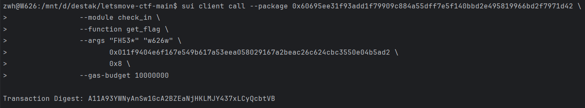

## 基本信息
- Sui钱包地址: `0x472478f05c79a17b04f2a201e845cd6b7d82099bad3d23397ab254c5a5fa6486`
> 首次参与需要完成第一个任务注册好钱包地址才被合并，并且后续学习奖励会打入这个地址
- github: `w626w`

## 个人简介
- 工作经验: 0年
- 技术栈: `java` `C++`
- 多年web2开发经验，对Move特别感兴趣，想通过Move入门区块链
- 联系方式: tg: `14708266023` 

## 任务

##   01 hello move  
- [x] package id: 0x56e28c9bb3b80b39ea847dd306b753cffd4b6ba15494019cc08f3ee849ab493e

##   02 move coin
- [x] My Coin package id : 0x47cf688dff2f021c693de8bba024d89d1be4552703d951f273884a11a9964cc4
- [x] Faucet package id : 0x47cf688dff2f021c693de8bba024d89d1be4552703d951f273884a11a9964cc4
- [x] 转账 `My Coin` hash:Fen34FGHbzYuG2Uymy41y1LexU8o6Xa353L9XmD6kwa7

##   03 move NFT
- [x] nft package id :0x581d4d7726bd1878cbd617e2bcf205923ede197d09a158809767c567ce128194
- [x] nft object id : 0x5f4c447290d7a2db15ee3f4ec70f38eb228da19394e7d60595265590a9513a73
- [x] 转账 nft  hash:Em2ee3XpTVG3vGDCcxtWtFLQQUT9HkJvB6GANDQrMhAi

##   04 Move Game
- [x] game package id :0x788a3e00567606027e012bd3b73256aacb20e81082076fbe9c1f9b4a061a8e33
- [x] call game hash:AdegAiWcfdSkmfu5bvBhxyT6RpPytr7i4LkVisKwXovT

##   05 Move Swap
- [x] swap package id :0xd6f4b1d25a401c678fcccdb72680866abc45f1c737c48e3bad2a08f83b8a0317
- [x] call swap hash:4z67RvQRtfc9oTZkRQfcSfj4Ss5HiQN1DX6zmVXqQof

##   06 SDK PTB
- [x] save hash :BQ4UxfvYNhsngy8mBEnfDGk2yUqubcPvMxjQNFJw44cy

##   07 Move CTF Check In
- [] CLI call 截图 : 
- [] flag hash :F2rEFg3PLPkZSn8xVxEXTHYR6f6xASkgTw7iCBtnsk9u

##   08 Move CTF Lets Move
- [] proof :
- [] flag hash :