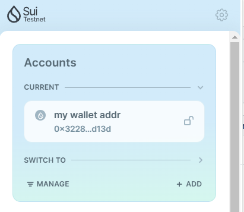
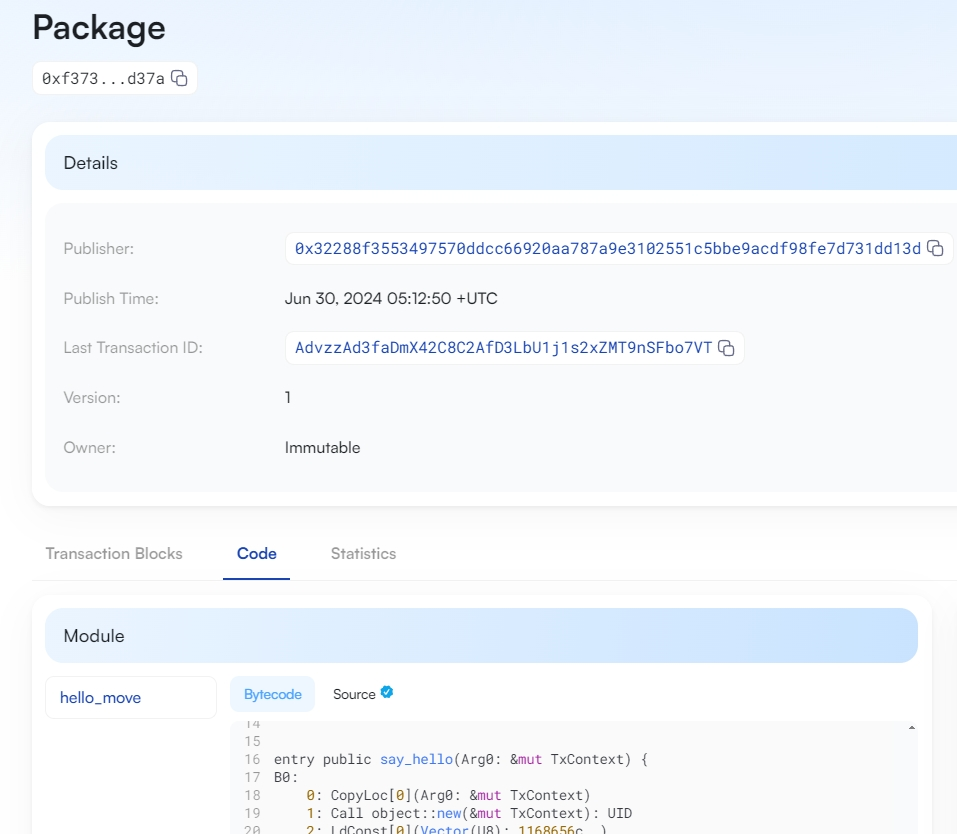

## 基本信息
- Sui钱包地址: `0x32288f3553497570ddcc66920aa787a9e3102551c5bbe9acdf98fe7d731dd13d`
- github: `wahack`

## 个人简介
- 工作经验: 5年
- 技术栈: `typescript` `rust`
- 多年web2开发经验，对Move特别感兴趣
- 联系方式: tg: `wahack` 

## 任务

##   01 hello move  
- [x] Sui cli version:  1.27.0
- [x] Sui钱包截图: 
- [x] package id: `0xf373db4f4c46273e778a9eab2fa3f779f8ece3762aa2d053d6ed648254a8d37a`
- [x] package id 在 scan上的查看截图:

##   02 move coin
- [x] My Coin package id : `0xc4957097f97d71e4250739bbb277e3991a4a15fdc244e10b019f9506a983e2e5` 
- [x] Faucet package id : `0xc4957097f97d71e4250739bbb277e3991a4a15fdc244e10b019f9506a983e2e5` 
- [x] 转账 `My Coin` hash: `3KSe4Q7qkFSds969PNDk44W7zEquUnyeA2242vezBaC8`
- [x] `Faucet Coin` address1 mint hash: `N6gjK43Zh9Z6RdyHBmgU87h8Ev2hECbRT5w4BTYRdSw`
- [x] `Faucet Coin` address2 mint hash: `FjHQWhMN3wSpZ3FWN8jiAWGXWrCCV1CNkujXwbi9oCdL`

##   03 move NFT
- [] nft package id :
- [] nft object id : 
- [] 转账 nft  hash:
- [] scan上的NFT截图:

##   04 Move Game
- [] game package id :
- [] deposit Coin hash:
- [] withdraw `Coin` hash:
- [] play game hash:

##   05 Move Swap
- [] swap package id :
- [] call swap CoinA-> CoinB  hash :
- [] call swap CoinB-> CoinA  hash :

##   06 Dapp-kit SDK PTB
- [] save hash :

##   07 Move CTF Check In
- [] CLI call 截图 : 
- [] flag hash :

##   08 Move CTF Lets Move
- [] proof : 
- [] flag hash :
