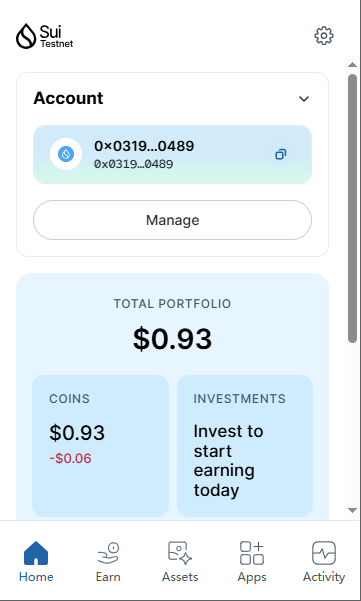
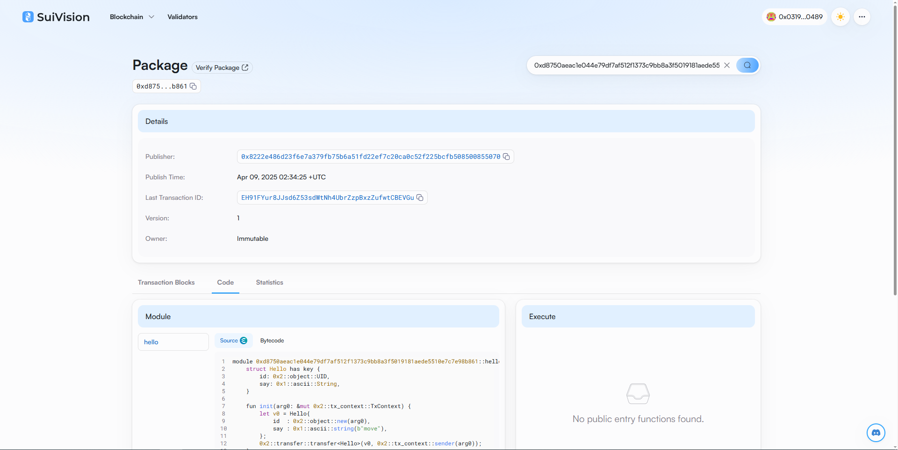
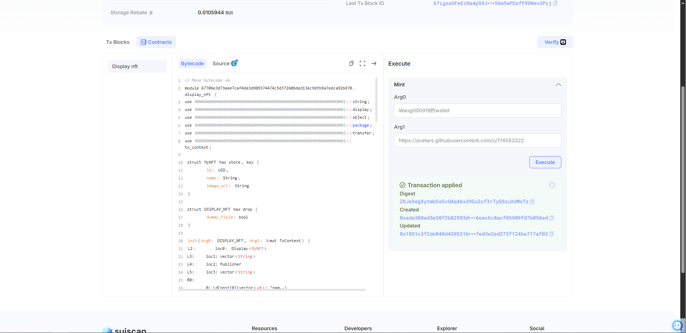

## 基本信息
- Sui钱包地址: `0x0319dd163d7b895fc5caa4712a2fe49a4f46d86ff16976a8b0cf5295e5e00489`
> 首次参与需要完成第一个任务注册好钱包地址才被合并，并且后续学习奖励会打入这个地址
- github: `wang000919`

## 个人简介
- 工作经验: 1年
- 技术栈: `javascript`
> 重要提示 请认真写自己的简介
- 多年（+在校期间项目实战）web2开发经验，对Move特别感兴趣，想通过Move入门区块链

## 任务

##   01 hello move  
- [x] Sui cli version: 1.46.0-e011e770764f
- [x] Sui钱包截图: 
- [x] package id: 0xdx8750aeac1e044e79df7af512f1373c9bb8a3f5019181aede5510e7c7e98b861
- [x] package id 在 scan上的查看截图:

##   02 move coin
- [x] My Coin package id : 0x0x858f798dabbbb00cfdf1dc82792dd766616a7a5970ffd9cfacfe3474e1d1f00
- [x] Faucet package id : 0x0x858f798dabbbb00cfdf1dc82792dd766616a7a5970ffd9cfacfe3474e1d1f00
- [x] 转账 `My Coin` hash: Apu8Ce1k3FstbW9wkm2v6btwjbFWZbrX3Gcs6avzWR2f
- [x] `Faucet Coin` address1 mint hasxh:5KgDsx1UqNzZ52FTxAWkRah2kkj4bTUX1EjNa9NYti7S
- [x] `Faucet Coin` address2 mint hash:2FRTgepPHncSsvGWLYTSBWjbaofGCmRoh7brDXBPmsfN

##   03 move NFT
- [x] nft package id :0xx67706e3d73aee7caf4de3d909374474c5d37260bded13ec9dfb9a7edca92bd70
- [x] nft object id : 0x6x763e66f1c1a2698896f97cd1eeb318cb5924bc5601faf2dd47c4b4e297ad46f
- [x] 转账 nft  hash:9r3gS7rKWeGqKXo38g6DvZ6QtWdHJWjEjKG6ZRF31LoQ
- [x] scan上的NFT截图:

##   04 Move Game
- [] game package id :
- [] deposit Coin hash:
- [] withdraw `Coin` hash:
- [] play game hash:

##   05 Move Swap
- [] swap package id :
- [] call swap CoinA-> CoinB  hash :
- [] call swap CoinB-> CoinA  hash :

##   06 Dapp-kit SDK PTB
- [] save hash :

##   07 Move CTF Check In
- [] CLI call 截图 : 
- [] flag hash :

##   08 Move CTF Lets Move
- [] proof : 
- [] flag hash :

