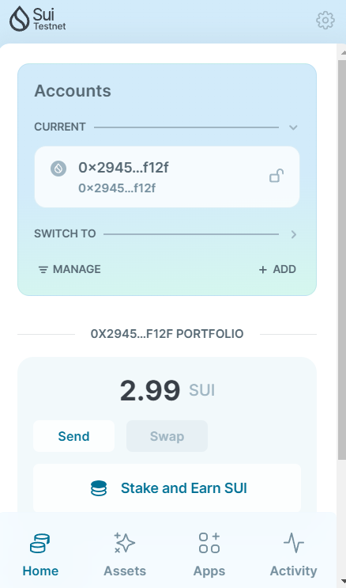
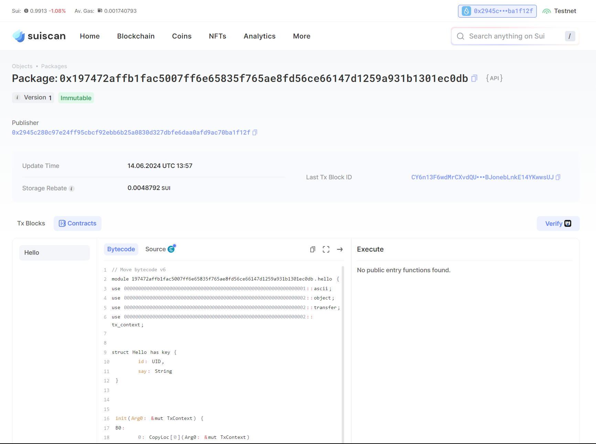
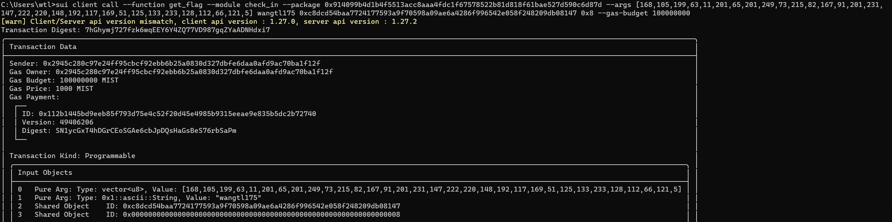

## 基本信息
- Sui钱包地址: `0x2945c280c97e24ff95cbcf92ebb6b25a0830d327dbfe6daa0afd9ac70ba1f12f`
- github: `wangtl175`

## 个人简介
- 工作经验: 2年
- 技术栈: `Rust` `C++`
- 中山大学毕业，毕业后一直在互联网大厂工作，对web3感兴趣，希望通过学习Move入门
- 联系方式: tg: `@loon_w` 

## 任务

##   01 hello move  
- [x] Sui cli version: sui 1.27.0-e5f080922d56-dirty
- [x] Sui钱包截图: 
- [x] package id: 0x197472affb1fac5007ff6e65835f765ae8fd56ce66147d1259a931b1301ec0db
- [x] package id 在 scan上的查看截图:

##   02 move coin
- [x] My Coin package id : 0xba9f79ebc5c551fb0b23e740e8c3af328ab7342c819b0ebf2ea3878ebfc8e1ce
- [x] Faucet package id : 0x6e7a5fb185ccaa392e21db2fb42a68f1c635a75d2677fc6aefb2d9985e140a1c
- [x] 转账 `My Coin` hash: 4JinANJMrEeqQsSJwzmSAYuHN9WX4p5bdpmV8H3vh9SZ
- [x] `Faucet Coin` address1 mint hash: uytpT6NvQ4SrTUZfvVGQkBj8sJmJ76c22TqUhFHc4HB
- [x] `Faucet Coin` address2 mint hash: HvQyiWZATEK1PZEcXHCeVtSyqpcAg7DeJtnACnhQbMoq

##   03 move NFT
- [] nft package id :
- [] nft object id : 
- [] 转账 nft  hash:
- [] scan上的NFT截图:

##   04 Move Game
- [] game package id :
- [] deposit Coin hash:
- [] withdraw `Coin` hash:
- [] play game hash:

##   05 Move Swap
- [] swap package id :
- [] call swap CoinA-> CoinB  hash :
- [] call swap CoinB-> CoinA  hash :

##   06 Dapp-kit SDK PTB
- [] save hash :

##   07 Move CTF Check In
- [x] CLI call 截图 : 
- [x] flag hash :7hGhymj727fzk6wqEEY6Y4ZQ77VD987gqZYaADNHdxi7

##   08 Move CTF Lets Move
- [x] proof : `[11,13,132,205,190,193,54,98]`
- [x] flag hash : HAFhwTjMjGSKngh9xpJ1WEwDA8AzjUyx4JUK8YaCprHE
